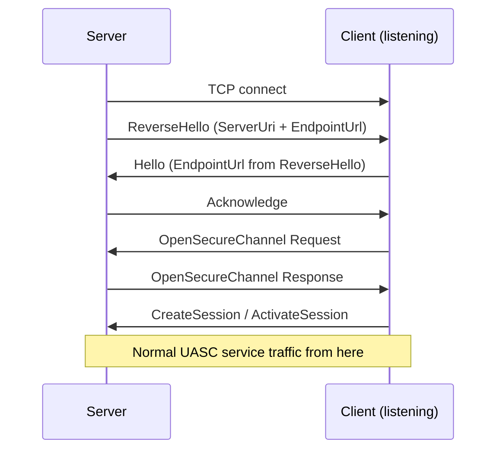
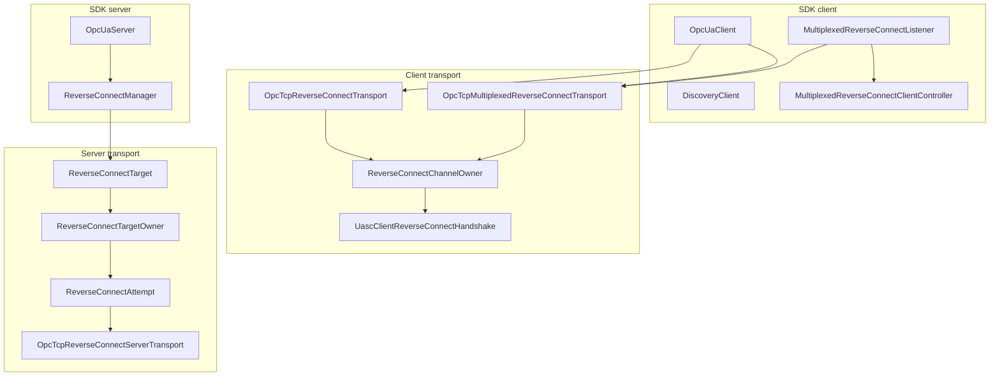
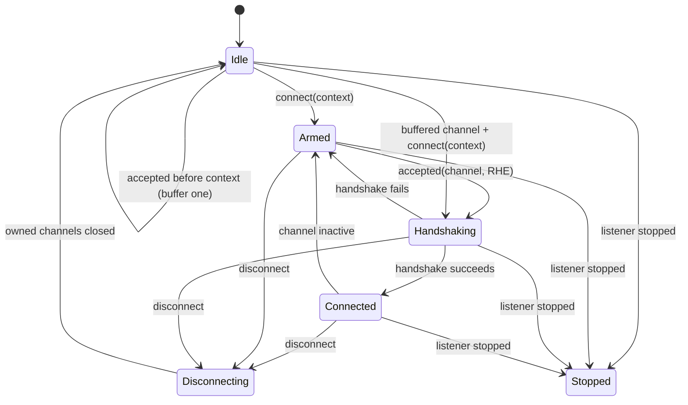
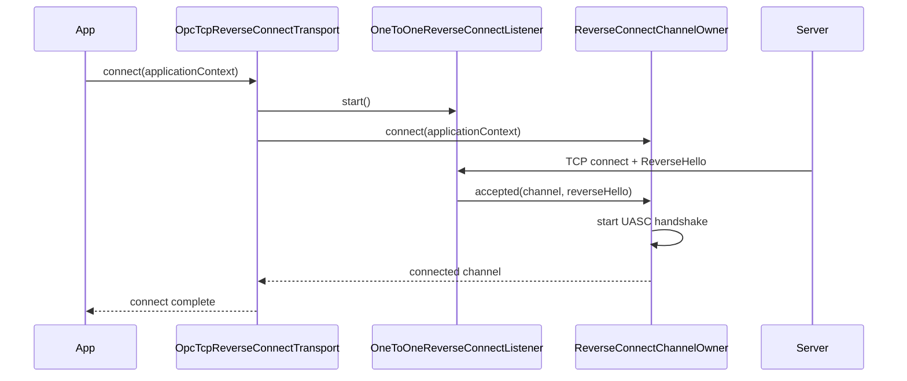
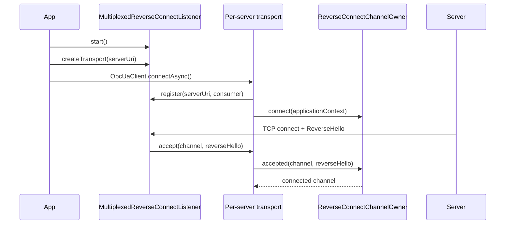

# Reverse Connect Architecture

OPC UA Reverse Connect (Part 6, Section 7.1.3) reverses the normal TCP dial direction:
the server opens a TCP connection to a listening client, sends `ReverseHello`, and then
the client drives the normal Hello/Acknowledge/OpenSecureChannel flow. Milo implements
this as asynchronous Netty I/O around serialized lifecycle owners, so each logical
client channel or server target has one component responsible for state, timers,
cleanup, and future completion.

**Specification references:**

- [Part 6 Section 7.1 - Connection Protocol](https://reference.opcfoundation.org/Core/Part6/v105/docs/7)
- [Part 6 Section 7.1.3 - Establishing a Connection](https://reference.opcfoundation.org/Core/Part6/v104/7.1.3)
- [Part 2 Section 6.14 - Reverse Connect Security](https://reference.opcfoundation.org/Core/Part2/v104/docs/6.14)
- [Part 7 Section 6.6.5 - Reverse Connect Server Facet](https://reference.opcfoundation.org/Core/Part7/v104/docs/6.6.5)
- [Part 7 Section 6.6.75 - Reverse Connect Client Facet](https://reference.opcfoundation.org/v104/Core/docs/Part7/6.6.75/)

* * *

## Table of Contents

1. [Protocol Overview](#1-protocol-overview)
2. [Architecture Overview](#2-architecture-overview)
3. [Client Lifecycle Owner](#3-client-lifecycle-owner)
4. [One-To-One Client Flow](#4-one-to-one-client-flow)
5. [Multiplexed Client Flow](#5-multiplexed-client-flow)
6. [Discovery And Pass-2 Behavior](#6-discovery-and-pass-2-behavior)
7. [Server-Side Architecture](#7-server-side-architecture)
8. [Session Integration](#8-session-integration)
9. [Configuration Reference](#9-configuration-reference)
10. [Testing](#10-testing)
11. [Key Design Decisions](#11-key-design-decisions)

* * *

## 1. Protocol Overview

### 1.1 Handshake Sequence



The reverse-only part is the TCP direction plus the `ReverseHello` message. After the
client sends `Hello` and the server responds with `Acknowledge`, the channel proceeds
through the same UASC handlers used by a forward TCP connection.

### 1.2 ReverseHello Message

`ReverseHelloMessage` is a Connection Protocol message in `stack-core`.

```
[MessageType "RHE" + Reserved "F"]  4 bytes
[MessageSize: UInt32 LE]            4 bytes
[ServerUri length: Int32 LE]
[ServerUri bytes: UTF-8]
[EndpointUrl length: Int32 LE]
[EndpointUrl bytes: UTF-8]
```

The `ServerUri` is the server application's URI. The `EndpointUrl` is the server
endpoint URL the client must echo in its `Hello`.

### 1.3 Three URLs

| Concept | Owner | Purpose |
| --- | --- | --- |
| Client endpoint URL | Client | TCP address the client listens on, such as `opc.tcp://client:48060`. The server is configured to dial this URL. |
| `ServerUri` | Server | Application URI carried in `ReverseHello`; clients can filter allowed values. |
| `EndpointUrl` | Server | Server endpoint URL carried in `ReverseHello` and used by the client in `Hello`. |

### 1.4 Idle Socket Invariant

Part 6 requires a reverse-connect server to maintain at least one open socket without an
active Session for each configured reverse-connect client. When an idle connection is
promoted to active by an opened SecureChannel, Milo starts a replacement idle attempt
for the same target.

* * *

## 2. Architecture Overview

Milo keeps protocol encoding in `stack-core`, transport mechanics in
`opc-ua-stack/transport`, and SDK-level client/server coordination in `opc-ua-sdk`.



The core ownership boundaries are:

- Client transports are adapters around `ReverseConnectChannelOwner`.
- The one-to-one listener and multiplexed listener decode only far enough to obtain
  `ReverseHello`, then hand the accepted channel to an owner or controller.
- `UascClientReverseConnectHandshake` owns Netty pipeline mutation for the client
  handshake, but it does not own lifecycle policy.
- Server-side `ReverseConnectTargetOwner` owns retry timers, idle/active attempts, and
  stop/remove cleanup for one configured client URL.
- `ReverseConnectManager` is a durable registration and lifecycle facade over target
  handles, not the owner of retry or idle-socket policy.

### 2.1 Component Inventory

| Component | Path | Role |
| --- | --- | --- |
| `ReverseHelloMessage` | `opc-ua-stack/stack-core/.../channel/messages/ReverseHelloMessage.java` | Wire representation for RHE. |
| `OpcTcpReverseConnectTransport` | `opc-ua-stack/transport/.../client/tcp/OpcTcpReverseConnectTransport.java` | One-to-one client transport with a private listener. |
| `OneToOneReverseConnectListener` | `opc-ua-stack/transport/.../client/tcp/OneToOneReverseConnectListener.java` | Private listener, RHE decode, child-channel tracking, listener stop. |
| `OpcTcpMultiplexedReverseConnectTransport` | `opc-ua-stack/transport/.../client/tcp/OpcTcpMultiplexedReverseConnectTransport.java` | Per-server transport registered with a shared listener. |
| `ChannelConsumerRegistry` | `opc-ua-stack/transport/.../client/tcp/ChannelConsumerRegistry.java` | Transport-layer inversion point implemented by the SDK listener. |
| `ReverseConnectChannelOwner` | `opc-ua-stack/transport/.../client/tcp/ReverseConnectChannelOwner.java` | Serialized client-side lifecycle owner. |
| `UascClientReverseConnectHandshake` | `opc-ua-stack/transport/.../client/uasc/UascClientReverseConnectHandshake.java` | Client handshake pipeline helper. |
| `MultiplexedReverseConnectListener` | `opc-ua-sdk/sdk-client/.../client/MultiplexedReverseConnectListener.java` | Shared SDK listener and ServerUri dispatcher. |
| `MultiplexedReverseConnectClientController` | `opc-ua-sdk/sdk-client/.../client/MultiplexedReverseConnectClientController.java` | Unknown-server resolver, discovery, on-demand client creation. |
| `OpcUaClient.createReverseConnect()` | `opc-ua-sdk/sdk-client/.../client/OpcUaClient.java` | One-to-one discovery factory. |
| `OpcTcpReverseConnectServerTransport` | `opc-ua-stack/transport/.../server/tcp/OpcTcpReverseConnectServerTransport.java` | Outbound server connector and pipeline installer. |
| `ReverseConnectAttempt` | `opc-ua-stack/transport/.../server/tcp/ReverseConnectAttempt.java` | Outcome bridge for one outbound attempt. |
| `ReverseConnectTargetOwner` | `opc-ua-stack/transport/.../server/tcp/ReverseConnectTargetOwner.java` | Serialized server target owner. |
| `ReverseConnectTarget` | `opc-ua-stack/transport/.../server/tcp/ReverseConnectTarget.java` | Public stack handle used by SDK manager. |
| `ReverseConnectManager` | `opc-ua-sdk/sdk-server/.../server/ReverseConnectManager.java` | SDK registration and start/stop facade. |

* * *

## 3. Client Lifecycle Owner

`ReverseConnectChannelOwner` owns one logical client-side reverse-connected channel
lifecycle. Both the one-to-one transport and the multiplexed transport use it.

### 3.1 State Model



| State | Meaning |
| --- | --- |
| `Idle` | No real client context is installed. The owner may buffer one accepted channel briefly. |
| `Armed` | The real `ClientApplicationContext` is installed and the owner is waiting for a channel. |
| `Handshaking` | One accepted channel is running `ReverseHello`/`Hello`/`Acknowledge`/OpenSecureChannel. |
| `Connected` | A `ClientSecureChannel` is active and service requests can use the channel. |
| `Disconnecting` | Normal disconnect is closing owned channels and will return the owner to `Idle`. |
| `Stopped` | Terminal state after the owning listener has stopped. Future waits fail with shutdown. |

### 3.2 Owner Rules

- A real handshake never starts until `connect(ClientApplicationContext)` installs the
  current client context.
- An accepted channel that arrives before context installation is buffered at most once
  and only until `connectTimeout`.
- Duplicate accepted channels are closed by the owner.
- `connect()` and `getChannel()` waiters are bounded by `connectTimeout`.
- Normal `disconnect()` clears application context, pending/handshaking/active
  channels, active secure channel, and waiters, then advances the generation so late
  callbacks from an earlier lifecycle cannot satisfy the next one.
- `listenerStopped()` is terminal: it closes owned channels, fails pending/future
  waiters with shutdown, and moves to `Stopped`.
- State listeners are notified through the configured executor by the transport
  adapters.

### 3.3 Handshake Helper Boundary

The owner starts `UascClientReverseConnectHandshake` for a channel that already supplied
a decoded `ReverseHelloMessage`. The helper installs the client UASC handlers on the
Netty event loop, feeds the pre-decoded RHE to `UascClientReverseHelloHandler`, and
returns a `CompletableFuture<ClientSecureChannel>`.

The helper owns pipeline mutation and handshake result reporting only. It does not own
duplicate channel policy, reconnect, disconnect, waiter completion, pending-accept
timeouts, or listener stop.

* * *

## 4. One-To-One Client Flow

`OpcTcpReverseConnectTransport` is the one-to-one client transport. It owns a private
`OneToOneReverseConnectListener` and one `ReverseConnectChannelOwner`.



### 4.1 Listener Responsibilities

`OneToOneReverseConnectListener` owns:

- binding the client listen address with a Netty `ServerBootstrap`;
- accepted child-channel tracking;
- first-message validation and `ReverseHello` decode;
- the raw TCP-to-RHE timeout;
- invalid first-message `Error` response;
- listener and child-channel cleanup during stop.

It does not install the client UASC handshake handlers. After decoding `ReverseHello`,
it invokes the accepted-channel sink, which is wired to `ReverseConnectChannelOwner`.

### 4.2 Transport Responsibilities

`OpcTcpReverseConnectTransport` owns:

- starting the listener before installing the real application context;
- delegating channel lifecycle to `ReverseConnectChannelOwner`;
- exposing `disconnectChannel()` for the discovery pass used by
  `OpcUaClient.createReverseConnect()`;
- stopping the listener during full `disconnect()`;
- exposing the current active child channel through `CurrentChannelProvider`;
- translating owner `Connected` transitions into `ChannelStateObservable` callbacks.

### 4.3 One-To-One API Example

```java
var transportConfig = OpcTcpReverseConnectTransportConfig.newBuilder()
    .setListenAddress(new InetSocketAddress("0.0.0.0", 48060))
    .addAllowedServerUri("urn:example:server")
    .build();

CompletableFuture<OpcUaClient> clientFuture =
    OpcUaClient.createReverseConnect(
        transportConfig,
        endpoints -> endpoints.stream()
            .filter(e -> SecurityPolicy.None.getUri().equals(e.getSecurityPolicyUri()))
            .findFirst(),
        builder -> builder
            .setApplicationName(LocalizedText.english("Example Client"))
            .setApplicationUri("urn:example:client"));

ReverseConnectHandle handle =
    server.addReverseConnect("opc.tcp://client-host:48060");

OpcUaClient client = clientFuture.get(60, TimeUnit.SECONDS);
client.connectAsync().get(30, TimeUnit.SECONDS);

try {
  // use the client
} finally {
  server.removeReverseConnect(handle);
  client.disconnectAsync().get(5, TimeUnit.SECONDS);
}
```

The factory returns a configured but unconnected client. The application still calls
`connect()` or `connectAsync()` to establish the real Session.

* * *

## 5. Multiplexed Client Flow

The multiplexed path lets one listening socket serve many reverse-connect servers. It
is split between an SDK listener/controller and per-server transport adapters.

### 5.1 Known Server Flow



`MultiplexedReverseConnectListener` implements `ChannelConsumerRegistry`, the
transport-module interface that keeps `opc-ua-stack/transport` independent from
`opc-ua-sdk`. Registrations are explicit and idempotent for the same transport identity.
Stopping the listener notifies unique registered consumers with `Bad_Shutdown`, clears
the registry, closes the listener channel, and closes tracked child channels.

`OpcTcpMultiplexedReverseConnectTransport` is a thin adapter around
`ReverseConnectChannelOwner`. It registers on `connect()`, deregisters on all
`disconnect()` outcomes, rejects late dispatch after disconnect, exposes the current
channel through `CurrentChannelProvider`, and dispatches state callbacks through the
configured executor.

### 5.2 Unknown Server Flow

When no consumer is registered for a `ServerUri`, the listener delegates to
`MultiplexedReverseConnectClientController` if an `EndpointResolver` is configured. The
controller owns resolver invocation, resolver timeout, optional discovery, client
configuration, `OpcUaClient` creation, and `ClientListener` notification.

Resolver and client callbacks run on the configured transport executor, not on a Netty
event loop or while the listener registry lock is held. Unmatched channels are bounded
by `maxPendingConnections` and `resolverTimeout`.

#### 1-Shot Cached Endpoint

If `EndpointResolver.cached(...)` or a custom resolver returns an endpoint without
calling `Discovery.getEndpoints()`, the original accepted channel is preserved. The
controller creates a transport, calls `transport.offerChannel(channel, reverseHello)`,
creates the client, and notifies `ClientListener`. The owner still waits for the real
`OpcUaClient.connectAsync()` call before starting the handshake.

#### 2-Shot Live Discovery

If the resolver calls `Discovery.getEndpoints()`, the controller consumes the accepted
channel through `InboundChannelTransport` and `DiscoveryClient`, performs
`GetEndpoints`, waits for discovery disconnect, and then creates a real per-server
transport without offering the consumed channel. The server reconnects for the session,
and the listener dispatches that second connection to the registered transport.

### 5.3 Multiplexed API Example

```java
var transportConfig =
    OpcTcpMultiplexedReverseConnectTransportConfig.newBuilder().build();

var listenerConfig = MultiplexedReverseConnectListenerConfig.newBuilder()
    .setListenAddress(new InetSocketAddress("0.0.0.0", 48060))
    .setTransportConfig(transportConfig)
    .setEndpointResolver(EndpointResolver.discover((serverUri, endpoints) ->
        endpoints.stream()
            .filter(e -> SecurityPolicy.None.getUri().equals(e.getSecurityPolicyUri()))
            .findFirst()
            .orElseThrow()))
    .setClientCustomizer((serverUri, builder) -> builder
        .setApplicationName(LocalizedText.english("Example Client"))
        .setApplicationUri("urn:example:client"))
    .setClientListener(client -> client.connectAsync())
    .build();

var listener = new MultiplexedReverseConnectListener(listenerConfig);
listener.start();

try {
  ReverseConnectHandle handle =
      server.addReverseConnect("opc.tcp://client-host:48060");

  // wait for the ClientListener to connect the on-demand client
} finally {
  server.removeReverseConnect(handle);
  // disconnect created clients before stopping the shared listener
  listener.stop().get(5, TimeUnit.SECONDS);
}
```

Recommended shutdown order is: stop or remove server reverse-connect registrations,
disconnect clients, stop the shared listener, then release shared resources or shut
down the hosting server. That order avoids the server immediately replacing idle
connections while the client side is trying to close.

* * *

## 6. Discovery And Pass-2 Behavior

### 6.1 One-To-One Factory

`OpcUaClient.createReverseConnect()` implements the common two-pass setup:

1. Create an `OpcTcpReverseConnectTransport` and bind its listener.
2. Accept the first inbound server connection.
3. Open an unsecured discovery channel using `MessageSecurityMode.None` and
   `SecurityPolicy.None`.
4. Call `GetEndpoints`.
5. Disconnect only the discovery child channel with `disconnectChannel()`, leaving the
   listening socket open.
6. Build and return an `OpcUaClient` using the selected endpoint and the same transport.
7. Wait for caller code to invoke `client.connect()` or `client.connectAsync()` for the
   real Session.

The discovery connect plus `GetEndpoints` operation is bounded by the reverse transport
`connectTimeout`. Failure paths clean up through full transport `disconnect()` before
the returned future completes exceptionally.

### 6.2 Early Pass-2 Channels

The server may reconnect for pass 2 before the application has called
`client.connectAsync()` on the returned client. The owner handles this by buffering one
accepted channel until `connectTimeout`. If the real context arrives in time, the owner
starts the handshake with the correct context. If not, the channel is closed and later
connect/get-channel waiters fail with timeout.

### 6.3 Discovery Security Scope

Current reverse-connect discovery paths use unsecured discovery:

- `OpcUaClient.createReverseConnect()` builds the discovery endpoint with
  `MessageSecurityMode.None` and `SecurityPolicy.None`.
- `DiscoveryClient.getEndpoints(OpcTcpReverseConnectTransportConfig)` and
  `findServers(...)` use the same reverse-connect discovery transport pattern.
- Multiplexed 2-shot discovery in `MultiplexedReverseConnectClientController` also uses
  an unsecured discovery endpoint.

Secured reverse-connect discovery is intentionally deferred as `Claude-26`. It is a
separate feature from the lifecycle architecture described here.

* * *

## 7. Server-Side Architecture

### 7.1 Manager Facade

`ReverseConnectManager` is the SDK-level registry and lifecycle facade. It owns durable
`ReverseConnectHandle` registrations, materializes target handles on server startup,
and coordinates start, stop, and remove with `OpcUaServer`.

The manager does not own per-attempt retry timers or active-to-idle replacement. It
delegates target policy to stack transport-owned `ReverseConnectTarget` handles created
by `OpcTcpReverseConnectServerTransport`.

Key manager behavior:

- registrations added before startup are durable and materialize when the server starts;
- registrations added while running create and start a target immediately;
- `removeReverseConnect()` removes the durable registration and stops/removes the
  running target if one exists;
- `stop()` snapshots current targets, marks them terminal, invokes owner stop outside
  the manager lock, clears runtime targets, and completes only after target stop
  futures complete;
- compatible repeated `start()` calls while stopping coalesce; incompatible queued
  starts fail fast;
- `OpcUaServer.shutdown()` waits for manager stop completion.

### 7.2 Target Owner

`ReverseConnectTargetOwner` is package-private stack transport code for one configured
client endpoint URL. It serializes its lifecycle through a mailbox and owns:

- the client endpoint URL and resolved `InetSocketAddress`;
- the server endpoint URL and server URI sent in `ReverseHello`;
- one idle attempt, if present;
- zero or more active attempts;
- retry timer identity;
- generation and attempt ids for stale callback/timer rejection;
- stop/remove completion.

The owner invariant is: while running, if no idle attempt exists and no retry timer is
pending, start one. When an idle attempt reports `SecureChannelOpened`, the owner moves
that attempt to the active set, resets reconnect backoff, and immediately starts a
replacement idle attempt.

### 7.3 Attempt Bridge

`ReverseConnectAttempt` represents one outbound server attempt. It opens the TCP
connection through `OpcTcpReverseConnectServerTransport.connectAttempt(...)`, observes
the reverse handshake, and reports outcomes to the target owner:

| Outcome | Meaning |
| --- | --- |
| `TcpConnectFailure` | TCP connect failed before a channel was established. |
| `ReverseHelloWriteFailure` | The server could not write `ReverseHello`. |
| `ClientRejected` | The client sent an OPC UA `ErrorMessage` during the reverse handshake. |
| `SecureChannelOpened` | The client opened a SecureChannel; the idle attempt is now active. |
| `CloseBeforeSecureChannel` | The channel closed before an active SecureChannel. |
| `CloseAfterSecureChannel` | An active reverse-connected channel closed. |

The attempt observer is installed before `UascServerReverseHelloHandler`, so fast
`SecureChannelOpenedEvent` and inbound `ErrorMessage` observations are not missed.

### 7.4 Retry Policy

Retry policy is target-owned:

- TCP connect failure, `ReverseHello` write failure, and close-before-secure-channel
  use exponential reconnect backoff starting at `connectInterval` and capped by
  `maxReconnectDelay`.
- Client OPC UA `Error` rejection uses `rejectBackoff`.
- Successful idle TCP connect and `SecureChannelOpened` reset the reconnect delay.
- Active channel close removes that attempt from the active set and then ensures an
  idle attempt exists.
- Retry is effectively infinite while the target remains registered and running.
  Stop/remove is the cancellation boundary.

### 7.5 Stop And Remove

`ReverseConnectTarget.stop()` and `remove()` are terminal for the target owner. They
cancel retry timers, close known idle and active channels, wait for an in-flight idle
TCP connect to either fail or produce a channel, close any late successful idle channel,
and complete only after owned close futures settle. Later starts are rejected with
`Bad_Shutdown`.

* * *

## 8. Session Integration

Client transports that can report connection state implement `ChannelStateObservable`.
Forward TCP, one-to-one reverse, and multiplexed reverse transports all expose
connected/disconnected transitions to `SessionFsm`.

When a session becomes active, `SessionFsmFactory` registers a transition listener. A
disconnect notification posts `Event.ConnectionLost` through the configured transport
executor, so session reactivation does not run inline inside transport owner mutation.

Keep-alive channel close uses `CurrentChannelProvider`. `OpcTcpClientTransport`,
`OpcTcpReverseConnectTransport`, and `OpcTcpMultiplexedReverseConnectTransport` expose
the current Netty channel through this common seam, and `SessionFsmFactory` uses that
interface for keep-alive channel closure.

For reverse connect, reconnect is passive on the client side. The client waits for the
server's replacement idle attempt to dial in, the owner handshakes that accepted
channel, and `SessionFsm` reactivates through its normal reconnect states.

* * *

## 9. Configuration Reference

### 9.1 One-To-One Client Transport

`OpcTcpReverseConnectTransportConfig` extends `OpcClientTransportConfig` and
`UascClientConfig`.

| Property | Type | Default | Description |
| --- | --- | --- | --- |
| `listenAddress` | `InetSocketAddress` | required | Address the client binds for inbound server connections. |
| `allowedServerUris` | `Set<String>` | empty | Accepted `ServerUri` values. Empty accepts all. |
| `reverseHelloTimeout` | `long` ms | 30000 | Timeout for raw accepted TCP connection to provide RHE. |
| `connectTimeout` | `long` ms | 60000 | Bounds discovery, pending early accepted channels, and owner channel waiters. |
| `acknowledgeTimeout` | `UInteger` ms | 5000 | Inherited Hello/Acknowledge timeout. |
| `channelLifetime` | `UInteger` ms | 3600000 | Requested SecureChannel lifetime. |
| `serverBootstrapCustomizer` | `Consumer<ServerBootstrap>` | no-op | Customizes the listening bootstrap. |
| `channelPipelineCustomizer` | `Consumer<ChannelPipeline>` | no-op | Customizes accepted child pipelines before RHE decode. |

### 9.2 Multiplexed Listener

| Property | Type | Default | Description |
| --- | --- | --- | --- |
| `listenAddress` | `InetSocketAddress` | required | Shared client listen address. |
| `transportConfig` | `OpcClientTransportConfig` | required | Shared executor, scheduler, event loop, and wheel timer. |
| `rateLimitingEnabled` | `boolean` | `true` | Whether accepted child channels get `RateLimitingHandler`. |
| `maxConnections` | `int` | `0` | Maximum concurrent child channels; `0` means unlimited. |
| `maxPendingConnections` | `int` | `16` | Maximum unmatched channels awaiting resolver completion. |
| `resolverTimeout` | `long` ms | `60000` | Timeout for unknown-server endpoint resolution. |
| `reverseHelloTimeout` | `long` ms | `5000` | Timeout for raw accepted TCP connection to provide RHE. |
| `serverBootstrapCustomizer` | `Consumer<ServerBootstrap>` | no-op | Customizes the shared listener bootstrap. |
| `channelPipelineCustomizer` | `Consumer<ChannelPipeline>` | no-op | Customizes accepted child pipelines. |
| `endpointResolver` | `EndpointResolver` | `null` | Enables on-demand clients for unknown servers. |
| `clientCustomizer` | `ClientCustomizer` | `null` | Configures on-demand client builders. |
| `clientListener` | `ClientListener` | `null` | Receives on-demand clients. |

### 9.3 Multiplexed Per-Transport

| Property | Type | Default | Description |
| --- | --- | --- | --- |
| `allowedServerUris` | `Set<String>` | empty | Accepted `ServerUri` values for this transport. |
| `reverseHelloTimeout` | `long` ms | 30000 | Per-client reverse handshake timeout. |
| `connectTimeout` | `long` ms | 60000 | Bounds owner channel waiters and pending accepted channels. |
| `acknowledgeTimeout` | `UInteger` ms | 5000 | Inherited Hello/Acknowledge timeout. |
| `channelLifetime` | `UInteger` ms | 3600000 | Requested SecureChannel lifetime. |
| `channelPipelineCustomizer` | `Consumer<ChannelPipeline>` | no-op | Reserved for `OpcClientTransportConfig` parity; use listener customization for accepted child channels. |

### 9.4 Server Reverse Connect

`ReverseConnectConfig` configures server-side target owners through
`ReverseConnectManager`.

| Property | Type | Default | Description |
| --- | --- | --- | --- |
| `connectInterval` | `Duration` | 5s | Initial reconnect delay after connection failure. |
| `connectTimeout` | `Duration` | 5s | TCP connect timeout per attempt. |
| `rejectBackoff` | `Duration` | 60s | Delay after client OPC UA `Error` rejection. |
| `maxReconnectDelay` | `Duration` | 30s | Exponential reconnect backoff cap. |

* * *

## 10. Testing

Primary integration tests:

| Test class | Coverage |
| --- | --- |
| `opc-ua-sdk/integration-tests/.../ReverseConnectTest.java` | One-to-one session, reconnection, multiple clients, rejection, `createReverseConnect()` pass-2 buffering and timeout cleanup. |
| `opc-ua-sdk/integration-tests/.../ReverseConnectDiscoveryTest.java` | `DiscoveryClient.getEndpoints(...)` and `findServers(...)` over reverse connect. |
| `opc-ua-sdk/integration-tests/.../MultiplexedReverseConnectListenerTest.java` | Pre-registered multiplexed clients, multiple servers, reconnection, on-demand 1-shot and 2-shot discovery. |

Focused owner and integration unit tests live in the stack transport, sdk-client, and
sdk-server modules. Useful commands:

```bash
mvn -q -pl opc-ua-sdk/integration-tests -am test \
    -Dtest=ReverseConnectTest,ReverseConnectDiscoveryTest,MultiplexedReverseConnectListenerTest \
    -Dsurefire.failIfNoSpecifiedTests=false

mvn -q -pl opc-ua-stack/transport -am test \
    -Dtest=ReverseConnectChannelOwnerTest,ReverseConnectTargetOwnerTest,ReverseConnectAttemptTest \
    -Dsurefire.failIfNoSpecifiedTests=false

mvn -q -pl opc-ua-sdk/sdk-server -am test \
    -Dtest=ReverseConnectManagerTest,OpcUaServerTest \
    -Dsurefire.failIfNoSpecifiedTests=false
```

Project closeout verification remains:

```bash
mvn -q spotless:apply
mvn -q clean compile
```

* * *

## 11. Key Design Decisions

### Serialized owners, asynchronous I/O

Reverse Connect still uses Netty asynchronously. The serialized owner pattern only
centralizes lifecycle decisions: which channel is current, when a handshake may start,
how futures complete, when retry timers fire, and how shutdown closes resources.

### Context before handshake

Accepted channels are decoded to `ReverseHello`, but client UASC handshakes wait for
the real `ClientApplicationContext` installed by `connect()`. This prevents the
unsecured discovery context from leaking into the real pass-2 session.

### Factory parity with forward connect

`OpcUaClient.createReverseConnect()` performs the reverse-connect discovery setup and
returns an unconnected client, matching forward-connect factory semantics. The caller
still owns the real session `connect()` call.

### Listener dispatch is not client lifecycle

The multiplexed listener owns the listening socket and RHE dispatch table. Endpoint
resolution, discovery, client creation, and user callbacks live in
`MultiplexedReverseConnectClientController`, while per-client handshakes live in
transport owners.

### Server idle policy belongs to the target

The server idle-socket invariant is target-level policy, so it belongs in
`ReverseConnectTargetOwner`. The SDK manager only keeps registrations durable and
coordinates server lifecycle.

### Secured reverse-connect discovery is deferred

The implemented reverse-connect discovery flows use `SecurityPolicy.None`. Secured
reverse-connect discovery remains deferred under `Claude-26` and should be designed as a
separate feature.
