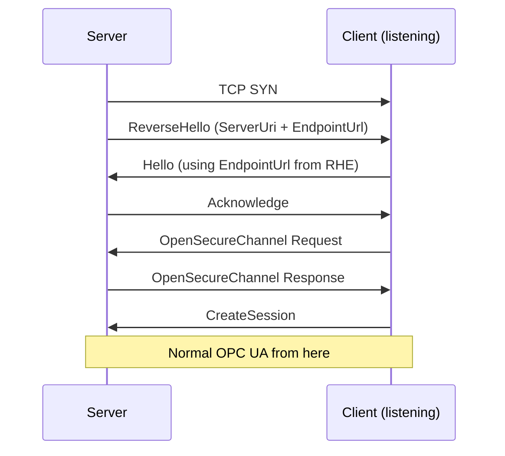
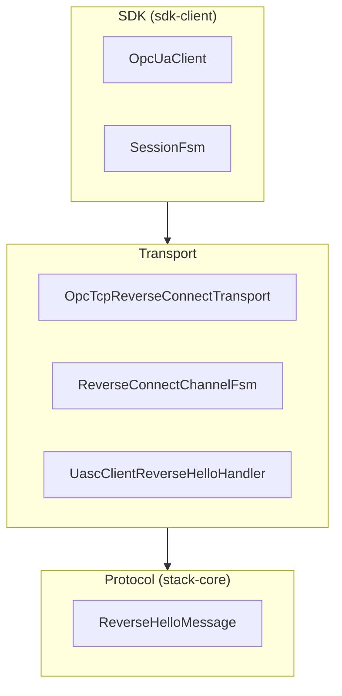
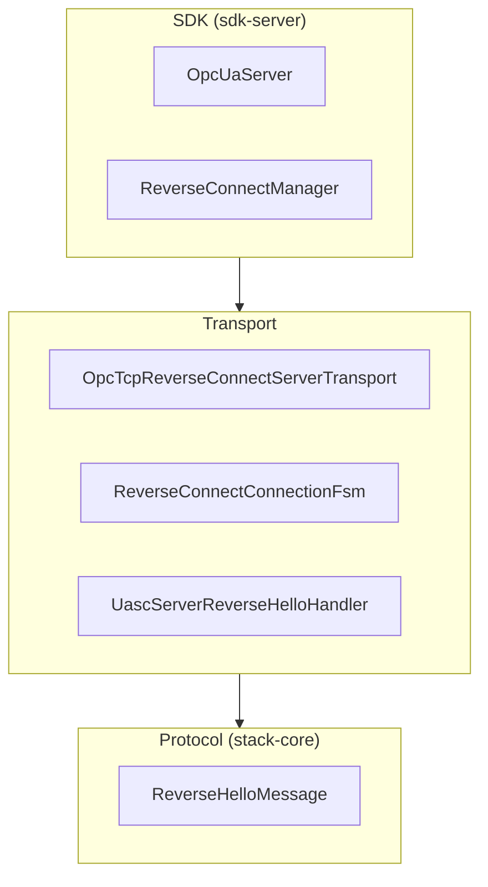
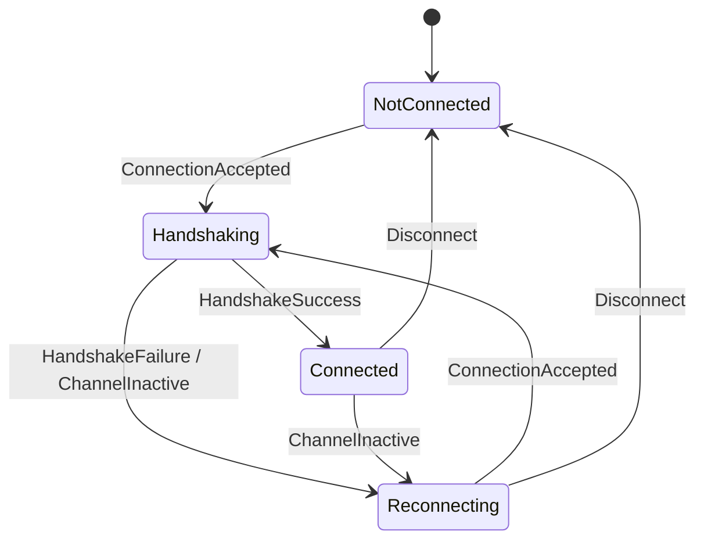
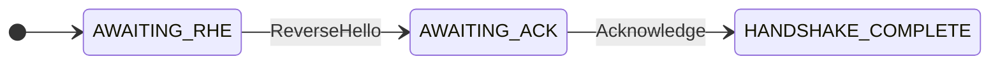
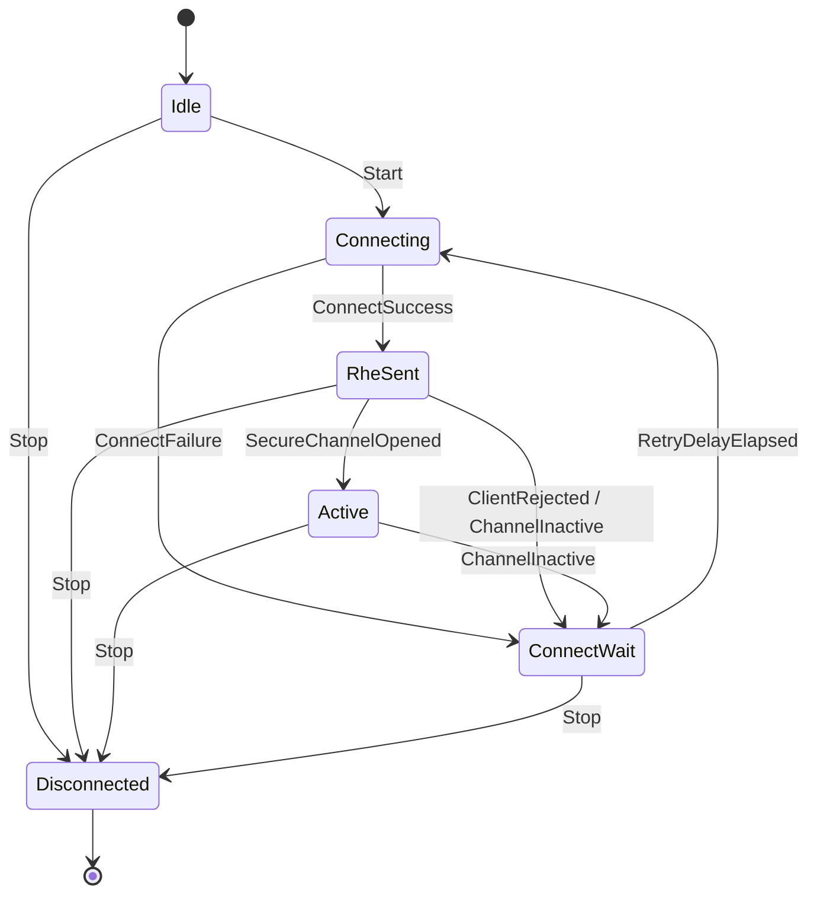

# Reverse Connect Architecture

OPC UA Reverse Connect (Part 6, Section 7.1.3) inverts the normal connection direction:
the **server** opens a TCP connection to a **client** that is listening, then the client
drives the rest of the OPC UA handshake as usual.
This allows servers behind firewalls or NAT to reach clients in a DMZ or IT network via
outbound connections that firewalls permit.

**Specification references:**

- [Part 6 Section 7.1 — Connection Protocol](https://reference.opcfoundation.org/Core/Part6/v105/docs/7)
- [Part 6 Section 7.1.3 — Establishing a Connection](https://reference.opcfoundation.org/Core/Part6/v104/7.1.3)
- [Part 2 Section 6.14 — Reverse Connect Security](https://reference.opcfoundation.org/Core/Part2/v104/docs/6.14)
- [Part 7 Section 6.6.5 — Reverse Connect Server Facet](https://reference.opcfoundation.org/Core/Part7/v104/docs/6.6.5)
- [Part 7 Section 6.6.75 — Reverse Connect Client Facet](https://reference.opcfoundation.org/v104/Core/docs/Part7/6.6.75/)

* * *

## Table of Contents

1. [Protocol Overview](#1-protocol-overview)
2. [Architecture Overview](#2-architecture-overview)
3. [Component Inventory](#3-component-inventory)
4. [Client-Side Architecture](#4-client-side-architecture)
5. [Server-Side Architecture](#5-server-side-architecture)
6. [Session Integration](#6-session-integration)
7. [Configuration Reference](#7-configuration-reference)
8. [Testing](#8-testing)
9. [Key Design Decisions](#9-key-design-decisions)

* * *

## 1. Protocol Overview

### 1.1 Handshake Sequence



After the ReverseHello + Hello exchange, everything proceeds identically to a normal
forward connection.

### 1.2 ReverseHello Message

The ReverseHello (RHE) is a Connection Protocol message (Part 6, Section 7.1.2.6). Wire
format:

```
[52 48 45 46]                 MessageType "RHE" + Reserved "F"
[MessageSize: UInt32 LE]      Total message length including header
[ServerUri length: Int32 LE]  OPC UA String length prefix
[ServerUri bytes: UTF-8]      Server's ApplicationUri (max 4096 bytes)
[EndpointUrl length: Int32 LE]
[EndpointUrl bytes: UTF-8]    Server's endpoint URL (max 4096 bytes)
```

The client validates the `ServerUri` against a whitelist (if configured) and uses the
`EndpointUrl` in its subsequent Hello message.

### 1.3 Three Distinct URLs

| Concept | Owner | Purpose |
| --- | --- | --- |
| **Client Endpoint URL** (`opc.tcp://client:port`) | Client | TCP address the client listens on; configured in the server |
| **ServerUri** (in RHE) | Server | Server’s `ApplicationUri`; used for identity/whitelist filtering |
| **EndpointUrl** (in RHE) | Server | Server’s OPC UA endpoint URL; echoed by client in Hello |

### 1.4 Idle Socket Invariant

The spec requires: *“Servers shall maintain at least one open socket without an active
Session with each Client it is configured to connect to.”*

When a connection becomes active (SecureChannel opened), the server must immediately
open a new idle connection.
This ensures the client can always initiate a new session without waiting for a server
retry cycle.

### 1.5 Discovery via Reverse Connect

For first-time connections the client typically performs a two-pass approach:

1. **Pass 1 (Discovery):** Accept RHE, open `SecurityMode.None` SecureChannel, call
   `GetEndpoints`, close.
2. **Pass 2 (Secure):** Accept next RHE (the server reconnects per the idle socket
   invariant), open SecureChannel with the desired `SecurityMode`.

The `OpcUaClient.createReverseConnect()` factory method implements this two-pass flow
automatically.

For standalone discovery without immediately creating a client (e.g., to persist
endpoint information for future connections), `DiscoveryClient` provides static
convenience methods:

```java
var rcConfig = OpcTcpReverseConnectTransportConfig.newBuilder()
    .setListenAddress(new InetSocketAddress("0.0.0.0", 48060))
    .build();

List<EndpointDescription> endpoints =
    DiscoveryClient.getEndpoints(rcConfig).get();

List<ApplicationDescription> servers =
    DiscoveryClient.findServers(rcConfig).get();
```

These methods create a listening socket, wait for a single server connection, perform
the discovery request, and fully disconnect.
Unlike `createReverseConnect()`, the listening socket is not kept open.

### 1.6 Retry Behavior

- **Client sends Error message:** Server backs off using `rejectBackoff` (default 60s).
- **Socket closes without Error:** Server reconnects with exponential backoff (capped at
  `maxReconnectDelay`, default 30s).
- Retry is **infinite** by spec.
  The only way to stop is to remove the reverse connection registration.

* * *

## 2. Architecture Overview

The implementation spans three layers matching Milo’s existing architecture.
Both sides share the protocol layer (`ReverseHelloMessage`, `MessageType.RHE`,
`TcpMessageEncoder`, `TcpMessageDecoder` in `stack-core`).

**Client side:**



**Server side:**



### Runtime Data Flow

**Client side:** The client opens a Netty `ServerBootstrap` (listening socket).
When the server connects inbound, a `ReverseHelloDecoder` (private inner class of
`OpcTcpReverseConnectTransport`) verifies the first message is an RHE, then fires a
`ConnectionAccepted` event into `ReverseConnectChannelFsm`. The FSM installs
`UascClientReverseHelloHandler` which sends Hello, receives Ack, and performs
OpenSecureChannel, producing a `ClientSecureChannel` identical to forward connect.

**Server side:** `ReverseConnectManager` holds per-client `ReverseConnectConnectionFsm`
instances. Each FSM uses `OpcTcpReverseConnectServerTransport` to make outbound TCP
connections. On connect, `UascServerReverseHelloHandler` sends the RHE then waits for
Hello. After Hello/Ack, the standard server pipeline (`UascServerAsymmetricHandler` ->
`UascServerSymmetricHandler` -> `UascServiceRequestHandler`) takes over.

* * *

## 3. Component Inventory

### 3.1 New Files

| Layer | File | Purpose |
| --- | --- | --- |
| Protocol | `stack-core/.../channel/messages/ReverseHelloMessage.java` | RHE encode/decode |
| Client Transport | `transport/.../client/tcp/OpcTcpReverseConnectTransport.java` | Listening transport |
| Client Transport | `transport/.../client/tcp/OpcTcpReverseConnectTransportConfig.java` | Config interface |
| Client Transport | `transport/.../client/tcp/OpcTcpReverseConnectTransportConfigBuilder.java` | Config builder |
| Client Transport | `transport/.../client/tcp/ReverseConnectChannelFsm.java` | Client channel FSM |
| Client Transport | `transport/.../client/uasc/UascClientReverseHelloHandler.java` | Client handshake handler |
| Client Transport | `transport/.../client/ChannelStateObservable.java` | Transport state interface |
| Server Transport | `transport/.../server/tcp/OpcTcpReverseConnectServerTransport.java` | Outbound connector |
| Server Transport | `transport/.../server/tcp/ReverseConnectConnectionFsm.java` | Server connection FSM |
| Server Transport | `transport/.../server/uasc/UascServerReverseHelloHandler.java` | Server handshake handler |
| Server Transport | `transport/.../server/uasc/SecureChannelOpenedEvent.java` | Netty user event for FSM |
| SDK Server | `sdk-server/.../server/ReverseConnectManager.java` | Orchestrator |
| SDK Server | `transport/.../server/tcp/ReverseConnectConfig.java` | Manager config interface |
| SDK Server | `transport/.../server/tcp/ReverseConnectConfigBuilder.java` | Manager config builder |
| SDK Server | `sdk-server/.../server/ReverseConnectHandle.java` | Registration handle |
| Examples | `milo-examples/client-examples/.../ReverseConnectExampleProsys.java` | Client example |
| Tests | `integration-tests/.../client/ReverseConnectTest.java` | SDK integration tests |
| Tests | `integration-tests/.../client/tcp/OpcTcpReverseConnectTransportTest.java` | Transport integration test |
| Tests | `stack-core/.../channel/messages/ReverseHelloMessageTest.java` | RHE encode/decode unit test |
| Tests | `transport/.../client/tcp/ReverseConnectChannelFsmTest.java` | Client FSM unit test |
| Tests | `transport/.../client/uasc/UascClientReverseHelloHandlerTest.java` | Client handler unit test |
| Tests | `transport/.../server/tcp/OpcTcpReverseConnectServerTransportTest.java` | Server transport unit test |
| Tests | `transport/.../server/tcp/ReverseConnectConnectionFsmTest.java` | Server FSM unit test |
| Tests | `transport/.../server/uasc/UascServerReverseHelloHandlerTest.java` | Server handler unit test |
| Tests | `sdk-server/.../server/ReverseConnectManagerTest.java` | Manager unit test |
| Tests | `integration-tests/.../client/ReverseConnectDiscoveryTest.java` | Discovery integration test |

### 3.2 Base Paths

Base directories for locating files:

```
opc-ua-stack/stack-core/src/main/java/org/eclipse/milo/opcua/stack/core/
opc-ua-stack/transport/src/main/java/org/eclipse/milo/opcua/stack/transport/
opc-ua-sdk/sdk-client/src/main/java/org/eclipse/milo/opcua/sdk/client/
opc-ua-sdk/sdk-server/src/main/java/org/eclipse/milo/opcua/sdk/server/
opc-ua-sdk/integration-tests/src/test/java/org/eclipse/milo/opcua/sdk/client/
```

* * *

## 4. Client-Side Architecture

### 4.1 Transport: `OpcTcpReverseConnectTransport`

The primary client-side component.
Extends `AbstractUascClientTransport` and implements `ChannelStateObservable`.

**Key difference from `OpcTcpClientTransport`:** Uses a Netty `ServerBootstrap` (listens
for inbound connections) instead of a client `Bootstrap` (outbound connections).

**Connection flow:**

```
connect(applicationContext)
  |-- stores application context in FSM
  |-- starts ServerBootstrap.bind(listenAddress) if not already listening
  |-- installs ReverseHelloDecoder on each accepted child channel
  |-- fires Event.Connect into ReverseConnectChannelFsm
  |-- returns CompletableFuture<Unit>
```

Each accepted child channel gets a `ReverseHelloDecoder` — a minimal
`ByteToMessageDecoder` that reads the first message, verifies it is an RHE, and fires
`ConnectionAccepted` into the FSM. The decoder then removes itself.

### 4.2 Client Channel FSM: `ReverseConnectChannelFsm`

Built on `strict-machine` (`com.digitalpetri.fsm`). Manages the lifecycle of a single
reverse-connected channel.

**States:**



| State | Description |
| --- | --- |
| `NotConnected` | Listening, no server has connected. `Connect` events queue futures. |
| `Handshaking` | RHE received. `UascClientReverseHelloHandler` installed on the channel. Hello/Ack/OPN in progress. `Disconnect` events are shelved. |
| `Connected` | SecureChannel active. Pending `Connect`/`GetChannel` futures are completed with the channel. |
| `Reconnecting` | Channel lost. Old state cleared. Waiting for server to reconnect. Pending futures are chained to a new future that will be completed on the next successful handshake. |

**Context keys:**

| Key | Type | Purpose |
| --- | --- | --- |
| `KEY_CF` | `ConnectFuture` | Pending connect future (wraps `CompletableFuture<Channel>`); chained across reconnections |
| `KEY_CHANNEL` | `Channel` | Current active Netty channel |
| `KEY_SECURE_CHANNEL` | `ClientSecureChannel` | Current secure channel |
| `KEY_APPLICATION` | `ClientApplicationContext` | Stored before connect |

### 4.3 Handshake Handler: `UascClientReverseHelloHandler`

Installed on accepted child channels by the FSM’s `Handshaking` entry action.
Structurally similar to `UascClientAcknowledgeHandler` but with an extra step: process
the RHE before sending Hello.

**Handler state (private enum, not a `strict-machine` FSM):**

A `volatile State` field tracks which message the handler expects next in `channelRead`:



**Sequence:**

1. Decode RHE, validate `serverUri` against `allowedServerUris`
2. If rejected: send Error message, close channel
3. If accepted: send Hello (using `endpointUrl` from RHE)
4. Receive Acknowledge, negotiate buffer sizes
5. Install `UascClientMessageHandler` (performs OpenSecureChannel)
6. Complete handshake future with `ClientSecureChannel`

Messages written during handshake are buffered and flushed after
`UascClientMessageHandler` is installed.

**RHE dispatch detail:** The `ReverseHelloDecoder` on the child channel already consumed
and decoded the raw RHE bytes.
The FSM’s `Handshaking` entry action passes the decoded `ReverseHelloMessage` directly
to `handler.onReverseHello(ctx, rhe)` rather than re-encoding to bytes and dispatching
through the pipeline, which avoids issues with `ByteToMessageCodec` pipeline dispatch.

### 4.4 `ChannelStateObservable` Interface

Decouples `SessionFsm` from the specific transport type:

```java
public interface ChannelStateObservable {

    void addTransitionListener(TransitionListener listener);
    void removeTransitionListener(TransitionListener listener);

    interface TransitionListener {
        void onConnectionStateChange(boolean connected);
    }
}
```

Implemented by both `OpcTcpClientTransport` (forward) and
`OpcTcpReverseConnectTransport` (reverse).
The `SessionFsm` checks for `instanceof ChannelStateObservable` rather than casting to a
concrete transport type.

### 4.5 Client API

**Discovery factory (recommended for new connections):**

```java
var transportConfig = OpcTcpReverseConnectTransportConfig.newBuilder()
    .setListenAddress(new InetSocketAddress("0.0.0.0", 48060))
    .addAllowedServerUri("urn:example:server")  // optional filter
    .build();

OpcUaClient client = OpcUaClient.createReverseConnect(
    transportConfig,
    endpoints -> endpoints.stream()
        .filter(e -> SecurityPolicy.None.getUri()
            .equals(e.getSecurityPolicyUri()))
        .findFirst(),
    config -> config
        .setApplicationName(LocalizedText.english("My Client"))
        .setApplicationUri("urn:example:client")
).get(60, TimeUnit.SECONDS);

client.connect().get();
```

The factory performs two-pass discovery automatically: it opens a `SecurityMode.None`
SecureChannel on the first accepted connection to call `GetEndpoints`, tears down the
channel (but keeps the listening socket open), then returns an `OpcUaClient` wired to
the same transport. The caller then calls `connect()` to establish the real session on
the server’s next inbound connection.

**Standalone discovery (for persist-and-reuse workflows):**

```java
var rcConfig = OpcTcpReverseConnectTransportConfig.newBuilder()
    .setListenAddress(new InetSocketAddress("0.0.0.0", 48060))
    .addAllowedServerUri("urn:example:server")
    .build();

// Discover endpoints (creates and tears down transport internally)
List<EndpointDescription> endpoints =
    DiscoveryClient.getEndpoints(rcConfig).get();

// Persist the selected endpoint for future use
EndpointDescription selected = pickBest(endpoints);
saveToFile(selected);
```

This is the reverse connect counterpart to `DiscoveryClient.getEndpoints(endpointUrl)`
for forward connect.
The transport lifecycle (listen, accept, request, disconnect) is fully managed by the
static method. Use this when endpoint information will be persisted and reused across
application restarts, avoiding the two-pass overhead on subsequent connections.

**Direct construction (when endpoints are already known):**

```java
var transport = new OpcTcpReverseConnectTransport(transportConfig);
var client = new OpcUaClient(clientConfig, transport);
client.connect().get();
```

* * *

## 5. Server-Side Architecture

### 5.1 `ReverseConnectManager`

The SDK-level orchestrator.
Manages per-client FSMs, enforces the idle socket invariant, and provides the public
API.

**Responsibilities:**

1. Manages `ConcurrentHashMap<ReverseConnectHandle, Fsm<State, Event>>` of per-client
   connection FSMs
2. Maintains a secondary index `handlesByClientUrl` for sibling lookups
3. Enforces the idle socket invariant via `ensureIdleConnection()` callback
4. Supports deferred registration (registrations added before `start()`)
5. Coordinates with `OpcUaServer` startup/shutdown

**Lifecycle:**

```
OpcUaServer.setReverseConnectManager(manager)   // before startup()
OpcUaServer.startup()
  |-- binds normal endpoints
  |-- calls manager.start(applicationContext, serverUri)
        |-- drains pending registrations
        |-- resolves endpoint URLs
        |-- creates FSMs, fires Start events

// At runtime:
server.addReverseConnect("opc.tcp://client:48060")
  |-- creates FSM + handle, fires Start event

// Shutdown:
OpcUaServer.shutdown()
  |-- unbinds normal endpoints
  |-- calls manager.stop() (non-blocking)
        |-- fires Stop on all FSMs
  |-- tears down namespaces and subscriptions
  |-- returns future that completes when manager has stopped
```

**Idle socket invariant enforcement:**

Each FSM is constructed with an `onActiveCallback` lambda.
When an FSM transitions to `Active` (client opened a SecureChannel on the connection),
the callback calls `ensureIdleConnection(clientEndpointUrl, endpointUrl)`. This method
checks whether any existing FSM for the same client URL is in an idle state (not
`Active`, not `Disconnected`). If none is idle and the manager is still running, a new
anonymous FSM is created and started.

**Pre-start registration:**

Registrations added before `start()` are stored as `PendingRegistration` records.
During `start()`, any registration with a `null` endpoint URL is resolved to the
server’s primary endpoint URL (first non-discovery endpoint).

### 5.2 Transport: `OpcTcpReverseConnectServerTransport`

A thin component that initiates outbound TCP connections to client listening addresses.
**Not** an `OpcServerTransport` — it does not implement `bind()`/`unbind()`.

```java
public CompletableFuture<Channel> connect(
    ServerApplicationContext applicationContext,
    InetSocketAddress clientAddress,
    String serverUri,
    String endpointUrl,
    long connectTimeoutMs)
```

Creates a Netty `Bootstrap`, installs `UascServerReverseHelloHandler`, and calls
`bootstrap.connect(clientAddress)`. The handler sends the RHE immediately on
`channelActive()`.

**Note:** `RateLimitingHandler` is **not** installed on Reverse Connect channels since
the server initiates these connections.

### 5.3 Server Connection FSM: `ReverseConnectConnectionFsm`

Built on `strict-machine`. Manages the lifecycle of a single outbound reverse connection
to a client.

**States:**



| State | Description |
| --- | --- |
| `Idle` | Initial state. Accepts `Start` or `Stop`. |
| `Connecting` | TCP connect in progress. Entry action initiates `transport.connect()`. `Stop` events are shelved. |
| `ConnectWait` | Backoff before retry. Entry action schedules a `RetryDelayElapsed` timer with exponential backoff. Exit action cancels the timer. |
| `RheSent` | TCP connected, RHE sent. Entry action stores channel, resets backoff, and monitors for `SecureChannelOpened` via a Netty user event. |
| `Active` | Client has opened a SecureChannel. Entry action resets backoff. The `onActiveCallback` fires to enforce the idle socket invariant. |
| `Disconnected` | Terminal. Cleans up channel and retry timers. Completes `Stop` futures. |

**Reconnection with exponential backoff:**

- Initial delay: `connectIntervalMs` (default 5s)
- After each retry: `delay = min(delay * 2, maxReconnectDelayMs)` (default max 30s)
- After client rejection (Error message): uses `rejectBackoffMs` (default 60s) as an
  override via `executeFirst` in the FSM builder
- Backoff resets on successful TCP connect (transition to `RheSent`)

**SecureChannel detection:**

The FSM monitors for `SecureChannelOpenedEvent` (a Netty user event) fired by
`UascServerAsymmetricHandler` when OpenSecureChannel completes.
A small inline `ChannelInboundHandlerAdapter` is added to the pipeline in the `RheSent`
entry action to capture this event.

### 5.4 Handshake Handler: `UascServerReverseHelloHandler`

Extends `UascServerHelloHandler` for maximum code reuse.
The only new behavior: sends the RHE on `channelActive()` before starting the Hello
deadline timer.

```
channelActive()
  |-- encode and send ReverseHelloMessage(serverUri, endpointUrl)
  |-- call super.channelActive() (starts Hello deadline timer)

// Then inherits:
channelRead()  → onHello() → validate, send Ack, install asymmetric handler
```

`UascServerHelloHandler` was modified to make `config`, `application`,
`transportProfile` fields and the `onHello()` method `protected` for clean subclassing.

### 5.5 Server API

```java
// Setup (before startup)
var rcConfig = ReverseConnectConfig.newBuilder()
    .setConnectInterval(Duration.ofSeconds(5))
    .setConnectTimeout(Duration.ofSeconds(5))
    .setRejectBackoff(Duration.ofSeconds(60))
    .setMaxReconnectDelay(Duration.ofSeconds(30))
    .build();

var transportConfig = OpcTcpServerTransportConfig.newBuilder().build();
var manager = new ReverseConnectManager(rcConfig, transportConfig);
server.setReverseConnectManager(manager);
server.startup().get();

// Add reverse connections (can be before or after startup)
ReverseConnectHandle h1 = server.addReverseConnect("opc.tcp://client1:48060");
ReverseConnectHandle h2 = server.addReverseConnect(
    "opc.tcp://client2:48060",
    "opc.tcp://my-server:4840/custom-path"  // explicit endpoint URL
);

// Remove at runtime
server.removeReverseConnect(h1);

// Shutdown stops all reverse connections
server.shutdown().get();
```

`addReverseConnect(clientEndpointUrl)` resolves the endpoint URL from the server’s
primary endpoint. `addReverseConnect(clientEndpointUrl, endpointUrl)` allows an explicit
override.

`removeReverseConnect(handle)` stops the handle’s FSM **and all sibling FSMs** for the
same client URL (including any idle socket FSMs spawned by the invariant enforcement).

* * *

## 6. Session Integration

### 6.1 SessionFsm Connection Loss Detection

The `SessionFsm` detects connection loss through `ChannelStateObservable`. During
session activation, `SessionFsmFactory` installs a `TransitionListener` on the
transport:

```java
if (transport instanceof ChannelStateObservable observable) {
    observable.addTransitionListener(connected -> {
        if (!connected) {
            fsm.fireEvent(new Event.ConnectionLost());
        }
    });
}
```

This works identically for both forward and Reverse Connect transports.
On connection loss, the `SessionFsm` transitions through `ReactivatingWait` →
`Reactivating` to re-establish the session when the channel recovers.

### 6.2 Transparent Reconnection

For Reverse Connect, reconnection is **passive**: the client waits for the server to
make a new outbound connection.
The `ReverseConnectChannelFsm` transitions to `Reconnecting` on `ChannelInactive`, then
back to `Handshaking` when the server reconnects.
The `SessionFsm` is unaware of this distinction — it only observes the
`connected`/`not connected` state changes.

### 6.3 Service Request Routing

`SessionFsm` sends service requests through `transport.sendRequestMessage()`. The
`AbstractUascClientTransport` base class routes them to `getChannel()`, which in
`OpcTcpReverseConnectTransport` delegates to the FSM. If the FSM is in `Connected`
state, the current channel is returned immediately.
Otherwise, a `GetChannel` event is fired and the returned future completes when a
channel becomes available.

* * *

## 7. Configuration Reference

### 7.1 Client Transport Config

`OpcTcpReverseConnectTransportConfig` extends `OpcClientTransportConfig` and
`UascClientConfig`.

| Property | Type | Default | Description |
| --- | --- | --- | --- |
| `listenAddress` | `InetSocketAddress` | *(required)* | Address/port the client binds to. Use port `0` for OS-assigned. |
| `allowedServerUris` | `Set<String>` | empty (accept all) | Server URIs accepted in ReverseHello. Empty permits any server. |
| `reverseHelloTimeout` | `long` (ms) | 30,000 | Timeout for receiving RHE after TCP accept. |
| `serverBootstrapCustomizer` | `Consumer<ServerBootstrap>` | no-op | Hook to customize the Netty `ServerBootstrap`. |
| `acknowledgeTimeout` | `UInteger` (ms) | 5,000 | Inherited. Timeout for Acknowledge after Hello. |
| `channelLifetime` | `UInteger` (ms) | 3,600,000 | Inherited. SecureChannel lifetime. |

### 7.2 Server Reverse Connect Config

`ReverseConnectConfig` configures the `ReverseConnectManager`.

| Property | Type | Default | Description |
| --- | --- | --- | --- |
| `connectInterval` | `Duration` | 5s | Initial interval between reconnection attempts. |
| `connectTimeout` | `Duration` | 5s | TCP connect timeout per attempt. |
| `rejectBackoff` | `Duration` | 60s | Backoff after client sends an Error (explicit rejection). |
| `maxReconnectDelay` | `Duration` | 30s | Ceiling for exponential backoff. |

* * *

## 8. Testing

### 8.1 Integration Tests

Test class:
`opc-ua-sdk/integration-tests/src/test/java/org/eclipse/milo/opcua/sdk/client/ReverseConnectTest.java`

Run with:

```bash
mvn -q verify -pl opc-ua-sdk/integration-tests -Dtest=ReverseConnectTest
```

| Test | What It Validates |
| --- | --- |
| `reverseConnectSession` | Basic end-to-end: client listens, server connects, session established, data read succeeds. |
| `reverseConnectReconnection` | After forced channel closure, session re-establishes automatically via `SessionActivityListener`. |
| `multipleClientsConnectIndependently` | Two clients on different ports maintain independent sessions with the same server. |
| `reverseConnectServerUriRejection` | Client with `allowedServerUris` rejects non-matching server; connection times out. |
| `shutdownCompletesWithoutDeadlock` | Verifies server shutdown completes cleanly without deadlocking the FSM executor. |

**Test setup patterns:**

- Uses accelerated timings (`connectInterval=500ms`, `rejectBackoff=500ms`,
  `maxReconnectDelay=2s`) to speed up retry cycles.
- Clients bind to `localhost:0` (OS-assigned port) and read the actual port via
  reflection on the transport’s `serverChannel` field.
- Server registration via `server.addReverseConnect(url, endpointUrl)` happens **after**
  the client starts listening.
- 30-second timeout on all futures to accommodate the full lifecycle.

### 8.2 Unit Tests

Unit tests for individual components live alongside their source in the standard Maven
test directories:

```bash
# ReverseHelloMessage encode/decode
mvn -q verify -pl opc-ua-stack/stack-core -Dtest=ReverseHelloMessageTest

# Client FSM state transitions
mvn -q verify -pl opc-ua-stack/transport -Dtest=ReverseConnectChannelFsmTest

# Client handshake handler
mvn -q verify -pl opc-ua-stack/transport -Dtest=UascClientReverseHelloHandlerTest

# Server transport outbound connect
mvn -q verify -pl opc-ua-stack/transport -Dtest=OpcTcpReverseConnectServerTransportTest

# Server FSM state transitions and backoff
mvn -q verify -pl opc-ua-stack/transport -Dtest=ReverseConnectConnectionFsmTest

# Server handshake handler
mvn -q verify -pl opc-ua-stack/transport -Dtest=UascServerReverseHelloHandlerTest

# ReverseConnectManager orchestration
mvn -q verify -pl opc-ua-sdk/sdk-server -Dtest=ReverseConnectManagerTest
```

The transport-level and discovery integration tests (client listening + server
connecting within a single JVM):

```bash
mvn -q verify -pl opc-ua-sdk/integration-tests -Dtest=OpcTcpReverseConnectTransportTest

# DiscoveryClient reverse connect methods (getEndpoints, findServers)
mvn -q verify -pl opc-ua-sdk/integration-tests -Dtest=ReverseConnectDiscoveryTest
```

### 8.3 Writing New Tests

When adding tests for Reverse Connect:

1. Create `OpcTcpReverseConnectTransportConfig` with `localhost:0`
2. Construct `OpcTcpReverseConnectTransport` and `OpcUaClient` directly
3. Call `client.connectAsync()` first (starts listening)
4. Use `getListenPort()` helper to discover the bound port
5. Register the server target with `server.addReverseConnect()`
6. Wait for the connect future (up to 30s)
7. Clean up with `server.removeReverseConnect()` and `client.disconnectAsync()`

* * *

## 9. Key Design Decisions

### Separate Transport Class vs. Mode Flag

`OpcTcpReverseConnectTransport` is a separate class from `OpcTcpClientTransport` rather
than a mode flag because the connection lifecycles are fundamentally different (listen
vs. connect). The existing `ChannelFsm` from `digitalpetri-netty-fsm` assumes
client-initiated connections and cannot be reused.
The WebSocket transport (`OpcWebSocketClientTransport`) is precedent for separate
transport classes.

### strict-machine for FSMs

Both client and server FSMs use `strict-machine` (`com.digitalpetri.fsm`) directly
rather than the higher-level `ChannelFsm` library.
`strict-machine` is already a transitive dependency (used by `SessionFsm`) and provides
enum states, class-based events with data, serialized execution, typed context store,
and event shelving — all needed for the Reverse Connect lifecycle.

### ReverseConnectManager at SDK Level

The manager lives in `sdk-server`, not `transport`, because retry/pooling logic is
application-level policy (configurable intervals, dynamic add/remove).
The transport layer only handles single outbound connections.

### ChannelStateObservable Abstraction

Rather than adding more `instanceof` checks in `SessionFsmFactory`, a
`ChannelStateObservable` interface was introduced.
Both forward and reverse transports implement it, providing a clean abstraction for
session-layer connection monitoring.

### Server Handler via Inheritance

`UascServerReverseHelloHandler` extends `UascServerHelloHandler` rather than duplicating
code. The only new behavior is sending the RHE on `channelActive()`. All Hello
processing, buffer negotiation, and pipeline installation is inherited.
This required making three fields and one method `protected` in the parent class.

### Dynamic Registration API

Reverse Connect targets are added/removed at runtime via `server.addReverseConnect()` /
`server.removeReverseConnect()` rather than through static configuration.
This matches other OPC UA SDKs (.NET Standard, open62541, Prosys) and reflects that
Reverse Connect targets are operational configuration that may change at runtime.

### Two-Pass Discovery in Client Factory

`OpcUaClient.createReverseConnect()` performs endpoint discovery on the first accepted
connection, tears down the channel (keeping the listener socket open), then returns a
client wired to the same transport.
The server reconnects per the idle socket invariant, and the caller’s subsequent
`connect()` establishes the real session.
This mirrors how `OpcUaClient.create(String endpointUrl)` works for forward connect.
