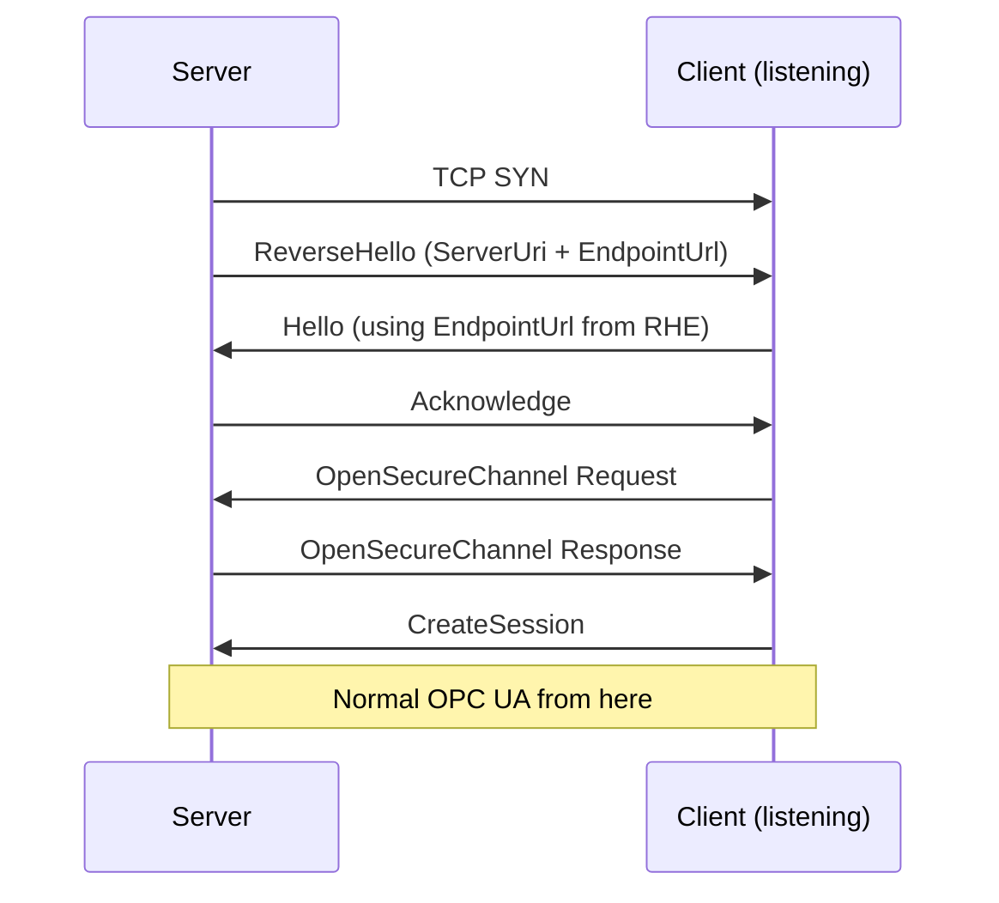
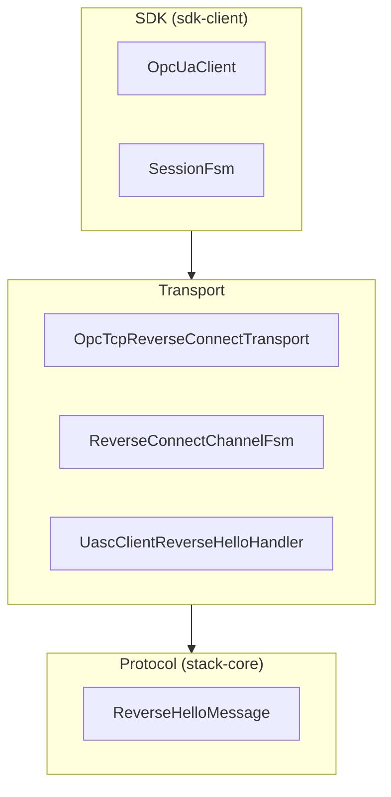
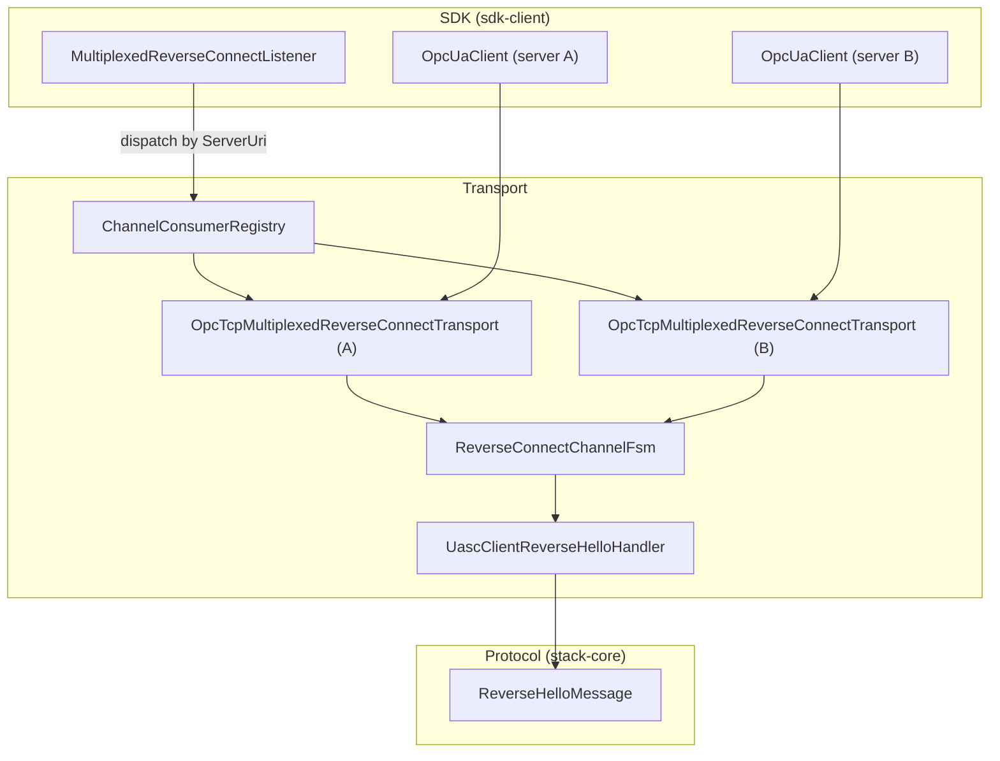
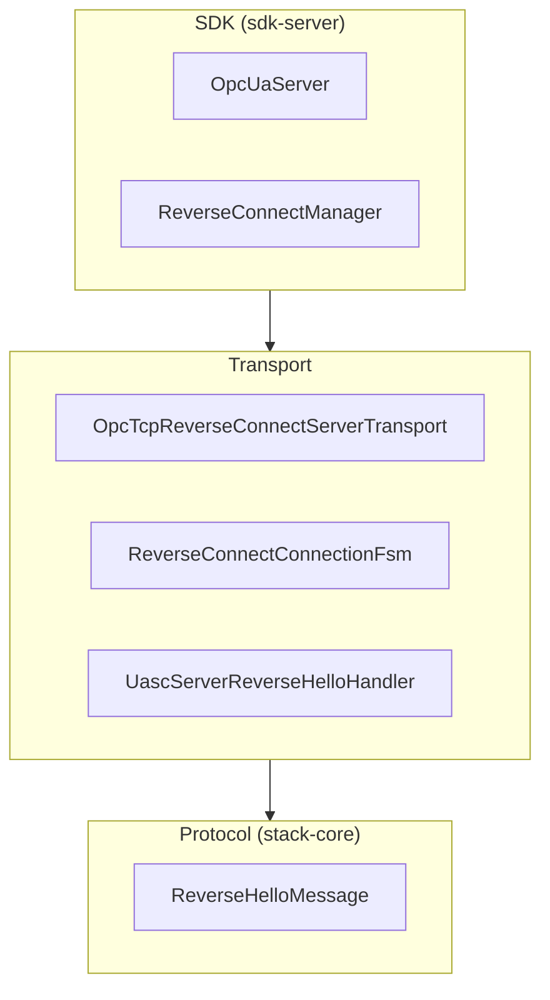
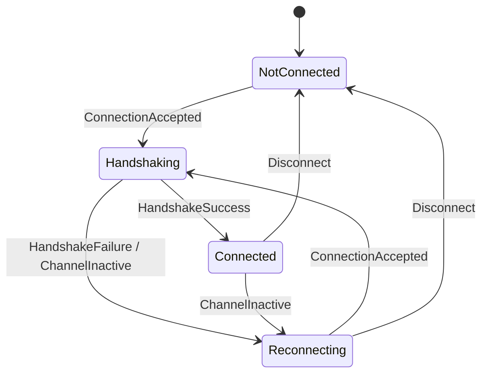
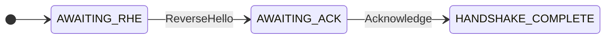
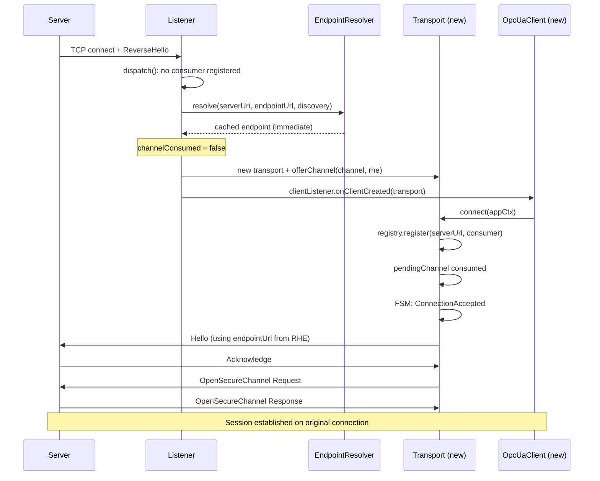
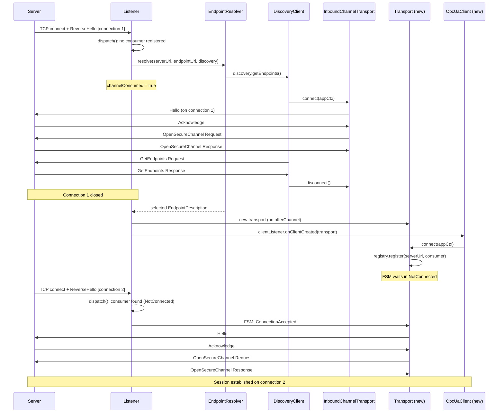
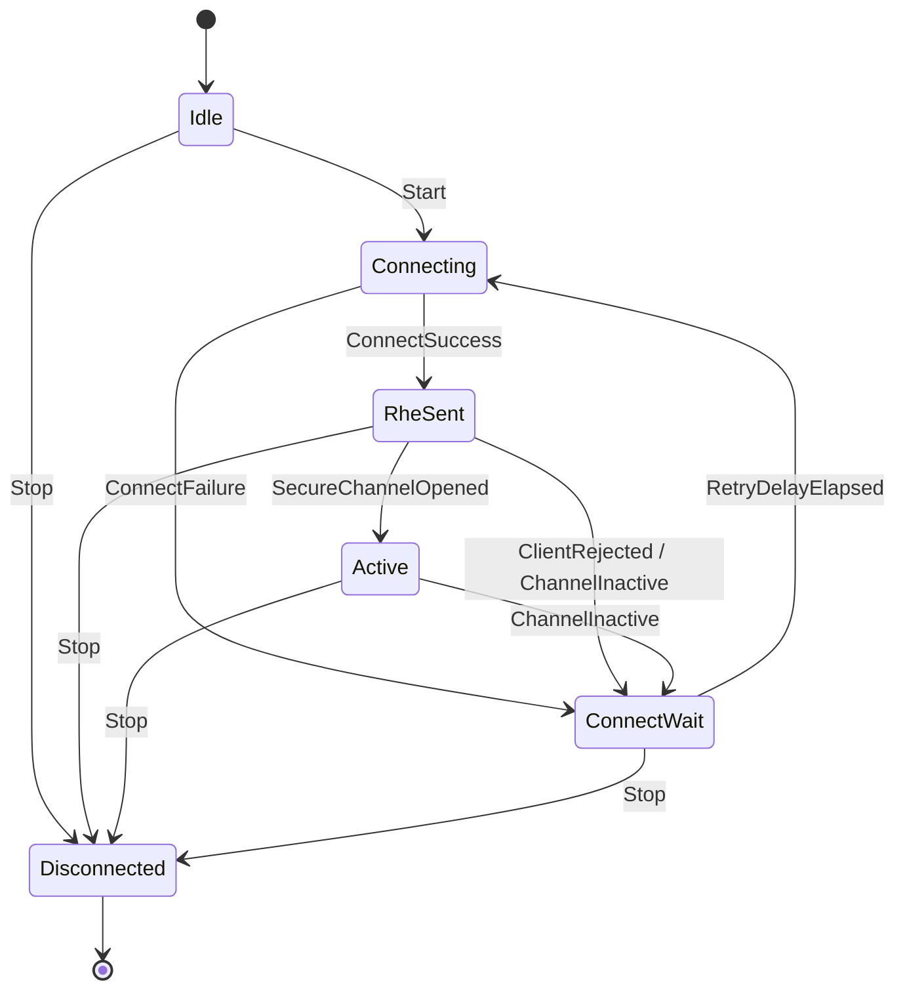

# Reverse Connect Architecture

OPC UA Reverse Connect (Part 6, Section 7.1.3) inverts the normal connection direction:
the **server** opens a TCP connection to a **client** that is listening, then the client
drives the rest of the OPC UA handshake as usual.
This allows servers behind firewalls or NAT to reach clients in a DMZ or IT network via
outbound connections that firewalls permit.

**Specification references:**

- [Part 6 Section 7.1 — Connection Protocol](https://reference.opcfoundation.org/Core/Part6/v105/docs/7)
- [Part 6 Section 7.1.3 — Establishing a Connection](https://reference.opcfoundation.org/Core/Part6/v104/7.1.3)
- [Part 2 Section 6.14 — Reverse Connect Security](https://reference.opcfoundation.org/Core/Part2/v104/docs/6.14)
- [Part 7 Section 6.6.5 — Reverse Connect Server Facet](https://reference.opcfoundation.org/Core/Part7/v104/docs/6.6.5)
- [Part 7 Section 6.6.75 — Reverse Connect Client Facet](https://reference.opcfoundation.org/v104/Core/docs/Part7/6.6.75/)

* * *

## Table of Contents

1. [Protocol Overview](#1-protocol-overview)
2. [Architecture Overview](#2-architecture-overview)
3. [Component Inventory](#3-component-inventory)
4. [Client-Side Architecture: 1-1 Transport](#4-client-side-architecture-1-1-transport)
5. [Client-Side Architecture: Multiplexed Transport](#5-client-side-architecture-multiplexed-transport)
6. [Server-Side Architecture](#6-server-side-architecture)
7. [Session Integration](#7-session-integration)
8. [Configuration Reference](#8-configuration-reference)
9. [Testing](#9-testing)
10. [Key Design Decisions](#10-key-design-decisions)

* * *

## 1. Protocol Overview

### 1.1 Handshake Sequence



After the ReverseHello + Hello exchange, everything proceeds identically to a normal
forward connection.

### 1.2 ReverseHello Message

The ReverseHello (RHE) is a Connection Protocol message (Part 6, Section 7.1.2.6). Wire
format:

```
[52 48 45 46]                 MessageType "RHE" + Reserved "F"
[MessageSize: UInt32 LE]      Total message length including header
[ServerUri length: Int32 LE]  OPC UA String length prefix
[ServerUri bytes: UTF-8]      Server's ApplicationUri (max 4096 bytes)
[EndpointUrl length: Int32 LE]
[EndpointUrl bytes: UTF-8]    Server's endpoint URL (max 4096 bytes)
```

The client validates the `ServerUri` against a whitelist (if configured) and uses the
`EndpointUrl` in its subsequent Hello message.

### 1.3 Three Distinct URLs

| Concept | Owner | Purpose |
| --- | --- | --- |
| **Client Endpoint URL** (`opc.tcp://client:port`) | Client | TCP address the client listens on; configured in the server |
| **ServerUri** (in RHE) | Server | Server’s `ApplicationUri`; used for identity/whitelist filtering |
| **EndpointUrl** (in RHE) | Server | Server’s OPC UA endpoint URL; echoed by client in Hello |

### 1.4 Idle Socket Invariant

The spec requires: *“Servers shall maintain at least one open socket without an active
Session with each Client it is configured to connect to.”*

When a connection becomes active (SecureChannel opened), the server must immediately
open a new idle connection.
This ensures the client can always initiate a new session without waiting for a server
retry cycle.

### 1.5 Discovery via Reverse Connect

For first-time connections the client typically performs a two-pass approach:

1. **Pass 1 (Discovery):** Accept RHE, open `SecurityMode.None` SecureChannel, call
   `GetEndpoints`, close.
2. **Pass 2 (Secure):** Accept next RHE (the server reconnects per the idle socket
   invariant), open SecureChannel with the desired `SecurityMode`.

The `OpcUaClient.createReverseConnect()` factory method implements this two-pass flow
automatically.

For standalone discovery without immediately creating a client (e.g., to persist
endpoint information for future connections), `DiscoveryClient` provides static
convenience methods:

```java
var rcConfig = OpcTcpReverseConnectTransportConfig.newBuilder()
    .setListenAddress(new InetSocketAddress("0.0.0.0", 48060))
    .build();

List<EndpointDescription> endpoints =
    DiscoveryClient.getEndpoints(rcConfig).get();

List<ApplicationDescription> servers =
    DiscoveryClient.findServers(rcConfig).get();
```

These methods create a listening socket, wait for a single server connection, perform
the discovery request, and fully disconnect.
Unlike `createReverseConnect()`, the listening socket is not kept open.

### 1.6 Retry Behavior

- **Client sends Error message:** Server backs off using `rejectBackoff` (default 60s).
- **Socket closes without Error:** Server reconnects with exponential backoff (capped at
  `maxReconnectDelay`, default 30s).
- Retry is **infinite** by spec.
  The only way to stop is to remove the reverse connection registration.

* * *

## 2. Architecture Overview

The implementation spans three layers matching Milo’s existing architecture.
Both sides share the protocol layer (`ReverseHelloMessage`, `MessageType.RHE`,
`TcpMessageEncoder`, `TcpMessageDecoder` in `stack-core`).

### 2.1 Two Client Transport Models

Milo provides two client-side transport models for Reverse Connect:

| Model | Transport Class | Listening Socket | Use Case |
| --- | --- | --- | --- |
| **1-1** | `OpcTcpReverseConnectTransport` | Each transport owns its own `ServerBootstrap` | Single server per port; simplest setup |
| **Multiplexed** | `OpcTcpMultiplexedReverseConnectTransport` | Shared via `MultiplexedReverseConnectListener` | Multiple servers on one port; on-demand client creation |

Both models reuse the same `ReverseConnectChannelFsm` for channel lifecycle management
and `UascClientReverseHelloHandler` for the handshake.
The FSM is parameterized via a `ChannelFsmConfig` record that decouples it from the
specific transport type.

### 2.2 1-1 Client Architecture



### 2.3 Multiplexed Client Architecture



The `MultiplexedReverseConnectListener` (SDK layer) owns a single `ServerBootstrap` and
decodes ReverseHello messages.
It dispatches each accepted channel to the correct per-server
`OpcTcpMultiplexedReverseConnectTransport` (transport layer) via the
`ChannelConsumerRegistry` interface.
For unknown servers, an optional `EndpointResolver` can perform on-demand endpoint
discovery and client creation.

### 2.4 Server Architecture



### 2.5 Runtime Data Flow

**1-1 client:** The transport opens a Netty `ServerBootstrap` (listening socket).
When the server connects inbound, a `ReverseHelloDecoder` (private inner class of
`OpcTcpReverseConnectTransport`) verifies the first message is an RHE, then fires a
`ConnectionAccepted` event into `ReverseConnectChannelFsm`. The FSM installs
`UascClientReverseHelloHandler` which sends Hello, receives Ack, and performs
OpenSecureChannel, producing a `ClientSecureChannel` identical to forward connect.

**Multiplexed client:** The `MultiplexedReverseConnectListener` owns the
`ServerBootstrap`. Its `ReverseHelloDecoder` decodes the RHE and calls `dispatch()`,
which looks up the `ServerUri` in the consumer registry and fires `ConnectionAccepted`
into the matching transport’s FSM. If no consumer is registered and an
`EndpointResolver` is configured, the listener performs endpoint resolution (1-shot or
2-shot) and creates a new transport on demand.

**Server side:** `ReverseConnectManager` holds per-client `ReverseConnectConnectionFsm`
instances. Each FSM uses `OpcTcpReverseConnectServerTransport` to make outbound TCP
connections. On connect, `UascServerReverseHelloHandler` sends the RHE then waits for
Hello. After Hello/Ack, the standard server pipeline (`UascServerAsymmetricHandler` ->
`UascServerSymmetricHandler` -> `UascServiceRequestHandler`) takes over.

* * *

## 3. Component Inventory

### 3.1 Files

#### Protocol Layer

| File | Purpose |
| --- | --- |
| `stack-core/.../channel/messages/ReverseHelloMessage.java` | RHE encode/decode |

#### Client Transport — Shared

| File | Purpose |
| --- | --- |
| `transport/.../client/tcp/ReverseConnectChannelFsm.java` | Client channel FSM (shared by 1-1 and multiplexed) |
| `transport/.../client/uasc/UascClientReverseHelloHandler.java` | Client handshake handler |
| `transport/.../client/ChannelStateObservable.java` | Transport state observation interface |

#### Client Transport — 1-1

| File | Purpose |
| --- | --- |
| `transport/.../client/tcp/OpcTcpReverseConnectTransport.java` | 1-1 listening transport |
| `transport/.../client/tcp/OpcTcpReverseConnectTransportConfig.java` | 1-1 config interface |
| `transport/.../client/tcp/OpcTcpReverseConnectTransportConfigBuilder.java` | 1-1 config builder |

#### Client Transport — Multiplexed

| File | Purpose |
| --- | --- |
| `transport/.../client/tcp/OpcTcpMultiplexedReverseConnectTransport.java` | Per-server multiplexed transport |
| `transport/.../client/tcp/OpcTcpMultiplexedReverseConnectTransportConfig.java` | Per-transport config interface |
| `transport/.../client/tcp/OpcTcpMultiplexedReverseConnectTransportConfigBuilder.java` | Per-transport config builder |
| `transport/.../client/tcp/ChannelConsumerRegistry.java` | Dispatch interface between listener and transports |
| `transport/.../client/tcp/InboundChannelTransport.java` | Ephemeral transport for 2-shot discovery |
| `transport/.../client/tcp/EndpointResolver.java` | Endpoint resolution strategy interface |

#### SDK Client — Multiplexed

| File | Purpose |
| --- | --- |
| `sdk-client/.../client/MultiplexedReverseConnectListener.java` | Shared listener; RHE decode + dispatch |
| `sdk-client/.../client/MultiplexedReverseConnectListenerConfig.java` | Listener config interface |
| `sdk-client/.../client/MultiplexedReverseConnectListenerConfigBuilder.java` | Listener config builder |
| `sdk-client/.../client/ClientListener.java` | On-demand client creation callback |
| `sdk-client/.../client/ClientCustomizer.java` | On-demand client config customization callback |

#### Server Transport

| File | Purpose |
| --- | --- |
| `transport/.../server/tcp/OpcTcpReverseConnectServerTransport.java` | Outbound connector |
| `transport/.../server/tcp/ReverseConnectConnectionFsm.java` | Server connection FSM |
| `transport/.../server/uasc/UascServerReverseHelloHandler.java` | Server handshake handler |
| `transport/.../server/uasc/SecureChannelOpenedEvent.java` | Netty user event for FSM |

#### SDK Server

| File | Purpose |
| --- | --- |
| `sdk-server/.../server/ReverseConnectManager.java` | Orchestrator |
| `transport/.../server/tcp/ReverseConnectConfig.java` | Manager config interface |
| `transport/.../server/tcp/ReverseConnectConfigBuilder.java` | Manager config builder |
| `sdk-server/.../server/ReverseConnectHandle.java` | Registration handle |

#### Examples

| File | Purpose |
| --- | --- |
| `milo-examples/client-examples/.../ReverseConnectExampleProsys.java` | 1-1 client example |
| `milo-examples/client-examples/.../MultiplexedReverseConnectExampleProsys.java` | Multiplexed client example |

#### Tests

| File | Purpose |
| --- | --- |
| `stack-core/.../channel/messages/ReverseHelloMessageTest.java` | RHE encode/decode unit test |
| `transport/.../client/tcp/ReverseConnectChannelFsmTest.java` | Client FSM unit test |
| `transport/.../client/uasc/UascClientReverseHelloHandlerTest.java` | Client handler unit test |
| `transport/.../client/tcp/EndpointResolverTest.java` | Endpoint resolver unit test |
| `transport/.../client/tcp/InboundChannelTransportTest.java` | Inbound channel transport unit test |
| `sdk-client/.../client/MultiplexedReverseConnectListenerTest.java` | Listener dispatch + wiring unit test |
| `sdk-client/.../client/OpcTcpMultiplexedReverseConnectTransportTest.java` | Multiplexed transport unit test |
| `transport/.../server/tcp/OpcTcpReverseConnectServerTransportTest.java` | Server transport unit test |
| `transport/.../server/tcp/ReverseConnectConnectionFsmTest.java` | Server FSM unit test |
| `transport/.../server/uasc/UascServerReverseHelloHandlerTest.java` | Server handler unit test |
| `sdk-server/.../server/ReverseConnectManagerTest.java` | Manager unit test |
| `integration-tests/.../client/ReverseConnectTest.java` | 1-1 SDK integration tests |
| `integration-tests/.../client/tcp/OpcTcpReverseConnectTransportTest.java` | 1-1 transport integration test |
| `integration-tests/.../client/ReverseConnectDiscoveryTest.java` | Discovery integration test |
| `integration-tests/.../client/MultiplexedReverseConnectListenerTest.java` | Multiplexed integration test |

### 3.2 Base Paths

Base directories for locating files:

```
opc-ua-stack/stack-core/src/main/java/org/eclipse/milo/opcua/stack/core/
opc-ua-stack/transport/src/main/java/org/eclipse/milo/opcua/stack/transport/
opc-ua-sdk/sdk-client/src/main/java/org/eclipse/milo/opcua/sdk/client/
opc-ua-sdk/sdk-server/src/main/java/org/eclipse/milo/opcua/sdk/server/
opc-ua-sdk/integration-tests/src/test/java/org/eclipse/milo/opcua/sdk/client/
```

* * *

## 4. Client-Side Architecture: 1-1 Transport

### 4.1 Transport: `OpcTcpReverseConnectTransport`

The 1-1 client-side transport.
Extends `AbstractUascClientTransport` and implements `ChannelStateObservable`.

**Key difference from `OpcTcpClientTransport`:** Uses a Netty `ServerBootstrap` (listens
for inbound connections) instead of a client `Bootstrap` (outbound connections).

**Connection flow:**

```
connect(applicationContext)
  |-- stores application context in FSM
  |-- starts ServerBootstrap.bind(listenAddress) if not already listening
  |-- installs ReverseHelloDecoder on each accepted child channel
  |-- fires Event.Connect into ReverseConnectChannelFsm
  |-- returns CompletableFuture<Unit>
```

Each accepted child channel gets a `ReverseHelloDecoder` — a minimal
`ByteToMessageDecoder` that reads the first message, verifies it is an RHE, and fires
`ConnectionAccepted` into the FSM. The decoder then removes itself.

### 4.2 Client Channel FSM: `ReverseConnectChannelFsm`

Built on `strict-machine` (`com.digitalpetri.fsm`). Manages the lifecycle of a single
reverse-connected channel.
Shared by both the 1-1 and multiplexed transports.

**Parameterization:**

The FSM is decoupled from the specific transport type via `ChannelFsmConfig`:

```java
public record ChannelFsmConfig(
    UascClientConfig uascConfig,
    Set<String> allowedServerUris,
    long reverseHelloTimeout) {}
```

Both `OpcTcpReverseConnectTransportConfig` and
`OpcTcpMultiplexedReverseConnectTransportConfig` implement `UascClientConfig`, so either
can be wrapped into a `ChannelFsmConfig`. The factory method takes the config and a
`UascResponseHandler` (implemented by both transport classes via
`AbstractUascClientTransport`):

```java
public static ReverseConnectChannelFsm create(
    ChannelFsmConfig config,
    UascResponseHandler responseHandler,
    Supplier<Long> requestIdSupplier,
    Executor executor)
```

**States:**



| State | Description |
| --- | --- |
| `NotConnected` | Listening, no server has connected. `Connect` and `GetChannel` events queue futures. |
| `Handshaking` | RHE received. `UascClientReverseHelloHandler` installed on the channel. Hello/Ack/OPN in progress. `Disconnect` events are shelved. Duplicate `ConnectionAccepted` events are rejected (channel closed). |
| `Connected` | SecureChannel active. Pending `Connect`/`GetChannel` futures are completed with the channel. Duplicate `ConnectionAccepted` events are rejected (channel closed). |
| `Reconnecting` | Channel lost. Old state cleared. Waiting for server to reconnect. Pending futures are chained to a new future that will be completed on the next successful handshake. |

**Events:**

| Event | Data | Purpose |
| --- | --- | --- |
| `Connect` | `CompletableFuture<Channel>` | Request a connected channel; future completes on `Connected` |
| `GetChannel` | `CompletableFuture<Channel>` | Request the current channel; completes immediately if `Connected` |
| `ConnectionAccepted` | `Channel`, `ReverseHelloMessage` | Inbound server connection decoded |
| `HandshakeSuccess` | `Channel`, `ClientSecureChannel` | Hello/Ack/OPN completed |
| `HandshakeFailure` | `Throwable` | Handshake failed |
| `ChannelInactive` | *(none)* | Netty channel closed |
| `Disconnect` | `CompletableFuture<Unit>` | Tear down the channel |

**Context keys:**

| Key | Type | Purpose |
| --- | --- | --- |
| `KEY_CF` | `ConnectFuture` | Pending connect future (wraps `CompletableFuture<Channel>`); chained across reconnections |
| `KEY_CHANNEL` | `Channel` | Current active Netty channel |
| `KEY_SECURE_CHANNEL` | `ClientSecureChannel` | Current secure channel |
| `KEY_APPLICATION` | `ClientApplicationContext` | Stored before connect via `setApplicationContext()` |

**Duplicate connection rejection:**

If a `ConnectionAccepted` event arrives while the FSM is in `Handshaking` or
`Connected`, an internal transition closes the new channel immediately.
This prevents orphaned connections when the server reconnects faster than expected.

**State observation:**

The FSM exposes a `TransitionListener` interface:

```java
public interface TransitionListener {
    void onStateTransition(State from, State to);
}
```

Both transport classes register a listener that translates FSM transitions into
`ChannelStateObservable.onConnectionStateChange(boolean)` callbacks for the
`SessionFsm`.

### 4.3 Handshake Handler: `UascClientReverseHelloHandler`

Installed on accepted child channels by the FSM’s `Handshaking` entry action.
Structurally similar to `UascClientAcknowledgeHandler` but with an extra step: process
the RHE before sending Hello.

**Handler state (private enum, not a `strict-machine` FSM):**

A `volatile State` field tracks which message the handler expects next in `channelRead`:



**Sequence:**

1. Decode RHE, validate `serverUri` against `allowedServerUris`
2. If rejected: send Error message, close channel
3. If accepted: send Hello (using `endpointUrl` from RHE)
4. Receive Acknowledge, negotiate buffer sizes
5. Install `UascClientMessageHandler` (performs OpenSecureChannel)
6. Complete handshake future with `ClientSecureChannel`

Messages written during handshake are buffered and flushed after
`UascClientMessageHandler` is installed.

**RHE dispatch detail:** The `ReverseHelloDecoder` on the child channel already consumed
and decoded the raw RHE bytes.
The FSM’s `Handshaking` entry action passes the decoded `ReverseHelloMessage` directly
to `handler.onReverseHello(ctx, rhe)` rather than re-encoding to bytes and dispatching
through the pipeline, which avoids issues with `ByteToMessageCodec` pipeline dispatch.

**ReverseHello timeout guard:**

The handler uses an `AtomicBoolean timeoutStarted` to ensure the ReverseHello timeout is
started exactly once, from whichever of `channelActive()` or `handlerAdded()` fires
first:

```java
if (reverseHelloTimeoutMs > 0 && timeoutStarted.compareAndSet(false, true)) {
    timeout = startReverseHelloTimeout(ctx);
}
```

This dual-path start is necessary because when the handler is installed on a channel
that is already active (the multiplexed listener path), `channelActive()` will not fire
— only `handlerAdded()` runs.
The `reverseHelloTimeoutMs > 0` guard prevents scheduling a racy 0ms wheel-timer task
when the RHE has already been pre-decoded (e.g., in `InboundChannelTransport` during
2-shot discovery, which passes `timeout=0`).

### 4.4 `ChannelStateObservable` Interface

Decouples `SessionFsm` from the specific transport type:

```java
public interface ChannelStateObservable {

    void addTransitionListener(TransitionListener listener);
    void removeTransitionListener(TransitionListener listener);

    interface TransitionListener {
        void onConnectionStateChange(boolean connected);
    }
}
```

Implemented by `OpcTcpClientTransport` (forward), `OpcTcpReverseConnectTransport` (1-1
reverse), and `OpcTcpMultiplexedReverseConnectTransport` (multiplexed reverse).
The `SessionFsm` checks for `instanceof ChannelStateObservable` rather than casting to a
concrete transport type.

### 4.5 1-1 Client API

**Discovery factory (recommended for new connections):**

```java
var transportConfig = OpcTcpReverseConnectTransportConfig.newBuilder()
    .setListenAddress(new InetSocketAddress("0.0.0.0", 48060))
    .addAllowedServerUri("urn:example:server")  // optional filter
    .build();

OpcUaClient client = OpcUaClient.createReverseConnect(
    transportConfig,
    endpoints -> endpoints.stream()
        .filter(e -> SecurityPolicy.None.getUri()
            .equals(e.getSecurityPolicyUri()))
        .findFirst(),
    config -> config
        .setApplicationName(LocalizedText.english("My Client"))
        .setApplicationUri("urn:example:client")
).get(60, TimeUnit.SECONDS);

client.connect().get();
```

The factory performs two-pass discovery automatically: it opens a `SecurityMode.None`
SecureChannel on the first accepted connection to call `GetEndpoints`, tears down the
channel (but keeps the listening socket open), then returns an `OpcUaClient` wired to
the same transport. The caller then calls `connect()` to establish the real session on
the server’s next inbound connection.

**Standalone discovery (for persist-and-reuse workflows):**

```java
var rcConfig = OpcTcpReverseConnectTransportConfig.newBuilder()
    .setListenAddress(new InetSocketAddress("0.0.0.0", 48060))
    .addAllowedServerUri("urn:example:server")
    .build();

// Discover endpoints (creates and tears down transport internally)
List<EndpointDescription> endpoints =
    DiscoveryClient.getEndpoints(rcConfig).get();

// Persist the selected endpoint for future use
EndpointDescription selected = pickBest(endpoints);
saveToFile(selected);
```

This is the reverse connect counterpart to `DiscoveryClient.getEndpoints(endpointUrl)`
for forward connect.
The transport lifecycle (listen, accept, request, disconnect) is fully managed by the
static method. Use this when endpoint information will be persisted and reused across
application restarts, avoiding the two-pass overhead on subsequent connections.

**Direct construction (when endpoints are already known):**

```java
var transport = new OpcTcpReverseConnectTransport(transportConfig);
var client = new OpcUaClient(clientConfig, transport);
client.connect().get();
```

* * *

## 5. Client-Side Architecture: Multiplexed Transport

The multiplexed transport allows a single listening TCP port to accept inbound reverse
connections from multiple servers and route each connection to the correct per-server
`OpcUaClient` instance.

### 5.1 Overview

The implementation is split across two layers to avoid a compile-time dependency from
`opc-ua-stack` (transport) to `opc-ua-sdk` (SDK):

| Layer | Component | Responsibility |
| --- | --- | --- |
| SDK (`sdk-client`) | `MultiplexedReverseConnectListener` | Owns the `ServerBootstrap`; decodes RHE; dispatches channels; on-demand client creation |
| Transport | `OpcTcpMultiplexedReverseConnectTransport` | Per-server transport; wraps a `ReverseConnectChannelFsm`; implements `OpcClientTransport` |

The two layers are decoupled through the `ChannelConsumerRegistry` interface (transport
layer), which `MultiplexedReverseConnectListener` implements.

### 5.2 Listener: `MultiplexedReverseConnectListener`

The SDK-level component that owns the shared listening socket.

**Key fields:**

| Field | Type | Purpose |
| --- | --- | --- |
| `consumers` | `ConcurrentHashMap<String, CopyOnWriteArrayList<ChannelConsumer>>` | Dispatch table: `ServerUri` -> list of registered FSM consumers |
| `activeConnections` | `AtomicInteger` | Running count of live child channels for `maxConnections` enforcement |
| `pendingConnections` | `AtomicInteger` | Count of in-flight `EndpointResolver` invocations for backpressure |
| `childChannels` | `ChannelGroup` | All accepted child channels; bulk-closed on `stop()` |
| `serverBootstrap` | `volatile ServerBootstrap` | The Netty bootstrap; null before `start()` |
| `serverChannel` | `volatile Channel` | The bound listen channel |

**Lifecycle:**

```
start()  [synchronized, idempotent]
  |-- builds ServerBootstrap with NioServerSocketChannel
  |-- child handler initializer per accepted connection:
  |     |-- maxConnections check (close if at limit)
  |     |-- activeConnections.incrementAndGet()
  |     |-- RateLimitingHandler (if enabled)
  |     |-- ReverseHelloDecoder
  |     |-- channelPipelineCustomizer
  |-- applies serverBootstrapCustomizer
  |-- binds to listenAddress

stop()  [synchronized first half]
  |-- closes serverChannel
  |-- consumers.clear()
  |-- childChannels.close()
  |-- returns CompletableFuture<Void>
```

#### `ChannelConsumerRegistry` Implementation

The listener implements `ChannelConsumerRegistry`:

- **`register(serverUri, consumer)`:**
  `consumers.computeIfAbsent(serverUri, ...) .add(consumer)`. Called by each transport’s
  `connect()` method.
- **`deregister(serverUri, consumer)`:** Removes the consumer by identity; removes the
  map entry if the list becomes empty.
  Called by each transport’s `disconnect()`.

#### Dispatch Algorithm

Called from `ReverseHelloDecoder.decode()` after a ReverseHello is decoded:

```
dispatch(channel, rhe)
  |-- consumers.get(rhe.serverUri())
  |
  |-- [Found] Scan the consumer list for the first FSM in NotConnected
  |   or Reconnecting state:
  |     |-- Fire Event.ConnectionAccepted on that FSM → return
  |
  |-- [Found, but all consumers are Connected/Handshaking]
  |     |-- Fire on list.get(0) anyway; the FSM's internal transition
  |         closes the duplicate channel
  |
  |-- [Not found, EndpointResolver configured]
  |     |-- dispatchToResolver(channel, rhe)
  |
  |-- [Not found, no resolver]
  |     |-- channel.close()
```

The priority scan ensures that when multiple transports are registered for the same
`ServerUri` (uncommon but possible), a transport that actually needs a connection is
served first.

### 5.3 Per-Server Transport: `OpcTcpMultiplexedReverseConnectTransport`

Extends `AbstractUascClientTransport` and implements `ChannelStateObservable`. Each
instance is associated with one `ServerUri` and wraps a single
`ReverseConnectChannelFsm`.

**Key difference from `OpcTcpReverseConnectTransport`:** Does not own a
`ServerBootstrap`. Instead, receives pre-accepted channels from the shared listener via
the `ChannelConsumerRegistry` dispatch mechanism.

**Key fields:**

| Field | Type | Purpose |
| --- | --- | --- |
| `serverUri` | `String` | The `ApplicationUri` this transport accepts connections for |
| `registry` | `ChannelConsumerRegistry` | Injected at construction; the shared listener |
| `channelFsm` | `ReverseConnectChannelFsm` | Per-transport FSM |
| `channelConsumer` | `ChannelConsumer` | Record bundling `(channelFsm, this)` registered in the registry |
| `pendingChannel` | `AtomicReference<PendingChannel>` | Pre-accepted channel for the 1-shot path |

**Connection flow:**

```
connect(applicationContext)
  |-- channelFsm.setApplicationContext(applicationContext)
  |-- registry.register(serverUri, channelConsumer)
  |-- fires Event.Connect into the FSM
  |-- checks pendingChannel (for 1-shot path):
  |     |-- if non-null and channel still active:
  |           fires Event.ConnectionAccepted immediately
  |-- returns CompletableFuture<Unit>
```

**`offerChannel(channel, rhe)`:** Stores a `PendingChannel` in the `AtomicReference`.
Registers a `closeFuture` listener that atomically clears the reference if the channel
dies before `connect()` is called.
This is the entry point for the 1-shot path.

### 5.4 `ChannelConsumerRegistry` Interface

```java
public interface ChannelConsumerRegistry {
    void register(String serverUri, ChannelConsumer consumer);
    void deregister(String serverUri, ChannelConsumer consumer);

    record ChannelConsumer(
        ReverseConnectChannelFsm channelFsm,
        @Nullable OpcTcpMultiplexedReverseConnectTransport transport) {}
}
```

Lives in the transport module.
`MultiplexedReverseConnectListener` (SDK module) implements it.
This inverted dependency prevents the transport module from depending on the SDK module.

### 5.5 Endpoint Resolution

When a ReverseHello arrives from an unknown `ServerUri` (no registered consumer), the
listener can resolve the endpoint on demand via the `EndpointResolver` interface:

```java
public interface EndpointResolver {
    CompletableFuture<EndpointDescription> resolve(
        String serverUri, String endpointUrl, Discovery discovery);

    @FunctionalInterface
    interface Discovery {
        CompletableFuture<List<EndpointDescription>> getEndpoints();
    }
}
```

The resolver receives:
- `serverUri` and `endpointUrl` from the ReverseHello
- A `Discovery` handle that can perform live GetEndpoints discovery on the inbound
  channel

Two factory methods are provided:

| Factory | Behavior | Channel consumed? |
| --- | --- | --- |
| `EndpointResolver.cached(endpoint)` | Returns the pre-set endpoint immediately; ignores `Discovery` | No (1-shot) |
| `EndpointResolver.discover(selector)` | Calls `discovery.getEndpoints()`, applies selector function | Yes (2-shot) |

Custom resolvers can implement any mix — e.g., checking a cache first, falling back to
discovery on miss.

### 5.6 Connection Flows: 1-Shot vs 2-Shot

The multiplexed listener supports two distinct flows for handling connections from
unknown servers. The key difference is whether the inbound TCP connection is
**preserved** for the session (1-shot) or **consumed** for discovery (2-shot).

#### 1-Shot Flow (Cached Endpoint)

Use when the endpoint is already known (e.g., from prior discovery or static
configuration). The `EndpointResolver` returns immediately without calling
`Discovery.getEndpoints()`, and the original inbound channel is reused for the session.



**Total server connections required: 1**

The inbound channel is handed to the transport via `offerChannel()` before `connect()`
is called. When `connect()` fires `Event.Connect`, it finds the pending channel and
immediately fires `Event.ConnectionAccepted`, driving the FSM from `NotConnected` to
`Handshaking` without waiting for a new inbound connection.

**Edge case — channel dies before `connect()`:** If the offered channel closes before
the application calls `connect()`, the `closeFuture` listener atomically clears the
`pendingChannel` reference.
`connect()` then finds no pending channel and the FSM waits in `NotConnected` for the
server to reconnect (same as the 2-shot path from that point).

#### 2-Shot Flow (Live Discovery)

Use when the endpoint is not known and must be discovered via `GetEndpoints`. The first
inbound connection is consumed for discovery; the server must reconnect for the session.



**Total server connections required: 2**

The server reconnects automatically per the idle socket invariant (Section 1.4). The
time between connection 1 closing and connection 2 arriving depends on the server’s
`connectInterval` and backoff configuration.

### 5.7 `InboundChannelTransport`

A short-lived transport used exclusively during 2-shot discovery.
Wraps an already-accepted inbound channel and drives the Hello/Ack/OpenSecureChannel
sequence on it so that a `DiscoveryClient` can call `GetEndpoints`.

Extends `AbstractUascClientTransport`.

**`connect(applicationContext)` installs the pipeline:**

```
channel.pipeline()
  |-- DelegatingUascResponseHandler(this)
  |-- UascClientReverseHelloHandler (allowedServerUris=empty, timeout=0)
  |-- handler.onReverseHello(ctx, rhe)  // direct call with pre-decoded RHE
```

The transport is not connected to any FSM; the connect future completes when the
handshake produces a `ClientSecureChannel`. The `DiscoveryClient` then sends
`GetEndpoints`, and finally calls `disconnect()` which closes the channel.

A `closeFuture` listener ensures the connect future completes exceptionally if the
channel dies during the handshake.

### 5.8 Backpressure

The listener enforces two limits to prevent resource exhaustion:

| Limit | Config Property | Default | Enforcement |
| --- | --- | --- | --- |
| Total child channels | `maxConnections` | 0 (unlimited) | Checked in `ChannelInitializer`; excess channels closed immediately |
| Concurrent resolver calls | `maxPendingConnections` | 16 | Checked in `dispatchToResolver()`; excess channels closed immediately |

### 5.9 Multiplexed Client API

**Pre-registered servers (endpoints already known):**

```java
// Create and start the shared listener
var transportConfig = OpcTcpMultiplexedReverseConnectTransportConfig.newBuilder()
    .setWheelTimer(wheelTimer)
    .build();

var listenerConfig = MultiplexedReverseConnectListenerConfig.newBuilder()
    .setListenAddress(new InetSocketAddress("0.0.0.0", 48060))
    .setTransportConfig(transportConfig)
    .build();

var listener = new MultiplexedReverseConnectListener(listenerConfig);
listener.start();

// Create a per-server transport and client (explicit config)
var transport = listener.createTransport("urn:example:server", transportConfig);
var client = new OpcUaClient(clientConfig, transport);
client.connect().get();

// Alternative: derive transport config from the listener's own config
var transport2 = listener.createTransport("urn:example:server2");
```

**On-demand client creation (1-shot, cached endpoint):**

```java
var listenerConfig = MultiplexedReverseConnectListenerConfig.newBuilder()
    .setListenAddress(new InetSocketAddress("0.0.0.0", 48060))
    .setTransportConfig(transportConfig)
    .setEndpointResolver(EndpointResolver.cached(knownEndpoint))
    .setClientCustomizer((serverUri, builder) -> {
        builder.setApplicationName(LocalizedText.english("My Client"));
    })
    .setClientListener(client -> {
        client.connectAsync();
    })
    .build();

var listener = new MultiplexedReverseConnectListener(listenerConfig);
listener.start();
// Clients are created automatically as unknown servers connect
```

The `ClientCustomizer` callback configures the `OpcUaClientConfigBuilder` before the
client is created. The `ClientListener` callback receives the fully-constructed
`OpcUaClient` — the listener builds the client internally using the customized config
and the per-server transport.

**On-demand client creation (2-shot, live discovery):**

```java
var listenerConfig = MultiplexedReverseConnectListenerConfig.newBuilder()
    .setListenAddress(new InetSocketAddress("0.0.0.0", 48060))
    .setTransportConfig(transportConfig)
    .setEndpointResolver(EndpointResolver.discover((serverUri, endpoints) ->
        endpoints.stream()
            .filter(e -> SecurityPolicy.None.getUri()
                .equals(e.getSecurityPolicyUri()))
            .findFirst()
            .orElseThrow()))
    .setClientCustomizer((serverUri, builder) -> {
        builder.setApplicationName(LocalizedText.english("My Client"));
    })
    .setClientListener(client -> {
        client.connectAsync();
    })
    .build();

var listener = new MultiplexedReverseConnectListener(listenerConfig);
listener.start();
// First connection from each unknown server triggers discovery,
// second connection establishes the session
```

* * *

## 6. Server-Side Architecture

### 6.1 `ReverseConnectManager`

The SDK-level orchestrator.
Manages per-client FSMs, enforces the idle socket invariant, and provides the public
API.

**Responsibilities:**

1. Manages `ConcurrentHashMap<ReverseConnectHandle, Fsm<State, Event>>` of per-client
   connection FSMs
2. Maintains a secondary index `handlesByClientUrl` for sibling lookups
3. Enforces the idle socket invariant via `ensureIdleConnection()` callback
4. Supports deferred registration (registrations added before `start()`)
5. Coordinates with `OpcUaServer` startup/shutdown

**Lifecycle:**

```
OpcUaServer.setReverseConnectManager(manager)   // before startup()
OpcUaServer.startup()
  |-- binds normal endpoints
  |-- calls manager.start(applicationContext, serverUri)
        |-- drains pending registrations
        |-- resolves endpoint URLs
        |-- creates FSMs, fires Start events

// At runtime:
server.addReverseConnect("opc.tcp://client:48060")
  |-- creates FSM + handle, fires Start event

// Shutdown:
OpcUaServer.shutdown()
  |-- unbinds normal endpoints
  |-- calls manager.stop() (non-blocking)
        |-- fires Stop on all FSMs
  |-- tears down namespaces and subscriptions
  |-- returns future that completes when manager has stopped
```

**Idle socket invariant enforcement:**

Each FSM is constructed with an `onActiveCallback` lambda.
When an FSM transitions to `Active` (client opened a SecureChannel on the connection),
the callback calls `ensureIdleConnection(clientEndpointUrl, endpointUrl)`. This method
checks whether any existing FSM for the same client URL is in an idle state (not
`Active`, not `Disconnected`). If none is idle and the manager is still running, a new
anonymous FSM is created and started.

**Pre-start registration:**

Registrations added before `start()` are stored as `PendingRegistration` records.
During `start()`, any registration with a `null` endpoint URL is resolved to the
server’s primary endpoint URL (first non-discovery endpoint).

### 6.2 Transport: `OpcTcpReverseConnectServerTransport`

A thin component that initiates outbound TCP connections to client listening addresses.
**Not** an `OpcServerTransport` — it does not implement `bind()`/`unbind()`.

```java
public CompletableFuture<Channel> connect(
    ServerApplicationContext applicationContext,
    InetSocketAddress clientAddress,
    String serverUri,
    String endpointUrl,
    long connectTimeoutMs)
```

Creates a Netty `Bootstrap`, installs `UascServerReverseHelloHandler`, and calls
`bootstrap.connect(clientAddress)`. The handler sends the RHE immediately on
`channelActive()`.

**Note:** `RateLimitingHandler` is **not** installed on Reverse Connect channels since
the server initiates these connections.

### 6.3 Server Connection FSM: `ReverseConnectConnectionFsm`

Built on `strict-machine`. Manages the lifecycle of a single outbound reverse connection
to a client.

**States:**



| State | Description |
| --- | --- |
| `Idle` | Initial state. Accepts `Start` or `Stop`. |
| `Connecting` | TCP connect in progress. Entry action initiates `transport.connect()`. `Stop` events are shelved. |
| `ConnectWait` | Backoff before retry. Entry action schedules a `RetryDelayElapsed` timer with exponential backoff. Exit action cancels the timer. |
| `RheSent` | TCP connected, RHE sent. Entry action stores channel, resets backoff, and monitors for `SecureChannelOpened` via a Netty user event. |
| `Active` | Client has opened a SecureChannel. Entry action resets backoff. The `onActiveCallback` fires to enforce the idle socket invariant. |
| `Disconnected` | Terminal. Cleans up channel and retry timers. Completes `Stop` futures. |

**Reconnection with exponential backoff:**

- Initial delay: `connectIntervalMs` (default 5s)
- After each retry: `delay = min(delay * 2, maxReconnectDelayMs)` (default max 30s)
- After client rejection (Error message): uses `rejectBackoffMs` (default 60s) as an
  override via `executeFirst` in the FSM builder
- Backoff resets on successful TCP connect (transition to `RheSent`)

**SecureChannel detection:**

The FSM monitors for `SecureChannelOpenedEvent` (a Netty user event) fired by
`UascServerAsymmetricHandler` when OpenSecureChannel completes.
A small inline `ChannelInboundHandlerAdapter` is added to the pipeline in the `RheSent`
entry action to capture this event.

### 6.4 Handshake Handler: `UascServerReverseHelloHandler`

Extends `UascServerHelloHandler` for maximum code reuse.
The only new behavior: sends the RHE on `channelActive()` before starting the Hello
deadline timer.

```
channelActive()
  |-- encode and send ReverseHelloMessage(serverUri, endpointUrl)
  |-- call super.channelActive() (starts Hello deadline timer)

// Then inherits:
channelRead()  -> onHello() -> validate, send Ack, install asymmetric handler
```

`UascServerHelloHandler` was modified to make `config`, `application`,
`transportProfile` fields and the `onHello()` method `protected` for clean subclassing.

### 6.5 Server API

```java
// Setup (before startup)
var rcConfig = ReverseConnectConfig.newBuilder()
    .setConnectInterval(Duration.ofSeconds(5))
    .setConnectTimeout(Duration.ofSeconds(5))
    .setRejectBackoff(Duration.ofSeconds(60))
    .setMaxReconnectDelay(Duration.ofSeconds(30))
    .build();

var transportConfig = OpcTcpServerTransportConfig.newBuilder().build();
var manager = new ReverseConnectManager(rcConfig, transportConfig);
server.setReverseConnectManager(manager);
server.startup().get();

// Add reverse connections (can be before or after startup)
ReverseConnectHandle h1 = server.addReverseConnect("opc.tcp://client1:48060");
ReverseConnectHandle h2 = server.addReverseConnect(
    "opc.tcp://client2:48060",
    "opc.tcp://my-server:4840/custom-path"  // explicit endpoint URL
);

// Remove at runtime
server.removeReverseConnect(h1);

// Shutdown stops all reverse connections
server.shutdown().get();
```

`addReverseConnect(clientEndpointUrl)` resolves the endpoint URL from the server’s
primary endpoint. `addReverseConnect(clientEndpointUrl, endpointUrl)` allows an explicit
override.

`removeReverseConnect(handle)` stops only the handle’s own FSM and removes it from the
secondary index. Other registrations for the same client URL are not affected.

* * *

## 7. Session Integration

### 7.1 SessionFsm Connection Loss Detection

The `SessionFsm` detects connection loss through `ChannelStateObservable`. During
session activation, `SessionFsmFactory` installs a `TransitionListener` on the
transport:

```java
if (transport instanceof ChannelStateObservable observable) {
    observable.addTransitionListener(connected -> {
        if (!connected) {
            fsm.fireEvent(new Event.ConnectionLost());
        }
    });
}
```

This works identically for forward, 1-1 reverse, and multiplexed reverse transports.
On connection loss, the `SessionFsm` transitions through `ReactivatingWait` ->
`Reactivating` to re-establish the session when the channel recovers.

### 7.2 Transparent Reconnection

For Reverse Connect, reconnection is **passive**: the client waits for the server to
make a new outbound connection.
The `ReverseConnectChannelFsm` transitions to `Reconnecting` on `ChannelInactive`, then
back to `Handshaking` when the server reconnects.
The `SessionFsm` is unaware of this distinction — it only observes the
`connected`/`not connected` state changes.

For the multiplexed transport, the transport remains registered in the
`ChannelConsumerRegistry` during reconnection, so the next inbound connection from the
same `ServerUri` is dispatched to the same transport’s FSM.

### 7.3 Service Request Routing

`SessionFsm` sends service requests through `transport.sendRequestMessage()`. The
`AbstractUascClientTransport` base class routes them to `getChannel()`, which in both
transport types delegates to the FSM. If the FSM is in `Connected` state, the current
channel is returned immediately.
Otherwise, a `GetChannel` event is fired and the returned future completes when a
channel becomes available.

### 7.4 Keep-Alive Channel Close

When keep-alive detects a dead session, `SessionFsmFactory.closeTransportChannel()`
force-closes the underlying TCP channel.
The method dispatches on the concrete transport type to reach the channel:

| Transport Type | Channel Access |
| --- | --- |
| `OpcTcpClientTransport` (forward) | `getChannelFsm().getChannel().getNow(null)` via `ChannelFsm` |
| `OpcTcpReverseConnectTransport` (1-1 reverse) | `getChannelFsm().getChannel()` via `ReverseConnectChannelFsm` |
| `OpcTcpMultiplexedReverseConnectTransport` (multiplexed reverse) | `getChannelFsm().getChannel()` via `ReverseConnectChannelFsm` |

Force-closing the TCP channel triggers the following cascade:

1. Client `ReverseConnectChannelFsm` receives `ChannelInactive`, transitions to
   `Reconnecting`
2. Server `ReverseConnectConnectionFsm` receives `ChannelInactive`, transitions to
   `ConnectWait` (retry with backoff)
3. Server’s `onActiveCallback` fires on the next successful connection, calling
   `ensureIdleConnection()` to maintain the idle socket invariant

The forward-connect path uses `ChannelFsm.getChannel()` which returns a
`CompletableFuture<Channel>` (resolved via `getNow(null)`), while both reverse-connect
paths use `ReverseConnectChannelFsm.getChannel()` which returns a bare
`@Nullable Channel`.

* * *

## 8. Configuration Reference

### 8.1 1-1 Client Transport Config

`OpcTcpReverseConnectTransportConfig` extends `OpcClientTransportConfig` and
`UascClientConfig`.

| Property | Type | Default | Description |
| --- | --- | --- | --- |
| `listenAddress` | `InetSocketAddress` | *(required)* | Address/port the client binds to. Use port `0` for OS-assigned. |
| `allowedServerUris` | `Set<String>` | empty (accept all) | Server URIs accepted in ReverseHello. Empty permits any server. |
| `reverseHelloTimeout` | `long` (ms) | 30,000 | Timeout for receiving RHE after TCP accept. |
| `serverBootstrapCustomizer` | `Consumer<ServerBootstrap>` | no-op | Hook to customize the Netty `ServerBootstrap`. |
| `acknowledgeTimeout` | `UInteger` (ms) | 5,000 | Inherited. Timeout for Acknowledge after Hello. |
| `channelLifetime` | `UInteger` (ms) | 3,600,000 | Inherited. SecureChannel lifetime. |

### 8.2 Multiplexed Listener Config

`MultiplexedReverseConnectListenerConfig` configures the shared listening socket.

| Property | Type | Default | Description |
| --- | --- | --- | --- |
| `listenAddress` | `InetSocketAddress` | *(required)* | Address/port to bind the `ServerBootstrap` to. |
| `transportConfig` | `OpcClientTransportConfig` | *(required)* | Shared executor, scheduled executor, event loop, and wheel timer. |
| `rateLimitingEnabled` | `boolean` | `true` | Whether `RateLimitingHandler` is added to each child pipeline. |
| `maxConnections` | `int` | 0 (unlimited) | Hard cap on concurrent child channels. `0` = no limit. |
| `maxPendingConnections` | `int` | 16 | Cap on concurrent in-flight `EndpointResolver` calls. |
| `reverseHelloTimeout` | `long` (ms) | 5,000 | Timeout for receiving a ReverseHello after TCP accept. |
| `serverBootstrapCustomizer` | `Consumer<ServerBootstrap>` | no-op | Applied once during `start()`. |
| `channelPipelineCustomizer` | `Consumer<ChannelPipeline>` | no-op | Applied to each accepted child channel’s pipeline. |
| `endpointResolver` | `@Nullable EndpointResolver` | `null` | Resolver for unknown servers. `null` disables on-demand creation. |
| `clientCustomizer` | `@Nullable ClientCustomizer` | `null` | Callback for configuring on-demand client builders. |
| `clientListener` | `@Nullable ClientListener` | `null` | Callback notified when an on-demand client is created. |

### 8.3 Multiplexed Per-Transport Config

`OpcTcpMultiplexedReverseConnectTransportConfig` extends `OpcClientTransportConfig` and
`UascClientConfig`.

| Property | Type | Default | Description |
| --- | --- | --- | --- |
| `allowedServerUris` | `Set<String>` | empty (accept all) | Server URIs this transport will accept. Empty = accept all. |
| `reverseHelloTimeout` | `long` (ms) | 30,000 | Per-client handshake timeout inside `UascClientReverseHelloHandler`. |
| `acknowledgeTimeout` | `UInteger` (ms) | 5,000 | Inherited. Timeout for Acknowledge after Hello. |
| `channelLifetime` | `UInteger` (ms) | 3,600,000 | Inherited. SecureChannel lifetime. |

Note: The per-transport `reverseHelloTimeout` is distinct from the listener-level
`reverseHelloTimeout`. The listener timeout gates raw TCP -> RHE decode; the
per-transport timeout gates the handshake within `UascClientReverseHelloHandler`.

### 8.4 Server Reverse Connect Config

`ReverseConnectConfig` configures the `ReverseConnectManager`.

| Property | Type | Default | Description |
| --- | --- | --- | --- |
| `connectInterval` | `Duration` | 5s | Initial interval between reconnection attempts. |
| `connectTimeout` | `Duration` | 5s | TCP connect timeout per attempt. |
| `rejectBackoff` | `Duration` | 60s | Backoff after client sends an Error (explicit rejection). |
| `maxReconnectDelay` | `Duration` | 30s | Ceiling for exponential backoff. |

* * *

## 9. Testing

### 9.1 1-1 Integration Tests

Test class:
`opc-ua-sdk/integration-tests/src/test/java/org/eclipse/milo/opcua/sdk/client/ReverseConnectTest.java`

Run with:

```bash
mvn -q verify -pl opc-ua-sdk/integration-tests -Dtest=ReverseConnectTest
```

| Test | What It Validates |
| --- | --- |
| `reverseConnectSession` | Basic end-to-end: client listens, server connects, session established, data read succeeds. |
| `reverseConnectReconnection` | After forced channel closure, session re-establishes automatically via `SessionActivityListener`. |
| `multipleClientsConnectIndependently` | Two clients on different ports maintain independent sessions with the same server. |
| `reverseConnectServerUriRejection` | Client with `allowedServerUris` rejects non-matching server; connection times out. |
| `shutdownCompletesWithoutDeadlock` | Verifies server shutdown completes cleanly without deadlocking the FSM executor. |

**Test setup patterns:**

- Uses accelerated timings (`connectInterval=500ms`, `rejectBackoff=500ms`,
  `maxReconnectDelay=2s`) to speed up retry cycles.
- Clients bind to `localhost:0` (OS-assigned port) and read the actual port via
  reflection on the transport’s `serverChannel` field.
- Server registration via `server.addReverseConnect(url, endpointUrl)` happens **after**
  the client starts listening.
- 30-second timeout on all futures to accommodate the full lifecycle.

### 9.2 Multiplexed Integration Tests

Test class:
`opc-ua-sdk/integration-tests/src/test/java/org/eclipse/milo/opcua/sdk/client/MultiplexedReverseConnectListenerTest.java`

Run with:

```bash
mvn -q verify -pl opc-ua-sdk/integration-tests \
    -Dtest=MultiplexedReverseConnectListenerTest
```

Uses `@TestInstance(PER_CLASS)` with `@TestMethodOrder(OrderAnnotation.class)` — all
tests share a single `OpcUaServer` instance.

| Test | What It Validates |
| --- | --- |
| `preRegisteredClientConnectsViaSharedListener` | Single pre-registered transport connects through the shared listener. Session established, data read succeeds. |
| `multipleServersDispatchToCorrectClients` | Two servers (different `ApplicationUri`s) both connect to the same listener port. Each is dispatched to the correct per-server transport. Independent sessions verified. |
| `reconnectionAfterChannelDrop` | Force-close the underlying channel; verify session re-establishes automatically. Transport remains registered during reconnection. |
| `onDemandClientCreatedForUnknownServer` | **1-shot path end-to-end.** No pre-registered transport. `EndpointResolver.cached()` returns immediately. `clientListener` creates client from the transport. Session established on the original connection. |
| `twoShotDiscoveryForUnknownServer` | **2-shot path end-to-end.** `EndpointResolver.discover()` calls `getEndpoints()` via `InboundChannelTransport`/`DiscoveryClient`. First connection consumed for discovery. Server reconnects; session established on second connection. |

### 9.3 Unit Tests

Unit tests for individual components live alongside their source in the standard Maven
test directories:

```bash
# ReverseHelloMessage encode/decode
mvn -q verify -pl opc-ua-stack/stack-core -Dtest=ReverseHelloMessageTest

# Client FSM state transitions
mvn -q verify -pl opc-ua-stack/transport -Dtest=ReverseConnectChannelFsmTest

# Client handshake handler
mvn -q verify -pl opc-ua-stack/transport -Dtest=UascClientReverseHelloHandlerTest

# Endpoint resolver factories (cached, discover, error propagation)
mvn -q verify -pl opc-ua-stack/transport -Dtest=EndpointResolverTest

# Inbound channel transport (pipeline install, disconnect, channel-inactive)
mvn -q verify -pl opc-ua-stack/transport -Dtest=InboundChannelTransportTest

# Multiplexed listener (dispatch, timeout, maxConnections, resolver, 1-shot reuse)
mvn -q verify -pl opc-ua-sdk/sdk-client \
    -Dtest=MultiplexedReverseConnectListenerTest

# Multiplexed transport (register/deregister, offerChannel, state listeners)
mvn -q verify -pl opc-ua-sdk/sdk-client \
    -Dtest=OpcTcpMultiplexedReverseConnectTransportTest

# Server transport outbound connect
mvn -q verify -pl opc-ua-stack/transport -Dtest=OpcTcpReverseConnectServerTransportTest

# Server FSM state transitions and backoff
mvn -q verify -pl opc-ua-stack/transport -Dtest=ReverseConnectConnectionFsmTest

# Server handshake handler
mvn -q verify -pl opc-ua-stack/transport -Dtest=UascServerReverseHelloHandlerTest

# ReverseConnectManager orchestration
mvn -q verify -pl opc-ua-sdk/sdk-server -Dtest=ReverseConnectManagerTest
```

The transport-level and discovery integration tests (client listening + server
connecting within a single JVM):

```bash
mvn -q verify -pl opc-ua-sdk/integration-tests -Dtest=OpcTcpReverseConnectTransportTest

# DiscoveryClient reverse connect methods (getEndpoints, findServers)
mvn -q verify -pl opc-ua-sdk/integration-tests -Dtest=ReverseConnectDiscoveryTest
```

### 9.4 Writing New Tests

**For 1-1 transport tests:**

1. Create `OpcTcpReverseConnectTransportConfig` with `localhost:0`
2. Construct `OpcTcpReverseConnectTransport` and `OpcUaClient` directly
3. Call `client.connectAsync()` first (starts listening)
4. Use `getListenPort()` helper to discover the bound port
5. Register the server target with `server.addReverseConnect()`
6. Wait for the connect future (up to 30s)
7. Clean up with `server.removeReverseConnect()` and `client.disconnectAsync()`

**For multiplexed transport tests:**

1. Create `MultiplexedReverseConnectListenerConfig` with `localhost:0`
2. Create and `start()` a `MultiplexedReverseConnectListener`
3. Create per-server transports via `listener.createTransport(serverUri, config)` or
   `listener.createTransport(serverUri)` (derives config from listener)
4. Wrap each transport in an `OpcUaClient`
5. Call `client.connectAsync()` first (registers in the dispatch table)
6. Use `listener.getLocalAddress()` to discover the bound port
7. Register server targets with `server.addReverseConnect()`
8. Clean up with `listener.stop()` and `client.disconnectAsync()`

* * *

## 10. Key Design Decisions

### Separate Transport Class vs. Mode Flag

`OpcTcpReverseConnectTransport` is a separate class from `OpcTcpClientTransport` rather
than a mode flag because the connection lifecycles are fundamentally different (listen
vs. connect). The existing `ChannelFsm` from `digitalpetri-netty-fsm` assumes
client-initiated connections and cannot be reused.
The WebSocket transport (`OpcWebSocketClientTransport`) is precedent for separate
transport classes.

### strict-machine for FSMs

Both client and server FSMs use `strict-machine` (`com.digitalpetri.fsm`) directly
rather than the higher-level `ChannelFsm` library.
`strict-machine` is already a transitive dependency (used by `SessionFsm`) and provides
enum states, class-based events with data, serialized execution, typed context store,
and event shelving — all needed for the Reverse Connect lifecycle.

### ReverseConnectManager at SDK Level

The manager lives in `sdk-server`, not `transport`, because retry/pooling logic is
application-level policy (configurable intervals, dynamic add/remove).
The transport layer only handles single outbound connections.

### ChannelStateObservable Abstraction

Rather than adding more `instanceof` checks in `SessionFsmFactory`, a
`ChannelStateObservable` interface was introduced.
All three client transport types (forward, 1-1 reverse, multiplexed reverse) implement
it, providing a clean abstraction for session-layer connection monitoring.

### Server Handler via Inheritance

`UascServerReverseHelloHandler` extends `UascServerHelloHandler` rather than duplicating
code. The only new behavior is sending the RHE on `channelActive()`. All Hello
processing, buffer negotiation, and pipeline installation is inherited.
This required making three fields and one method `protected` in the parent class.

### Dynamic Registration API

Reverse Connect targets are added/removed at runtime via `server.addReverseConnect()` /
`server.removeReverseConnect()` rather than through static configuration.
This matches other OPC UA SDKs (.NET Standard, open62541, Prosys) and reflects that
Reverse Connect targets are operational configuration that may change at runtime.

### Two-Pass Discovery in Client Factory

`OpcUaClient.createReverseConnect()` performs endpoint discovery on the first accepted
connection, tears down the channel (keeping the listener socket open), then returns a
client wired to the same transport.
The server reconnects per the idle socket invariant, and the caller’s subsequent
`connect()` establishes the real session.
This mirrors how `OpcUaClient.create(String endpointUrl)` works for forward connect.

### FSM Decoupled via ChannelFsmConfig

`ReverseConnectChannelFsm` was factored to accept a `ChannelFsmConfig` record and a
`UascResponseHandler` rather than a specific transport config type.
This allows the same FSM implementation to be shared by both the 1-1 transport (which
owns its own `ServerBootstrap`) and the multiplexed transport (which receives channels
from a shared listener).
The two callsites construct the `ChannelFsmConfig` from their respective config types,
both of which implement `UascClientConfig`.

### Two-Layer Multiplexed Architecture

The multiplexed implementation is split between `MultiplexedReverseConnectListener` (SDK
layer) and `OpcTcpMultiplexedReverseConnectTransport` (transport layer) to preserve the
existing module dependency direction: `sdk-client` depends on `transport`, not the other
way around. The `ChannelConsumerRegistry` interface in the transport module acts as the
inversion point — the listener implements it, the transports call it.

### 1-Shot Channel Reuse via offerChannel

When the `EndpointResolver` returns without calling `discovery.getEndpoints()`, the
inbound channel has not been consumed.
Rather than closing it and waiting for the server to reconnect, the listener pre-loads
it into the transport via `offerChannel()`. This saves one full connection round-trip
(often 5-30 seconds depending on server retry interval).
The `AtomicReference<PendingChannel>` with a `closeFuture` guard handles the race where
the channel dies before `connect()` is called.

### EndpointResolver as Strategy Interface

Endpoint resolution is a `@FunctionalInterface` rather than a fixed algorithm because
the optimal strategy depends on the deployment:
- **1-shot (`cached`):** Suitable when endpoints are known in advance, configured
  statically, or previously persisted.
  Saves one connection round-trip.
- **2-shot (`discover`):** Necessary for first-time connections to unknown servers where
  security policies must be discovered dynamically.
- **Custom:** Applications can implement any mix — e.g., cache lookup with discovery
  fallback.

The `Discovery` nested interface is passed as an argument rather than stored in the
resolver so that each invocation gets a fresh, connection-scoped discovery handle.

### Separate Listener and Per-Transport Timeouts

The listener’s `reverseHelloTimeout` (default 5s) gates the initial RHE decode — how
long a raw TCP connection can sit idle before sending a ReverseHello.
The per-transport `reverseHelloTimeout` (default 30s) gates the full handshake within
`UascClientReverseHelloHandler`. These are separate because the listener sees all
inbound connections (including potentially malicious ones) and should reject slow
connections quickly, while the per-transport handshake involves real cryptographic
operations that take longer.
