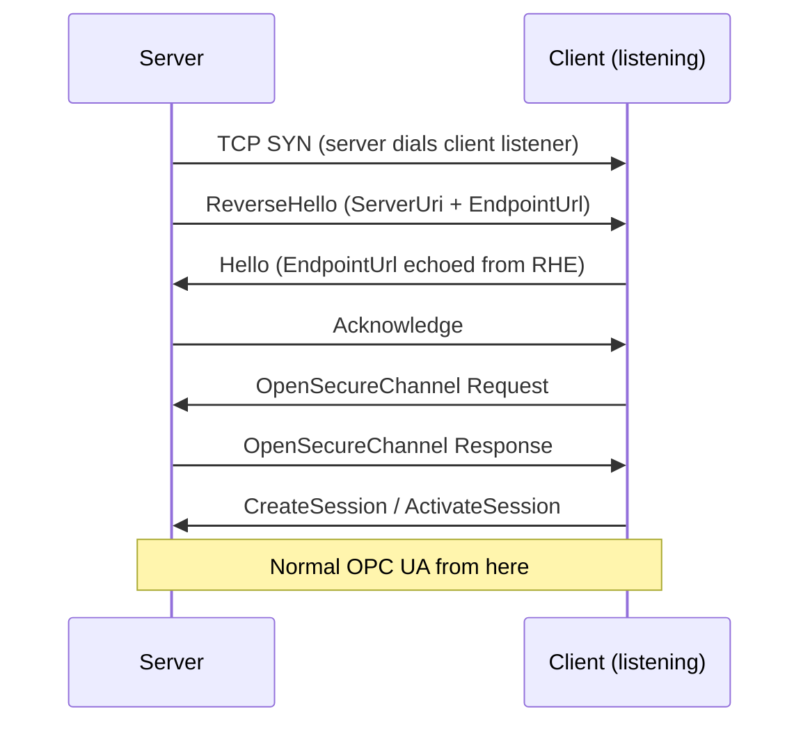
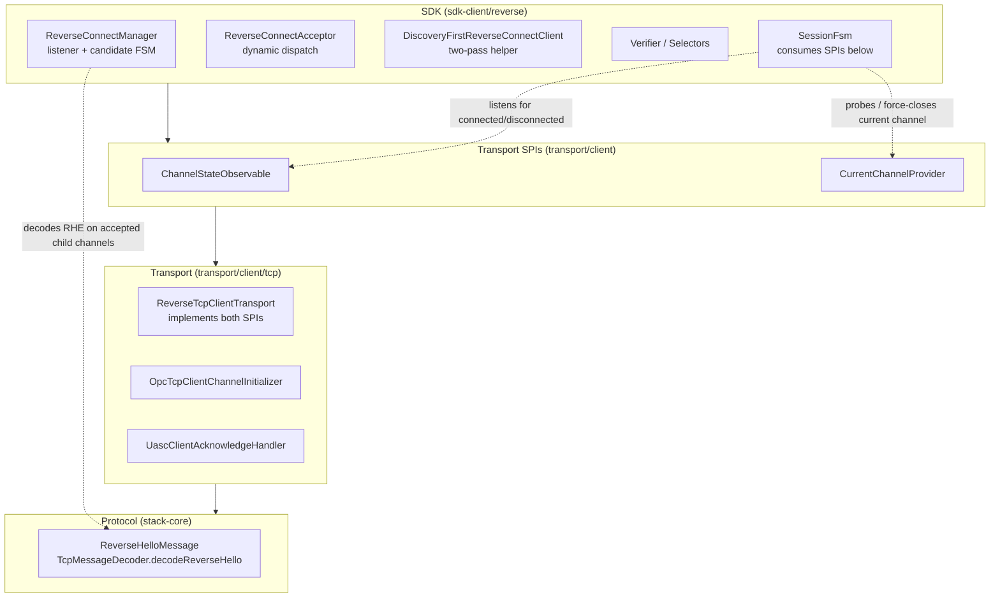
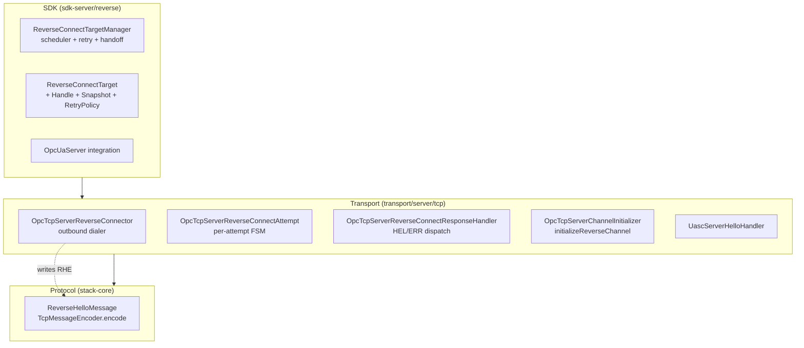
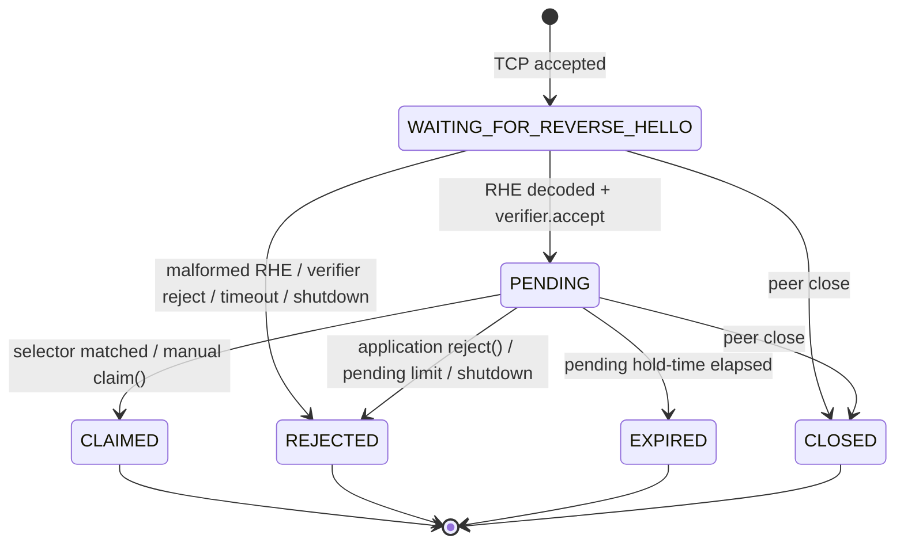
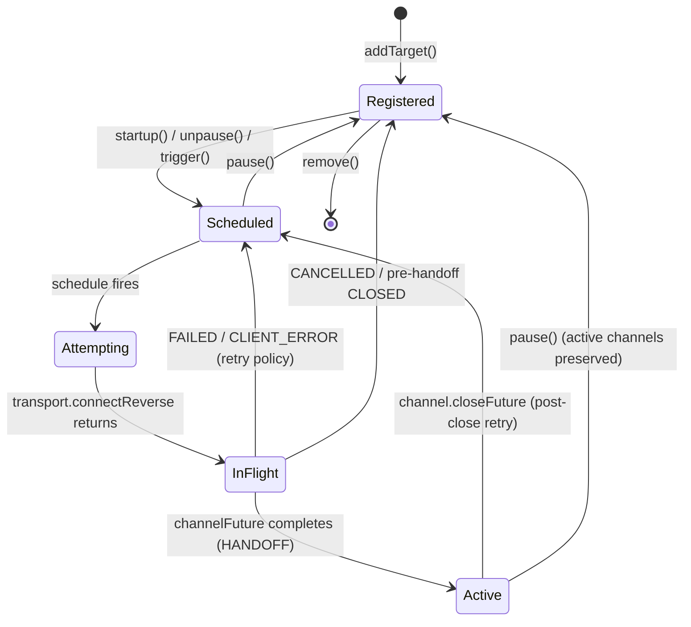
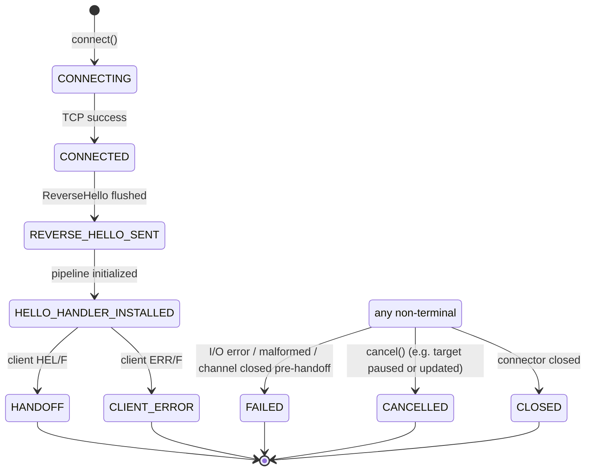

# Reverse Connect Architecture

OPC UA Reverse Connect (Part 6, Section 7.1.3) inverts the normal connection
direction: the **server** opens a TCP connection to a **client** that is
listening, then the client drives the rest of the OPC UA handshake as usual.
This lets servers behind firewalls or NAT reach clients in a DMZ or IT network
through outbound connections firewalls permit.

Milo's implementation is built around two SDK-level managers — one per side —
that own listener bookkeeping, target scheduling, retry policy, candidate
matching, and lifecycle observability. The transport layers stay thin: they own
exactly the bytes-on-wire steps unique to reverse connect (the `ReverseHello`
write on the server, the inbound listener and `ReverseHello` decode on the
client) and hand off to the standard UASC pipeline as soon as the protocol
allows. A separate "discovery-first" helper is provided so applications can
accept connections from servers whose endpoints are not known in advance.

**Specification references** (all links target OPC UA v1.05):

- [Part 6 Section 7.1 — Connection Protocol](https://reference.opcfoundation.org/Core/Part6/v105/docs/7)
- [Part 6 Section 7.1.3 — Establishing a Connection](https://reference.opcfoundation.org/Core/Part6/v105/docs/7.1.3)
- [Part 2 Section 6.14 — Reverse Connect Security](https://reference.opcfoundation.org/Core/Part2/v105/docs/6.14)
- [Part 7 — Profiles](https://reference.opcfoundation.org/Core/Part7/v105/docs) (Section 6.6.5 "Reverse Connect Server Facet" and Section 6.6.75 "Reverse Connect Client Facet" — the OPC Foundation reference site does not currently expose deep links into Part 7's facet catalog)

* * *

## Table of Contents

1. [Protocol Overview](#1-protocol-overview)
2. [Architecture Overview](#2-architecture-overview)
3. [Component Inventory](#3-component-inventory)
4. [Client-Side Architecture](#4-client-side-architecture)
5. [Server-Side Architecture](#5-server-side-architecture)
6. [Session Integration](#6-session-integration)
7. [Configuration Reference](#7-configuration-reference)
8. [Testing](#8-testing)
9. [Key Design Decisions](#9-key-design-decisions)

* * *

## 1. Protocol Overview

### 1.1 Handshake Sequence



After the `ReverseHello` + `Hello` exchange, all subsequent messages traverse
the same UASC pipeline as a normal forward connection. From `Acknowledge`
onwards the channel is indistinguishable on the wire from a client-initiated
connection.

### 1.2 ReverseHello Message

The `ReverseHello` (RHE) is a UA-TCP Connection Protocol message (Part 6,
Section 7.1.2.6). The body is two UA-Binary `String` fields after the standard
8-byte UACP header:

```
[52 48 45 46]                 MessageType "RHE" + Chunk "F"
[MessageSize: UInt32 LE]      Total message length including header
[ServerUri length: Int32 LE]  OPC UA String length prefix (-1 = null)
[ServerUri bytes: UTF-8]      Server's ApplicationUri (max 4096 bytes)
[EndpointUrl length: Int32 LE]
[EndpointUrl bytes: UTF-8]    Server's endpoint URL (max 4096 bytes)
```

Both string fields are nullable (`length == -1`) and capped at 4096 UTF-8
bytes per Part 6. `ReverseHelloMessage.MAX_STRING_LENGTH = 4096` enforces the
limit at both encode (`IllegalArgumentException`) and decode
(`Bad_EncodingLimitsExceeded`). The decoder also rejects truncated headers
(`Bad_DecodingError`) and oversized lengths that exceed the readable buffer.

### 1.3 Three Distinct URLs

| Concept | Owner | Purpose |
| --- | --- | --- |
| **Client Listener URL** (`opc.tcp://client:port`) | Client | TCP address the client listens on; configured in the server's target |
| **ServerUri** (in RHE) | Server | Server's `ApplicationUri`; used as a routing/admission hint by the client verifier |
| **EndpointUrl** (in RHE) | Server | Server's OPC UA endpoint URL; echoed by the client in `Hello` and used for endpoint lookup |

Both fields in the `ReverseHello` are **routing hints only**. Identity is
authenticated downstream in the normal certificate, endpoint, and `CreateSession`
validation flow. The implementation enforces this distinction in several
places (`ReverseHelloVerifier`, `ReverseConnectEndpointSelector`,
`ReverseConnectProductionSelectors`) and the client-side `package-info.java`
states it explicitly.

### 1.4 Idle-Connection Invariant

The OPC UA spec requires that a server configured for reverse connect maintain
at least one open TCP connection to each configured client at all times: when
a connection becomes active (a `SecureChannel` is opened on it), the server
must immediately schedule another outbound attempt so the client can always
initiate a new session without waiting for a server retry cycle.

In Milo's implementation, the server enforces this through the
`ReverseConnectTargetManager.shouldScheduleLocked` guard. A new outbound TCP
attempt is scheduled whenever **all** of these are true:

- the manager is running and the target is enabled and not paused;
- the target has no active reverse-opened channel (`activeChannels.isEmpty()`);
- the target has no in-flight attempt and no pending-handoff bookkeeping
  (`!hasPendingAttempt()`).

When a successfully handed-off channel later closes, the manager's
`evaluatePostCloseRetry` emits a synthetic `CLOSED` attempt event and
schedules a fresh outbound attempt. The retry delay comes from the
target's `ReverseConnectRetryPolicy`. Stock policies use the target's
registration period as a constant cadence; the SPI is open for
applications that need exponential backoff or per-failure-mode policy.

### 1.5 Discovery-First Pattern

For first-time connections the client typically does not know the server's
endpoint descriptions ahead of time. The implementation supports two flows:

1. **Discovery-first helper** (`DiscoveryFirstReverseConnectClient`) — claims
   the first matching reverse connection, opens a `SecurityPolicy.None`
   `SecureChannel`, calls `GetEndpoints`, tears down the discovery channel,
   selects an endpoint, and returns an `OpcUaClient` configured to wait for a
   *later* matching reverse connection for the production Session.
2. **Standalone discovery** (`DiscoveryClient.getEndpoints(connection)`) —
   consumes one pre-claimed `ReverseConnectConnection` for `GetEndpoints` and
   tears down the channel without retaining a client. Suitable for
   persist-and-reuse workflows where endpoint info is saved and the second
   stage is established later.

Both flows rely on the server's idle-connection invariant: the discovery
channel is consumed during pass 1, the server immediately schedules another
outbound attempt, and pass 2 waits for that second arrival.

### 1.6 Retry Behavior

Two retry regimes coexist, independent and on different sides:

- **Server target retries** (this feature) — driven by
  `ReverseConnectTargetManager` and `ReverseConnectRetryPolicy`. Triggered on
  attempt `FAILED` / `CLIENT_ERROR` (the client wrote an `ERR/F` instead of
  `HEL/F`) and on post-handoff channel close. Stock policies:
  `registrationPeriod()` (constant cadence equal to the target's configured
  registration period) and `fixedDelay(UInteger)`. There is no built-in
  exponential backoff; custom policies can branch on `event.state()` and
  `event.statusCode()` to implement one.
- **Client SessionFsm reactivation** (unchanged from forward connect) —
  exponential backoff capped at 16 seconds, applied to session
  re-creation/reactivation after `ConnectionLost`, keep-alive failure, or
  service fault. Reset on entering `Active`.

The two regimes are independent because they operate on different concerns:
the server retries the outbound TCP attempt, while the client retries the OPC
UA session over whatever channel is currently usable.

* * *

## 2. Architecture Overview

The implementation spans three layers on each side. The protocol layer
(stack-core) is shared between client and server. Each transport layer owns
the Netty plumbing unique to its direction. The SDK layer owns lifecycle,
registration, policy, observability, and the public API.

### 2.1 Client Side



The Transport SPIs row is the architectural seam introduced by this work:
`SessionFsm` depends only on those two interfaces, not on any concrete
transport type, so any transport that implements them (forward or reverse)
participates in the same connection-loss and recovery logic. See
Section 4.6 and Section 6.

### 2.2 Server Side



### 2.3 Runtime Data Flow

**Client side.** The application starts a `ReverseConnectManager`, which binds
one or more Netty `ServerBootstrap` listeners. When a server opens an inbound
TCP connection, the listener's child handler installs a `ReverseHelloHandler`
(private inner class of `ReverseConnectManager`) that decodes the first
message, verifies it is an `RHE/F`, and runs the configured
`ReverseHelloVerifier`. If accepted, the candidate enters a `PENDING` state
and is offered to registered `ReverseConnectSelector`s; the first match claims
the channel and produces a `ReverseConnectConnection` (a handoff object
wrapping the raw Netty channel).

A `ReverseTcpClientTransport` consumes the `ReverseConnectConnection`,
attaches the standard UASC pipeline through
`OpcTcpClientChannelInitializer.initializeConnectedChannel`, and completes its
handshake. From the perspective of `SessionFsm`, the transport behaves
identically to a forward-connect transport — connection-state events flow
through the new `ChannelStateObservable` SPI rather than a direct dependency
on `ChannelFsm`.

**Server side.** The application registers `ReverseConnectTarget`s with the
`ReverseConnectTargetManager`, either through `OpcUaServerConfig.builder()` at
construction time or through `OpcUaServer.addReverseConnectTarget(...)` at
runtime. After `OpcUaServer.startup()`, the manager schedules each
schedulable target via a one-shot
`ScheduledExecutorService.schedule(runScheduledAttempt, delay)`. When the
scheduled task fires, the manager calls
`OpcTcpServerTransport.connectReverse(parameters)`, which delegates to a
lazily-created `OpcTcpServerReverseConnector` (held in a `Lazy<>` holder so
servers that never use reverse connect pay no cost beyond the holder — see
Section 5.5). The connector builds a fresh Netty `Bootstrap`, dials the
client, encodes and writes a `ReverseHello`, installs
`OpcTcpServerReverseConnectResponseHandler` followed by the standard
`UascServerHelloHandler`, and reports state transitions through an
`OpcTcpServerReverseConnectAttemptObserver`.

When the client's `HEL/F` arrives, the response handler removes itself,
forwards the retained Hello buffer into `UascServerHelloHandler`, and reports
`HANDOFF`. From that point the channel is on the normal server UASC pipeline.
The manager registers the channel in the target's `activeChannels` map and
installs a `closeFuture` listener so it can re-schedule when the session
eventually ends.

* * *

## 3. Component Inventory

### 3.1 New Files (Protocol Layer)

| File | Purpose |
| --- | --- |
| `stack-core/.../channel/messages/ReverseHelloMessage.java` | RHE value class, encode/decode, 4096-byte field cap |
| `stack-core/.../channel/messages/MessageType.java` | RHE enum value added at ordinal 6, which is the historic position preserved by `MessageTypeTest.testExistingMessageTypeOrdinalsRemainStable`. (The declaration order in the source file does not by itself imply an ordinal — the pinning test is the contract.) |
| `stack-core/.../channel/messages/TcpMessageDecoder.java` | Added `decodeReverseHello(ByteBuf)` |
| `stack-core/.../channel/messages/TcpMessageEncoder.java` | Added `encode(ReverseHelloMessage)` overload |
| `stack-core/.../channel/messages/package-info.java` | Package-level documentation |

### 3.2 New Files (Client Transport)

| File | Purpose |
| --- | --- |
| `transport/.../client/ChannelStateObservable.java` | Transport SPI for connection-state transitions |
| `transport/.../client/CurrentChannelProvider.java` | Transport SPI for synchronous channel access |
| `transport/.../client/tcp/OpcTcpClientChannelInitializer.java` | Shared client UASC pipeline installer (outbound and connected paths) |

Modified: `AbstractUascClientTransport`, `OpcTcpClientTransport`,
`UascClientAcknowledgeHandler` (added 5-arg constructor with
`Supplier<String> endpointUrlSupplier`).

### 3.3 New Files (Server Transport)

| File | Purpose |
| --- | --- |
| `transport/.../server/tcp/OpcTcpServerReverseConnector.java` | Reusable outbound dialer (lazy in `OpcTcpServerTransport`) |
| `transport/.../server/tcp/OpcTcpServerReverseConnectAttempt.java` | Per-attempt state holder + `channelFuture` |
| `transport/.../server/tcp/OpcTcpServerReverseConnectAttemptEvent.java` | Immutable transition event |
| `transport/.../server/tcp/OpcTcpServerReverseConnectAttemptObserver.java` | Functional observer for attempt transitions |
| `transport/.../server/tcp/OpcTcpServerReverseConnectAttemptState.java` | Attempt state enum (9 values, 5 terminal) |
| `transport/.../server/tcp/OpcTcpServerReverseConnectParameters.java` | Immutable input record for one attempt |
| `transport/.../server/tcp/OpcTcpServerReverseConnectResponseHandler.java` | `HEL/F` vs `ERR/F` discriminator after RHE |
| `transport/.../server/tcp/OpcTcpServerChannelInitializer.java` | Shared server UASC pipeline installer (passive and reverse paths) |
| `transport/.../server/tcp/package-info.java` | Architectural framing for the package |

Modified: `OpcTcpServerTransport` (adds `connectReverse`),
`OpcTcpServerTransportConfig` (adds `getReverseConnectBootstrapCustomizer`),
`UascServerHelloHandler` (idempotent Hello deadline + `helloDeadlineFuture` cancel).

### 3.4 New Files (Client SDK — `sdk-client/.../reverse`)

| File | Purpose |
| --- | --- |
| `ReverseConnectManager.java` | Shared listener orchestrator + candidate FSM (~1394 lines) |
| `ReverseConnectManagerBuilder.java` | Manager builder |
| `ReverseConnectManagerSnapshot.java` | Observability snapshot |
| `ReverseConnectListener.java` | Listener interface (bound/unbound/accepted/pending/claimed/rejected/expired/error) |
| `ReverseConnectListenerSnapshot.java` | Per-bind-address snapshot |
| `ReverseConnectCandidateSnapshot.java` | Immutable view of one candidate |
| `ReverseConnectCandidateState.java` | Candidate FSM enum (6 values) |
| `ReverseConnectConnection.java` | Claim-time handoff (live channel + snapshot) |
| `ReverseConnectRegistration.java` | One-shot selector registration (AutoCloseable) |
| `ReverseConnectSelector.java` | Synchronous predicate; selects which candidate to claim |
| `ReverseConnectRejectionReason.java` | Rejection reason enum |
| `ReverseConnectVerificationResult.java` | Verifier result (accept/reject) |
| `ReverseHelloVerifier.java` | Synchronous pre-SecureChannel admission hook |
| `ReverseConnectAcceptor.java` | Dynamic dispatch for shared-listener multi-server flows (~708 lines) |
| `ReverseConnectAcceptorClientListener.java` | Acceptor's "client connected" callback |
| `ReverseConnectAcceptorErrorListener.java` | Acceptor's per-flow error callback |
| `ReverseConnectEndpointSelector.java` | Picks an `EndpointDescription` after `GetEndpoints` |
| `ReverseConnectEndpointSelectors.java` | Built-in endpoint selector factories |
| `ReverseConnectClientConfigFactory.java` | Turns `(discovery, endpoint)` into `OpcUaClientConfig` |
| `ReverseConnectProductionSelectors.java` | Default production-phase selector strategies (package-private) |
| `ReverseConnectDiscovery.java` | One-shot `GetEndpoints` over a reverse connection |
| `ReverseConnectDiscoveryResult.java` | `(candidate, endpoints)` immutable record |
| `DiscoveryFirstReverseConnectClient.java` | Two-pass helper: discover then connect (~535 lines) |
| `ReverseTcpClientTransport.java` | Client transport for reverse-claimed channels (~693 lines) |
| `package-info.java` | Package-level architecture documentation |

Modified: `OpcUaClient` (adds four `createReverseConnect` overloads,
`disconnectAsync` timeout for stuck FSMs), `DiscoveryClient` (adds two
`getEndpoints(ReverseConnectConnection)` overloads), `SessionFsm` /
`SessionFsmFactory` (switches from `ChannelFsm` to `ChannelStateObservable` +
`CurrentChannelProvider`).

### 3.5 New Files (Server SDK — `sdk-server/.../reverse`)

| File | Purpose |
| --- | --- |
| `ReverseConnectTargetManager.java` | The SDK orchestrator (~1192 lines) |
| `ReverseConnectTarget.java` | Immutable target configuration (UUID, URLs, timing, retry policy) |
| `ReverseConnectTargetHandle.java` | Runtime control handle (pause/resume/trigger/remove) |
| `ReverseConnectTargetListener.java` | Listener interface (added/updated/removed + attempt events) |
| `ReverseConnectTargetSnapshot.java` | Immutable target snapshot with defensive `Throwable` copy |
| `ReverseConnectRetryPolicy.java` | Retry policy SPI + stock policies |
| `ReverseConnectAttemptEvent.java` | SDK-facing immutable attempt event |
| `ReverseConnectAttemptState.java` | SDK-facing attempt state enum (mirrors transport enum) |
| `package-info.java` | Lifecycle and threading documentation |

Modified: `OpcUaServer` (adds the 7-method reverse-connect API plus startup
guard), `OpcUaServerConfig` / `OpcUaServerConfigBuilder` (adds
`getReverseConnectTargets()`).

### 3.6 Base Paths

```
opc-ua-stack/stack-core/src/main/java/org/eclipse/milo/opcua/stack/core/
opc-ua-stack/transport/src/main/java/org/eclipse/milo/opcua/stack/transport/
opc-ua-sdk/sdk-client/src/main/java/org/eclipse/milo/opcua/sdk/client/
opc-ua-sdk/sdk-server/src/main/java/org/eclipse/milo/opcua/sdk/server/
opc-ua-sdk/integration-tests/src/test/java/org/eclipse/milo/opcua/sdk/
```

* * *

## 4. Client-Side Architecture

The client side has a four-tier responsibility split. The `ReverseConnectManager`
owns listener sockets and the pre-SecureChannel candidate lifecycle. The
`ReverseTcpClientTransport` consumes a claimed channel and runs the UASC
handshake. Higher-level helpers (`DiscoveryFirstReverseConnectClient`,
`ReverseConnectAcceptor`) compose on top to handle two-pass discovery and
dynamic multi-server flows. The endpoint selection and verification machinery
is the policy layer that ties claim, discovery, and endpoint selection
together.

### 4.1 `ReverseConnectManager`

The central pre-UASC control plane. One instance per application typically
suffices: it can bind multiple listener addresses, serve many concurrent
selector registrations, and feed many `ReverseTcpClientTransport`s.

**Responsibilities:**

- Bind / unbind one or more Netty `ServerBootstrap` listeners.
- Decode the first inbound message as a `ReverseHello` (or reject with
  `MALFORMED_REVERSE_HELLO` / `FIRST_MESSAGE_TIMEOUT`).
- Run the configured `ReverseHelloVerifier` synchronously to admit or reject
  the candidate.
- Park accepted candidates in a `PENDING` state and offer them to registered
  `ReverseConnectSelector`s; the first match claims the channel.
- Maintain bounded snapshot histories for accepted (claimed) and rejected
  candidates plus counters per listener.
- Fire listener callbacks on a serialized `ExecutionQueue` so observers see a
  consistent ordering.

**Candidate state machine:**



`CLAIMED` is the only state that transfers channel ownership out of the
manager. In all other terminal states the manager owns the channel and closes
it (writing a TCP `ErrorMessage` first when applicable, with a 2-second
forced-close fallback if the write does not complete).

**Lock discipline.** The manager uses a single `ReentrantLock` and a strict
discipline documented in a long block comment in the source: **never call
user code while holding the lock.** Mutations happen under the lock, returning
helper records like `AcceptedCandidate`, `ClaimedCandidate`, `ClaimResult`,
and `ParkResult` that carry the snapshots, futures, and channels needing
post-unlock action. Verifier execution, selector evaluation, listener
notification, and Netty I/O all run after the lock is released. The reentrant
lock (rather than `synchronized`) is chosen specifically so virtual-thread
callers do not pin their carrier thread.

**Eager + deferred matching.** When a candidate becomes `PENDING`, the manager
immediately tries to match it against any existing selector registrations
(`tryClaimCandidate`). If no selector matches, it parks the candidate; if
parking succeeds, it tries again with the new pending snapshot to cover
selectors registered between the verifier returning and parking completing.
Symmetrically, when a selector registers, the manager scans the current
pending candidates so an arriving selector immediately picks up a parked
candidate.

**Public API:**

```java
static ReverseConnectManagerBuilder builder()

void startup() throws Exception                       // synchronous bind
void shutdown()                                       // closes listeners,
                                                      //   rejects pending,
                                                      //   cancels selectors
void close()                                          // delegates to shutdown

ReverseConnectRegistration registerSelector(ReverseConnectSelector selector)

Optional<ReverseConnectConnection> claim(UUID candidateId)
boolean reject(UUID candidateId, StatusCode statusCode, String diagnostic)

void    addListener(ReverseConnectListener listener)
boolean removeListener(ReverseConnectListener listener)

ReverseConnectManagerSnapshot snapshot()
```

`registerSelector(...)` returns a `ReverseConnectRegistration`, an AutoCloseable
facade with a `CompletableFuture<ReverseConnectConnection>` that completes
when the selector claims a candidate or completes exceptionally on close /
shutdown.

`claim(UUID)` lets applications take ownership directly from a snapshot they
observed through `onCandidatePending`. The acceptor uses this path for its
discovery flow.

### 4.2 `ReverseConnectAcceptor`

A higher-level dispatcher built on top of a `ReverseConnectManager` for the
common "one shared listener, many unknown servers" scenario. The acceptor
attaches a listener to the manager, watches for `PENDING` candidates, and for
each one runs the discovery-first lifecycle automatically.

**Flow per pending candidate:**

```
candidate becomes PENDING
   |
   v
discoverySelector.matches(snapshot)  ----- no -----> ignore
   |
   v yes
keyFunction(snapshot) -> key  (default: serverUri | endpointUrl | candidateId)
activeKeys.add(key)?  ----- no (duplicate) -----> ignore
   |
   v yes
manager.claim(snapshot.id())  ->  ReverseConnectConnection (discovery)
   |
   v
DiscoveryClient.getEndpoints(connection)  ->  ReverseConnectDiscoveryResult
   |
   v
endpointSelector.select(discovery)  ->  EndpointDescription
   |
   v
clientConfigFactory.create(discovery, endpoint)  ->  OpcUaClientConfig
productionSelectorFactory(discovery, endpoint)   ->  ReverseConnectSelector
   |
   v
OpcUaClient.createReverseConnect(config, manager, productionSelector, ...)
client.connectAsync()  // waits for a LATER matching reverse arrival
   |
   v
installs ChannelStateObservable listener to release `key` on disconnect
clientListener.onClientConnected(discovery, endpoint, client)
```

The deduplication key prevents the acceptor from running concurrent discovery
flows for the same logical server. Default key: `serverUri || endpointUrl ||
candidateId`. When the production client's transport later disconnects, the
acceptor releases the key and re-scans pending candidates so any candidate
that arrived while the key was held still gets processed.

The acceptor is `AutoCloseable`. `close()` removes its listener from the
manager, closes in-flight discovery connections, and disconnects in-flight
production clients **that have not yet been delivered to the
`clientListener`**. Already-delivered clients are owned by the application.

### 4.3 Verifier and Selector Model

The client side runs three different selector-style checks at three different
points in a candidate's lifecycle:

| Check | Type | When | Decides |
| --- | --- | --- | --- |
| `ReverseHelloVerifier` | `verify(snapshot) -> VerificationResult` | After RHE decode, before `PENDING` | Whether the candidate proceeds at all (admission gate) |
| `ReverseConnectSelector` | `matches(snapshot) -> boolean` | After `PENDING`, for each selector registration | Whether *this* selector claims the candidate |
| `ReverseConnectEndpointSelector` | `select(snapshot, endpoints) -> Optional<EndpointDescription>` | After `GetEndpoints` in the discovery-first flow | Which endpoint the production client uses |

**`ReverseHelloVerifier`** runs once per accepted candidate. The default
(`acceptAll()`) accepts every candidate. Applications wire in `ServerUri`
checks, `EndpointUrl` checks, or both. A throwing verifier produces
`VERIFIER_REJECTED` + `Bad_TcpInternalError`. A non-throwing `reject(...)`
result uses the caller-supplied reason, status code, and diagnostic; when
those fields are left unset, the manager fills in `VERIFIER_REJECTED` for
the reason and `Bad_TcpEndpointUrlInvalid` for the status code (the
`Bad_TcpInternalError` default applies only to the *throwing* path). The
verifier runs **outside the manager lock** so the candidate's channel may
close between verify and the post-verify re-lock — the manager re-checks
`channel.isActive()` defensively in `onReverseHello` (around line 537 of
`ReverseConnectManager`) and reports `CHANNEL_CLOSED` instead of advancing
to `PENDING` if it has.

**`ReverseConnectSelector`** has built-in factories `any()`,
`byCandidateId(UUID)`, `byServerUri(String)`, `byEndpointUrl(String)`,
`byServerUriAndEndpointUrl(String, String)`. Application-supplied selectors
are free predicates.

**`ReverseConnectEndpointSelector`** has built-in factories in
`ReverseConnectEndpointSelectors`:

- `noSecurity()` — first None/None endpoint.
- `noSecurityAnonymous()` — first None/None endpoint that advertises an
  Anonymous user token policy.
- `matchReverseHelloEndpointUrl()` — endpoint whose URL equals the RHE
  endpoint URL.
- `matchReverseHelloThen(Predicate)` — URL match plus an extra shape
  predicate.
- `preferReverseHelloEndpointUrl(Predicate)` — URL match if it satisfies the
  predicate, otherwise fall back to the first endpoint that does.
- `first(Predicate)` — first endpoint satisfying the predicate, ignoring the
  RHE hint.

Selectors compose via `default Selector orElse(Selector fallback)`.

**`ReverseConnectProductionSelectors`** (package-private) holds the
production-phase strategy used by the acceptor and the discovery-first
helper. The default is `matchDiscoveryRoutingHints(discoveryCandidate)`,
which produces a `ReverseConnectSelector` matching production candidates with
the same `ServerUri` and `EndpointUrl` as the discovery candidate, with
absent hints treated as "no constraint." When the discovery candidate has
neither hint, the default selector matches nothing and the discovery-first
helper short-circuits with `missingRoutingHintsException()`
(`Bad_ConfigurationError`).

### 4.4 `ReverseTcpClientTransport`

A `UascClientTransport` that consumes server-initiated reverse-connect
channels instead of dialing out. It owns no listening socket — the
`ReverseConnectManager` owns binding and accepting. Two construction modes:

| Mode | Constructor | Behavior |
| --- | --- | --- |
| Manager-bound | `(config, manager, selector)` | Registers a selector on each `connect()` / rearm. Reusable: a failed handshake or a closed connected channel causes the transport to register a fresh selector for the next matching reverse arrival. |
| Direct (one-shot) | `(config, connection)` | Consumes a single pre-claimed `ReverseConnectConnection`. Does not rearm after failure. Terminal failure becomes sticky and surfaces from `getChannel()`. Used by `DiscoveryClient.getEndpoints(connection)`. |

**Pipeline installation.** When the manager hands a claimed channel back, the
transport calls `OpcTcpClientChannelInitializer.initializeConnectedChannel`,
which adds:

1. `DelegatingUascResponseHandler` (wraps the transport's `UascResponseHandler`)
2. `UascClientAcknowledgeHandler` (the 5-arg variant taking a
   `Supplier<String> endpointUrlSupplier` returning the URL from the `RHE`)
3. The user-supplied `channelPipelineCustomizer` (added *after* the
   acknowledge handler so the customizer does not observe Hello writes)

The acknowledge handler proceeds with `Hello` → `Acknowledge` →
`OpenSecureChannel`, after which the standard `UascClientMessageHandler` takes
over. The `initializeConnectedChannel` factory enforces that it is called
from the channel's event loop (`IllegalStateException` otherwise) because it
mutates the pipeline.

**Connection-state SPI.** The transport implements `ChannelStateObservable`
and `CurrentChannelProvider`. Listeners receive `true` after a claimed
channel completes UASC handshake; `false` when that channel later closes or
the transport is explicitly disconnected. Manager-bound rearming happens
*before* the disconnect notification fires, so a listener that scans the
manager's pending candidates sees them already consumed (one of the more
subtle ordering guarantees, exercised by
`channelCloseRearmsBeforeDisconnectListenersScanPendingCandidates`).

### 4.5 Discovery-First Flow

`DiscoveryFirstReverseConnectClient` is a builder-driven helper that wraps
the two-pass flow in a single `CompletableFuture<OpcUaClient>` with
cancellation that cascades to all in-flight stages.

```java
OpcUaClient client =
    DiscoveryFirstReverseConnectClient.builder(manager)
        .setDiscoverySelector(ReverseConnectSelector.byServerUri("urn:server"))
        .setEndpointSelector(
            ReverseConnectEndpointSelectors.preferReverseHelloEndpointUrl(
                ReverseConnectEndpointSelectors::isNoSecurityAndAnonymous))
        .setClientConfig((discovery, endpoint) ->
            OpcUaClientConfig.builder()
                .setEndpoint(endpoint)
                .setApplicationName(LocalizedText.english("My Client"))
                .setApplicationUri("urn:example:client")
                .build())
        .connectAsync()
        .get(60, TimeUnit.SECONDS);
```

Pass 1 (`ReverseConnectDiscovery.getEndpoints`) registers a one-shot selector
on the manager, claims the first matching candidate, opens a None
SecureChannel through a direct-mode `ReverseTcpClientTransport`, calls
`GetEndpoints`, and disconnects. The candidate is consumed; the listening
socket stays open.

Pass 2 builds an `OpcUaClient` with `OpcUaClient.createReverseConnect(config,
manager, productionSelector)` — a manager-bound transport that registers its
own selector with the same manager. The server's idle-connection invariant
guarantees a second outbound TCP attempt, and the production selector
matches it.

Cancellation of the public future closes the discovery registration, fails
the discovery connection if claimed, and (if production has started)
disconnects the production client. A client that completes after cancellation
is still disconnected exactly once.

### 4.6 Transport SPIs

The reverse-connect work introduces two small capability interfaces in
`stack-transport/.../client/` that let `SessionFsm` work with any client
transport that opts in:

```java
public interface ChannelStateObservable {
  void addTransitionListener(TransitionListener listener);
  void removeTransitionListener(TransitionListener listener);

  @FunctionalInterface
  interface TransitionListener {
    void onStateTransition(boolean connected);
  }
}

public interface CurrentChannelProvider {
  @Nullable Channel getCurrentChannel();
}
```

Both `OpcTcpClientTransport` (forward) and `ReverseTcpClientTransport`
implement both interfaces. `SessionFsmFactory` uses `instanceof
ChannelStateObservable observable` (Java 17 pattern-matching) on entering
`Active` to attach a listener that fires `Event.ConnectionLost` on `connected
== false`. It also uses `CurrentChannelProvider` in two places:

1. Immediately after attaching the transition listener, probe the current
   channel; if it is already null or inactive (the channel went down between
   the SecureChannel handshake and reaching `Active`), fire a synthetic
   `ConnectionLost` so recovery starts immediately rather than waiting for
   the next request to fail. Without this, a reverse channel that closed
   between handshake and Active would leave the FSM idle until the next user
   request.
2. On exceeding `keepAliveFailuresAllowed`, force-close the current channel
   to short-circuit the TCP keep-alive timeout.

The old `ChannelFsm`-typed context key on `SessionFsm` was renamed to
`KEY_CHANNEL_STATE_TRANSITION_LISTENER` and re-typed to
`ChannelStateObservable.TransitionListener`. No other change was needed to
`SessionFsm`.

### 4.7 Client API

**Setup (typical):**

```java
ReverseConnectManager manager =
    ReverseConnectManager.builder()
        .addBindAddress(new InetSocketAddress("0.0.0.0", 48060))
        .setPendingConnectionHoldTime(Duration.ofSeconds(30))
        .setReverseHelloVerifier(candidate ->
            "urn:example:server".equals(candidate.serverUri())
                ? ReverseConnectVerificationResult.accept()
                : ReverseConnectVerificationResult.reject("unexpected ServerUri"))
        .build();

manager.startup();
```

**Discovery-first (single server, endpoint unknown):**

```java
OpcUaClient client =
    DiscoveryFirstReverseConnectClient.builder(manager)
        .setClientConfig((discovery, endpoint) ->
            OpcUaClientConfig.builder()
                .setEndpoint(endpoint)
                .setApplicationName(LocalizedText.english("My Client"))
                .setApplicationUri("urn:example:client")
                .build())
        .connectAsync()
        .get(60, TimeUnit.SECONDS);
```

**Acceptor (multiple servers sharing one listener):**

```java
ReverseConnectAcceptor acceptor =
    ReverseConnectAcceptor.builder(manager)
        .setClientConfig((discovery, endpoint) ->
            OpcUaClientConfig.builder()
                .setEndpoint(endpoint)
                .setApplicationName(LocalizedText.english("My Client"))
                .setApplicationUri("urn:example:client")
                .build())
        .setClientListener((discovery, endpoint, client) -> {
            // Application owns the client from here.
            client.connect();
            // ...
        })
        .setErrorListener((candidate, failure) -> log.warn(
            "Reverse-connect flow failed for candidate {}: {}",
            candidate.id(), failure.getMessage()))
        .build()
        .start();
```

**Direct construction (endpoint known up-front, manager-bound):**

```java
OpcUaClient client = OpcUaClient.createReverseConnect(
    clientConfig,
    manager,
    ReverseConnectSelector.byServerUri("urn:example:server"));

client.connect();
```

**Direct construction from a pre-claimed candidate:**

```java
ReverseConnectCandidateSnapshot candidate =
    manager.snapshot().pendingCandidates().get(0);
ReverseConnectConnection connection = manager.claim(candidate.id()).orElseThrow();

OpcUaClient client = OpcUaClient.createReverseConnect(clientConfig, connection);
client.connect();
```

**Standalone discovery (persist endpoints for later):**

```java
ReverseConnectConnection connection = manager.claim(candidateId).orElseThrow();
List<EndpointDescription> endpoints =
    DiscoveryClient.getEndpoints(connection).get();
```

Four `OpcUaClient.createReverseConnect` overloads exist (each in pairs with
and without a `Consumer<OpcTcpClientTransportConfigBuilder>` transport
customizer):

| Form | Mode | Rearm on failure |
| --- | --- | --- |
| `(config, manager, selector)` | Manager-bound | Yes |
| `(config, manager, selector, configureTransport)` | Manager-bound | Yes |
| `(config, connection)` | Direct (one-shot) | No |
| `(config, connection, configureTransport)` | Direct (one-shot) | No |

* * *

## 5. Server-Side Architecture

The server side mirrors the client's two-tier split. The SDK
`ReverseConnectTargetManager` owns target registration, scheduling, retry
policy, listener dispatch, and handoff bookkeeping. The transport
`OpcTcpServerReverseConnector` owns one outbound TCP attempt's Netty
plumbing: dial, write `ReverseHello`, install the response handler and the
standard `UascServerHelloHandler`, observe transitions, and hand off when the
client sends `Hello`. The two layers communicate through immutable parameter
records, an observer callback, and a `CompletableFuture<Channel>`.

### 5.1 `ReverseConnectTargetManager`

The orchestrator. One instance per `OpcUaServer`. Constructed eagerly in the
`OpcUaServer` constructor with the initial targets from
`OpcUaServerConfig.getReverseConnectTargets()`; activated by
`OpcUaServer.startup()`.

**Responsibilities:**

- Hold an insertion-ordered registry (`LinkedHashMap<UUID, TargetRecord>`) of
  targets. Each record carries the current `ReverseConnectTarget`, the active
  channels handed off for it, pending-handoff bookkeeping, generation /
  attempt counters, and timestamps.
- Validate each target's `endpointUrl` against the server's bound endpoints
  before scheduling. A target whose endpoint URL no longer matches any
  configured endpoint will not be scheduled and `resume()` will fail with
  `IllegalArgumentException`.
- Schedule outbound attempts via the server's `ScheduledExecutorService` —
  one-shot `schedule(runScheduledAttempt, delay)` per attempt rather than a
  recurring task. The same scheduler is also used to dispatch retry
  evaluation work off the Netty event loop.
- Enforce the idle-connection invariant (Section 1.4).
- Track the per-attempt `OpcTcpServerReverseConnectAttempt` and its
  `channelFuture`; on success, register the channel in the target's
  `activeChannels` map and install a `closeFuture` listener to re-schedule.
- Map transport-layer attempt states (`OpcTcpServerReverseConnectAttemptState`)
  to SDK-facing states (`ReverseConnectAttemptState`) and dispatch
  `ReverseConnectAttemptEvent`s to listeners through the server's
  `ExecutorService`.
- Run the configured `ReverseConnectRetryPolicy` for `FAILED` /
  `CLIENT_ERROR` events and for synthetic `CLOSED` events fired after a
  handed-off channel ends.

**Target lifecycle (per target, conceptual):**



This is a conceptual lifecycle rather than a literal FSM in code: there is
no `TargetState` enum. The manager tracks the current phase implicitly
through bookkeeping on `TargetRecord` (`scheduledFuture`, `pendingAttempt`,
`activeChannels`, plus the generation counter), and the SDK-facing
`ReverseConnectAttemptState` enum describes *attempts*, not targets. The
diagram is the shape applications should keep in mind when reading
listener callbacks and snapshots.

`pause()` cancels any scheduled attempt and clears the in-flight attempt
(through a handoff-rescue path described below) but does **not** close
already-handed-off channels. `remove()` cancels scheduled, closes in-flight,
and closes active channels — full teardown.

**Generation tracking and the handoff-rescue mechanism.** Each
`TargetRecord` has a monotonically increasing `generation` field. The
manager bumps it on any of: cancel, update, remove (when not handoff-accepted),
and post-handoff reschedule. Scheduled callbacks and event handlers carry the
generation they were issued under and self-filter if the current generation
no longer matches.

When `pause()` or `update()` cancels an in-flight attempt that may be racing
toward `HANDOFF`, the manager adds an `AttemptKey(attemptCounter, generation)`
to `record.pendingHandoffAttempts` and installs a callback on
`attempt.channelFuture().whenComplete(...)`. The success path
(`onAttemptChannel`) removes the key and accepts the handoff even though the
current `(attemptCounter, generation)` no longer match — preserving the
late-arriving channel rather than discarding it. The exceptional path
removes the orphan key and may immediately re-schedule. This guards against
losing a successful reverse connection to a pause/update race.

**Threading model:**

- Single coarse-grained `Object lock` guards all `TargetRecord` mutation, the
  `records` map, and the `listeners` list.
- `ScheduledExecutorService scheduler` runs schedules and dispatches retry
  evaluation off the Netty event loop.
- `ExecutorService listenerExecutor` dispatches `onTargetAdded`, `Updated`,
  `Removed`, `onAttemptEvent`. Notifications are always issued **outside**
  the lock; `safelyNotify` wraps every listener call in a try/catch so a
  misbehaving listener cannot block the manager.
- All mutating methods follow the same pattern: enter lock, compute snapshot
  and `TargetAction` record, leave lock, then close attempts / channels and
  notify listeners.

**Public API:**

```java
ReverseConnectTargetHandle addTarget(ReverseConnectTarget target)
void                       addListener(ReverseConnectTargetListener listener)
void                       removeListener(ReverseConnectTargetListener listener)

List<ReverseConnectTargetSnapshot>     snapshots()
Optional<ReverseConnectTargetSnapshot> snapshot(UUID targetId)
boolean                                hasSchedulableTargets()

void startup()
void validateTargets()
void shutdown()

CompletableFuture<ReverseConnectTargetSnapshot> update(ReverseConnectTarget target)
CompletableFuture<ReverseConnectTargetSnapshot> remove(UUID targetId)
```

Per-target operations (`pause`, `resume`, `trigger`) are part of the
public surface only through the `ReverseConnectTargetHandle` returned by
`addTarget`. The manager itself has matching package-private methods that
the handle delegates to; callers that hold only a snapshot must keep the
handle (or look up by UUID through the snapshot accessors and reconstruct
their handle reference).

### 5.2 `ReverseConnectTarget` and Friends

**`ReverseConnectTarget`** (immutable, built via `ReverseConnectTarget.builder()`):

| Field | Type | Default | Purpose |
| --- | --- | --- | --- |
| `id` | `UUID` | random | Stable lifecycle id; the handle's key |
| `clientListenerUrl` | `String` | *(required)* | `opc.tcp://client:port` to dial |
| `endpointUrl` | `String` | *(required)* | Local endpoint URL advertised in RHE |
| `registrationPeriod` | `UInteger` (ms) | 30,000 | Default retry delay |
| `connectTimeout` | `UInteger` (ms) | 5,000 | TCP connect timeout per attempt |
| `enabled` | `boolean` | `true` | Disabled targets are not scheduled |
| `paused` | `boolean` | `false` | Paused targets are not scheduled |
| `retryPolicy` | `ReverseConnectRetryPolicy` | `registrationPeriod()` | Delay between attempts |

Builder validation rejects non-`opc.tcp` URLs, blank hosts, registration
periods of zero, and connect timeouts outside `(0, Integer.MAX_VALUE]`.

**`ReverseConnectTargetHandle`** is the runtime control object:

```java
UUID getTargetId()
Optional<ReverseConnectTargetSnapshot> snapshot()

CompletableFuture<ReverseConnectTargetSnapshot> pause()
CompletableFuture<ReverseConnectTargetSnapshot> resume()
CompletableFuture<ReverseConnectTargetSnapshot> trigger()
CompletableFuture<ReverseConnectTargetSnapshot> remove()
```

`trigger()` requests an immediate attempt; it is a no-op if the target is
disabled, paused, the server is stopped, or an attempt is already pending or
active. `resume()` re-validates the target against the current bound
endpoints before scheduling.

**`ReverseConnectTargetSnapshot`** (immutable record): `targetId`, URLs,
timing fields, `enabled`, `paused`, `nextAttemptTime`, `lastAttemptTime`,
`lastSuccessTime`, `activeChannelCount`, `lastStatusCode`, `lastError`.

The `lastError` slot deserves a note. The snapshot defensively copies the
exception (including cause chain and suppressed exceptions) on every read,
through a private nested `LastErrorCopy extends Throwable`. This means the
*type* of the original exception is lost — callers cannot recover
`instanceof UaException`. The `lastStatusCode` field is provided for the
common case of needing the UA error code. The trade-off is intentional: the
manager retains the same defensive copy for itself, so a buggy listener that
mutates the exception's stack trace cannot corrupt the manager's state.

**`ReverseConnectRetryPolicy`** is a functional interface returning a `long`
delay in milliseconds given `(target, event)`. Two stock policies:

- `registrationPeriod()` — singleton returning `target.getRegistrationPeriod()`.
- `fixedDelay(UInteger delay)` — record returning a constant delay.

Both ignore the event details; custom policies may branch on
`event.state()` (e.g., longer back-off for `CLIENT_ERROR`) or
`event.statusCode()`. The manager catches any `Throwable` from a policy and
falls back to `target.getRegistrationPeriod()` with a logged warning, so a
broken policy degrades gracefully rather than killing the manager.

### 5.3 `OpcTcpServerReverseConnector` and Attempt FSM

The transport-layer dialer. Multi-attempt and lifecycle-scoped: one connector
exists per `OpcTcpServerTransport`, lazily created on the first
`connectReverse(...)` call and disposed when the transport unbinds. Each
`connect(parameters)` invocation builds a *fresh* Netty `Bootstrap`, applies
the transport config's `reverseConnectBootstrapCustomizer`, and returns a new
`OpcTcpServerReverseConnectAttempt`.

**Per-attempt sequence:**

1. Inside the connector's lock: re-check the closed flag, call
   `bootstrap.connect()`, store the connect future on the attempt, then add
   the attempt to the bookkeeping set. (The order matters: if
   `bootstrap.connect()` throws synchronously, the attempt does not leak into
   the in-flight set. See commit `Harden reverse TCP attempt handling`.)
2. Emit `CONNECTING` to the observer.
3. The connect listener fires (on a Netty I/O thread). On failure, classify
   via `connectFailureStatusCode(cause)` (`Bad_Timeout` for
   `ConnectTimeoutException`, `Bad_ConnectionRejected` for
   `ConnectException` / `UnknownHostException` / `NoRouteToHostException`,
   `Bad_ConnectionClosed` otherwise) and fail the attempt. On success,
   re-check connector and attempt state (race with concurrent `close()` /
   `cancel()`), set the channel, attach the pre-handoff `closeFuture`
   listener, and emit `CONNECTED`.
4. `channel.eventLoop().execute(() -> writeReverseHello(...))`. Encode
   `new ReverseHelloMessage(serverUri, endpointUrl)` via
   `TcpMessageEncoder.encode(...)` and `writeAndFlush`. On failure → `FAILED`
   terminal. On success → emit `REVERSE_HELLO_SENT`, then call
   `installServerHelloPath`. Handler installation is intentionally delayed
   until the write completes so an early client `Hello` cannot be processed
   before the server's `ReverseHello` has been flushed.
5. `installServerHelloPath` adds `OpcTcpServerReverseConnectResponseHandler`
   to the pipeline, then calls
   `OpcTcpServerChannelInitializer.initializeReverseChannel(channel, config,
   applicationContext)` — which installs the standard `UascServerHelloHandler`
   without rate limiting. Emit `HELLO_HANDLER_INSTALLED`.
6. The response handler decides the terminal: `HEL/F` from the client →
   `onHelloReceived` → emit `HANDOFF`, complete `channelFuture` with the
   channel, forward the retained Hello buffer into `UascServerHelloHandler`.
   `ERR/F` → `onClientError` → emit `CLIENT_ERROR`. Anything else (or
   exception in the handler) → `onFirstMessageInvalid` → emit `FAILED`.

**Attempt state machine** (mirrored in
`OpcTcpServerReverseConnectAttemptState` and the SDK
`ReverseConnectAttemptState`):



The diagram groups the three "owner-initiated or I/O" terminals
(`FAILED`, `CANCELLED`, `CLOSED`) under a single "any non-terminal" source
because the code allows any of `CONNECTING`, `CONNECTED`,
`REVERSE_HELLO_SENT`, or `HELLO_HANDLER_INSTALLED` to complete into any of
those terminals — `cancel()` from a paused target while writing
`ReverseHello`, a connector `close()` after the pipeline is installed, and
an unexpected exception during handler installation are all legal paths and
all exercised by `OpcTcpServerReverseConnectorTest`. The two
protocol-driven terminals (`HANDOFF`, `CLIENT_ERROR`) are reachable only
from `HELLO_HANDLER_INSTALLED`.

**Non-terminal vs terminal.** `CONNECTING`, `CONNECTED`,
`REVERSE_HELLO_SENT`, `HELLO_HANDLER_INSTALLED` are non-terminal and
transitioned via `transition(state)`. The five terminals
(`HANDOFF`, `CLIENT_ERROR`, `FAILED`, `CANCELLED`, `CLOSED`) are completed
via `completeTerminal(state, statusCode, cause, message)`. Terminal
completion is one-shot; once any terminal is reached, further transitions
are no-ops and the observer will not see any more events for that attempt.

**Single-threaded observer emission.** Each attempt has a per-attempt
emission loop (`emittingTransitions` flag + `pendingTransitions` queue) so
observers see a monotonic stream even when transitions happen concurrently
from multiple threads. If the observer itself triggers another transition
(e.g., a cancellation from inside an observer callback), the next emission
runs after the current one returns rather than re-entering. This is
verified by `reentrantObserverCancellationIsNotNestedInsideTransitionCallback`
in `OpcTcpServerReverseConnectorTest`.

**Channel ownership across handoff.** After `HANDOFF`, the channel logically
belongs to the server SecureChannel/Session path. The attempt's `close()`
method (intended for use after a successful handoff) will not close the
channel — it just removes the attempt from the connector's in-progress set.
The connector's own `close()` is the exception: it always closes every
channel it opened, even handed-off ones. This is the deliberate trade-off
"channel ownership transfers at handoff, but the connector remains
responsible for what it opened until it is itself closed."

### 5.4 Response Handler

`OpcTcpServerReverseConnectResponseHandler` is a `ByteToMessageDecoder`
installed only between RHE-flush and Hello-receipt. It validates that the
first response from the client is either `HEL/F` (forward into
`UascServerHelloHandler`) or `ERR/F` (terminal `CLIENT_ERROR`). Chunk type
other than `F` and unknown message types both produce `Bad_TcpMessageTypeInvalid`
and a terminal `FAILED`.

On the Hello path, it uses `readRetainedSlice(messageLength)`, removes
itself from the pipeline, calls `connector.onHelloReceived(...)` (which
drives the attempt to `HANDOFF` and completes `channelFuture`), then
`ctx.fireChannelRead(helloBuffer)` to dispatch the retained slice into the
standard handler. A `forwarded` flag with a `finally` block releases the
slice if any intermediate step throws so refcount leaks are not possible
on the error path.

### 5.5 `OpcTcpServerTransport` Integration

The reverse-connect entry point on the transport is one new public method:

```java
public OpcTcpServerReverseConnectAttempt connectReverse(
    OpcTcpServerReverseConnectParameters parameters);
```

The transport synchronizes this method with `bind()` / `unbind()` on the
same monitor. If unbinding has set `reverseConnectsClosed = true`, the
method throws `IllegalStateException("transport is unbound")` before
touching the connector, avoiding the misleading `OpcTcpServerReverseConnector
is closed` that would otherwise come from a race between unbind and
connect-reverse.

The connector itself is held in a `Lazy<OpcTcpServerReverseConnector>` so
servers that never use reverse connect pay no cost beyond a tiny holder.
`bind()` resets the closed flag and re-arms the lazy holder; `unbind()`
closes the connector if any exists and clears the holder.

### 5.6 `OpcUaServer` Integration

`OpcUaServer` constructs the manager eagerly, passing `transports::get`
(non-mutating lookup), `config.getApplicationUri()` as the server URI,
the application context's endpoint descriptions supplier, and the
executors. Targets from `OpcUaServerConfig.getReverseConnectTargets()` are
loaded at construction.

`startup()` sequence:

1. Bind passive transports normally.
2. `reverseConnectTargetManager.validateTargets()` — runs after binding so
   the supplier sees the bound transports.
3. `reverseConnectTargetManager.startup()` — flips `running = true`,
   schedules all schedulable targets at delay 0.
4. **Reverse-only startup guard.** If `boundEndpoints.isEmpty() &&
   !reverseConnectTargetManager.hasSchedulableTargets()`, startup fails with
   `Bad_ConfigurationError "No endpoints bound"`. Reverse-only servers (no
   passive bind) are explicitly supported provided at least one reverse
   target can be scheduled.
5. Any failure triggers `rollbackStartup()` which shuts down the manager
   first, then unbinds.

`shutdown()` calls `reverseConnectTargetManager.shutdown()` *before*
unbinding transports, so the manager can tear down in-flight attempts with
the transport still available.

The manager supports `startup → shutdown → startup` restart cycles. Between
shutdown and the next startup, *structure-changing* operations
(`addTarget`, `update`, channel/attempt callbacks) throw
`IllegalStateException`; queries and `remove` remain available.

**Public API on `OpcUaServer`** (each delegates 1:1 to the manager):

```java
ReverseConnectTargetHandle                       addReverseConnectTarget(ReverseConnectTarget target)
CompletableFuture<ReverseConnectTargetSnapshot>  updateReverseConnectTarget(ReverseConnectTarget target)
CompletableFuture<ReverseConnectTargetSnapshot>  removeReverseConnectTarget(UUID targetId)
List<ReverseConnectTargetSnapshot>               getReverseConnectTargetSnapshots()
Optional<ReverseConnectTargetSnapshot>           getReverseConnectTargetSnapshot(UUID targetId)
void                                             addReverseConnectTargetListener(ReverseConnectTargetListener listener)
void                                             removeReverseConnectTargetListener(ReverseConnectTargetListener listener)
```

Per-target pause/resume/trigger are only on the handle — callers that need
to re-acquire one after a restart must have retained the target's UUID and
look up by snapshot.

* * *

## 6. Session Integration

### 6.1 Decoupling SessionFsm from ChannelFsm

Before this work, `SessionFsm` reached into `OpcTcpClientTransport` directly
via `getChannelFsm()` and installed `ChannelFsm.TransitionListener`s. That
coupling was incompatible with a reverse transport that does not own a
`ChannelFsm`.

The fix introduces two small capability interfaces (Section 4.6),
`ChannelStateObservable` and `CurrentChannelProvider`, both in
`stack-transport/.../client/`. `SessionFsmFactory` now uses
`instanceof ChannelStateObservable observable` and `instanceof
CurrentChannelProvider channelProvider` checks; any transport that
implements them participates in the same recovery logic regardless of
direction.

This was a single-key rename in `SessionFsm` itself
(`KEY_CHANNEL_FSM_TRANSITION_LISTENER` →
`KEY_CHANNEL_STATE_TRANSITION_LISTENER`) and three modified regions in
`SessionFsmFactory` — the FSM topology is unchanged.

### 6.2 Connection-Loss Detection

On entering `State.Active`, `SessionFsmFactory` builds a
`ChannelStateObservable.TransitionListener` that fires `Event.ConnectionLost`
whenever it receives `connected == false`, registers it on the transport,
and stashes the handle in `KEY_CHANNEL_STATE_TRANSITION_LISTENER` for
symmetric removal on leaving `Active`.

For forward connect, the listener is invoked by
`OpcTcpClientTransport`'s `ChannelFsm`-listener bridge whenever the FSM
transitions in or out of `Connected`. For reverse connect,
`ReverseTcpClientTransport` fires `true` when a claimed channel completes
its UASC handshake and `false` when the channel later closes or the
transport is disconnected. `SessionFsm` cannot distinguish the two.

### 6.3 Race Guard Against Channels That Die Before Active

Immediately after registering the transition listener, the factory probes
`CurrentChannelProvider.getCurrentChannel()`. If the result is `null` or
`!isActive`, it fires `Event.ConnectionLost` synthetically. This catches
the race where the channel went down between SecureChannel handshake and
reaching `Active` — the transport already emitted `connected == false`
before the listener was attached. Without this probe, recovery would idle
until the next user request.

This guard is exercised by the commit `Fire ConnectionLost on missed
channel-active transition` and is one of the more subtle pieces of the
reverse-connect work; the same race exists for forward connect but is
much rarer because the forward FSM emits transitions on its own thread.

### 6.4 Service Request Routing Under Reverse Transport

`AbstractUascClientTransport.sendRequestMessage` was modified to schedule
the request timeout *before* awaiting `getChannel()`. With reverse connect,
`getChannel()` can park indefinitely if no server has dialed in yet — there
is no outbound connect attempt to fail. Scheduling the timeout up front
means a request still completes (exceptionally with `Bad_Timeout`) when its
`RequestHeader.timeoutHint` elapses even if no channel is ever produced.
After `getChannel()` resolves, the transport re-checks `pendingRequests`
before writing so a request whose timeout already fired is not emitted on
the late-arriving channel.

### 6.5 Bounded Disconnect Even With Hung FSM

`OpcUaClient.disconnectAsync()` bounds the wait for
`sessionFsm.closeSession()` by
`OpcUaClient.disconnectCloseSessionTimeoutMillis` (default 5 seconds).
After the timeout (or after `closeSession` resolves), it calls
`transport.disconnect()` unconditionally. The reverse transport's
`disconnect` fails the pending `channelFuture` so any FSM events shelved
in `Creating` or `Activating` resolve and the FSM can exit cleanly.
Without this bound, a reverse client whose server never came online would
hang in `disconnectAsync()` indefinitely.

* * *

## 7. Configuration Reference

### 7.1 `ReverseConnectManagerBuilder`

| Property | Type | Default | Description |
| --- | --- | --- | --- |
| `bindAddresses` | `List<InetSocketAddress>` | *(at least one required)* | Listener bind addresses; multi-bind supported |
| `executor` | `Executor` | `Stack.sharedExecutor()` | Serialized listener callback executor |
| `scheduler` | `ScheduledExecutorService` | `Stack.sharedScheduledExecutor()` | Pending-candidate expiry timer |
| `eventLoop` | `EventLoopGroup` | `Stack.sharedEventLoop()` | Listener Netty event loop |
| `firstMessageTimeout` | `Duration` | 5s | Wait for `ReverseHello` after TCP accept |
| `pendingConnectionHoldTime` | `Duration` | 30s | How long parked candidates wait for a selector |
| `maxPendingCandidates` | `int` | 64 | Pool ceiling; overflow → `PENDING_LIMIT_EXCEEDED` |
| `maxRetainedCandidateSnapshots` | `int` | 1024 | Bounded history per accepted/rejected bucket |
| `reverseHelloVerifier` | `ReverseHelloVerifier` | `acceptAll()` | Synchronous admission hook |
| `bootstrapCustomizer` | `Consumer<ServerBootstrap>` | no-op | Customize each Netty `ServerBootstrap` |

### 7.2 `DiscoveryFirstReverseConnectClient.Builder`

| Property | Type | Default |
| --- | --- | --- |
| `discoverySelector` | `ReverseConnectSelector` | `any()` |
| `endpointSelector` | `ReverseConnectEndpointSelector` | `preferReverseHelloEndpointUrl(isNoSecurityAndAnonymous)` |
| `clientConfig` | `ReverseConnectClientConfigFactory` or `Function<EndpointDescription, OpcUaClientConfig>` | Builds a config from the selected endpoint + discovery endpoint list, with `setSessionEndpointValidationEnabled(false)`. Identity is not set; anonymous activation is a downstream consequence of the default endpoint selector picking an Anonymous-capable endpoint. |
| `productionSelector` | `BiFunction<discovery, endpoint, ReverseConnectSelector>` | `matchDiscoveryRoutingHints(discovery.candidate())` with missing-hint guard |
| `discoveryTransport` | `Consumer<OpcTcpClientTransportConfigBuilder>` | no-op |
| `productionTransport` | `Consumer<OpcTcpClientTransportConfigBuilder>` | no-op |

Two defaults conspire to produce the common "no-security anonymous" shape:
the default `endpointSelector` picks the first endpoint that is no-security
*and* advertises an Anonymous user token policy, and the default
`clientConfig` factory hands that endpoint to `OpcUaClientConfig.builder()`
without setting an identity (which is Anonymous by default). Overriding
just one of these will not change the other, so applications that need
secured-with-anonymous, or no-security-with-X509, should override both.

`setSessionEndpointValidationEnabled(false)` is set explicitly even though
it matches `OpcUaClientConfig`'s default — the explicit assignment is the
"opt-in default" reminder for callers who override the factory.

### 7.3 `ReverseConnectAcceptor.Builder`

Same defaults as `DiscoveryFirstReverseConnectClient.Builder` plus:

| Property | Type | Default |
| --- | --- | --- |
| `keyFunction` | `Function<ReverseConnectCandidateSnapshot, Object>` | `serverUri ?? endpointUrl ?? candidateId` |
| `clientListener` | `ReverseConnectAcceptorClientListener` | no-op |
| `errorListener` | `ReverseConnectAcceptorErrorListener` | no-op |

### 7.4 `ReverseConnectTarget.Builder`

| Property | Type | Default | Description |
| --- | --- | --- | --- |
| `id` | `UUID` | `UUID.randomUUID()` | Stable lifecycle id |
| `clientListenerUrl` | `String` | *(required)* | `opc.tcp` URL of the client listener |
| `endpointUrl` | `String` | *(required)* | Local `opc.tcp` endpoint advertised in RHE |
| `registrationPeriod` | `UInteger` (ms) | 30,000 | Default retry delay |
| `connectTimeout` | `UInteger` (ms) | 5,000 | TCP connect timeout per attempt |
| `enabled` | `boolean` | `true` | Disabled targets are never scheduled |
| `paused` | `boolean` | `false` | Paused targets remain observable but unscheduled |
| `retryPolicy` | `ReverseConnectRetryPolicy` | `registrationPeriod()` | Delay between attempts |

### 7.5 `OpcTcpServerTransportConfig` (Reverse-Connect-Related)

One new knob:

| Property | Type | Default | Description |
| --- | --- | --- | --- |
| `reverseConnectBootstrapCustomizer` | `Consumer<Bootstrap>` | no-op | Customize the outbound Netty `Bootstrap` built inside `OpcTcpServerReverseConnector.connect(...)` |

The connect timeout is per-attempt (`parameters.connectTimeoutMillis()`)
rather than a config knob. The channel pipeline is shared with the
passive path via `getChannelPipelineCustomizer()`.

### 7.6 `OpcUaServerConfig` (Reverse-Connect-Related)

One new method:

```java
default Set<ReverseConnectTarget> getReverseConnectTargets() {
  return Set.of();
}
```

Builder additions: `setReverseConnectTargets(Set)`,
`addReverseConnectTarget(ReverseConnectTarget)`. Stored as an immutable
copy in the inner `OpcUaServerConfigImpl`. The existing
`getExecutor()` and `getScheduledExecutorService()` are reused; no new
executor knobs.

### 7.7 `OpcUaClient` (Reverse-Connect-Related)

| Property | Type | Default | Description |
| --- | --- | --- | --- |
| `OpcUaClient.disconnectCloseSessionTimeoutMillis` | `long` (ms) | 5,000 | Max wait for `sessionFsm.closeSession()` before forcing `transport.disconnect()`. Package-private; test-overridable. |

* * *

## 8. Testing

### 8.1 Wire Format

```bash
mvn -q verify -pl opc-ua-stack/stack-core -am -Dtest=ReverseHelloMessageTest
mvn -q verify -pl opc-ua-stack/stack-core -am -Dtest=MessageTypeTest
```

`ReverseHelloMessageTest` covers round-trips, null and empty fields,
oversize rejection (`Bad_EncodingLimitsExceeded`), truncated headers
(parameterized 0-7), invalid length encodings (`Bad_DecodingError`),
non-`RHE` types, non-final chunk types. `MessageTypeTest.testExistingMessageTypeOrdinalsRemainStable`
pins `ReverseHello = 6` so future enum reordering cannot silently break
persisted state.

### 8.2 Transport Unit Tests

```bash
mvn -q verify -pl opc-ua-stack/transport -am -Dtest=OpcTcpServerReverseConnectorTest
mvn -q verify -pl opc-ua-stack/transport -am -Dtest=OpcTcpServerTransportTest
mvn -q verify -pl opc-ua-stack/transport -am -Dtest=OpcTcpClientChannelInitializerTest
mvn -q verify -pl opc-ua-stack/transport -am -Dtest=OpcTcpServerChannelInitializerTest
```

`OpcTcpServerReverseConnectorTest` exercises the per-attempt FSM end-to-end:
successful handoff, connect failure, peer close before Hello, oversized /
non-final / wrong-type Hello headers, throwing pipeline customizer, close
and cancel before Hello, cancel-from-event-loop, observer reentrancy,
terminal-state stickiness under concurrent transitions
(50-iteration stress), and synchronous `Bootstrap.connect()` exceptions not
leaking attempts.

### 8.3 Client SDK Unit Tests

```bash
mvn -q verify -pl opc-ua-sdk/sdk-client -am -Dtest=ReverseConnectManagerTest
mvn -q verify -pl opc-ua-sdk/sdk-client -am -Dtest=ReverseConnectAcceptorTest
mvn -q verify -pl opc-ua-sdk/sdk-client -am -Dtest=ReverseConnectEndpointSelectorsTest
mvn -q verify -pl opc-ua-sdk/sdk-client -am -Dtest=ReverseConnectProductionSelectorsTest
mvn -q verify -pl opc-ua-sdk/sdk-client -am -Dtest=ReverseConnectEndpointSelectionFailureTest
mvn -q verify -pl opc-ua-sdk/sdk-client -am -Dtest=DiscoveryFirstReverseConnectClientCancellationTest
mvn -q verify -pl opc-ua-sdk/sdk-client -am -Dtest=ReverseTcpClientTransportTest
mvn -q verify -pl opc-ua-sdk/sdk-client -am -Dtest=OpcUaClientReverseConnectTest
```

`ReverseConnectManagerTest` exercises bind/unbind ordering (no orphan
`unbound` on partial startup failure), malformed-first-message rejection,
late first-message timeout, the first-message-vs-decode race, verifier
rejection, refcount safety on error close, forced-close timeout
cancellation, bounded snapshot history, the verifier-outside-lock channel
race, claim/reject lifecycle, and concurrent arrivals into a single
selector.

`ReverseTcpClientTransportTest` covers direct-mode terminal stickiness,
the `Bad_TcpEndpointUrlInvalid` rearm path, transition-listener ordering
under queuing executor, and the rearm-before-disconnect-notification
ordering guarantee.

`DiscoveryFirstReverseConnectClientCancellationTest` covers cancellation
of the public future, cancellation of the production-stage future, and
the race where production completes after cancellation arrives.

### 8.4 Server SDK Unit Tests

```bash
mvn -q verify -pl opc-ua-sdk/sdk-server -am -Dtest=OpcUaServerReverseConnectTargetTest
mvn -q verify -pl opc-ua-sdk/sdk-server -am -Dtest=ReverseConnectTargetManagerTest
mvn -q verify -pl opc-ua-sdk/sdk-server -am -Dtest=ReverseConnectTargetSnapshotTest
```

`OpcUaServerReverseConnectTargetTest` exercises reverse-only startup,
listener notification ordering (added-before-updated even at zero delay),
pause / resume / trigger / remove / update, retry policy throwing,
blocking retry policy not holding the manager lock, the pause-during-handoff
rescue, active-channel-close reconnect, and the
pause-during-`HELLO_HANDLER_INSTALLED` invalidation path.

`ReverseConnectTargetManagerTest` verifies generation advancement on
update/pause, paused-target re-validation on resume, shutdown clearing
pending-handoff bookkeeping, and post-remove handle operations failing.

`ReverseConnectTargetSnapshotTest` verifies the defensive `Throwable` copy
through mutation of the original stack trace, cause chain, and suppressed
list.

### 8.5 Integration Tests

```bash
mvn -q verify -pl opc-ua-sdk/integration-tests -am \
    -Dtest=OpcUaClientReverseConnectTest
mvn -q verify -pl opc-ua-sdk/sdk-client -am \
    -Dtest=DiscoveryClientReverseConnectTest
mvn -q verify -pl opc-ua-sdk/sdk-client -am \
    -Dtest=OpcUaClientDisconnectTest
```

Only `OpcUaClientReverseConnectTest` lives under
`opc-ua-sdk/integration-tests`. `DiscoveryClientReverseConnectTest` and
`OpcUaClientDisconnectTest` are end-to-end in nature but currently live in
the `sdk-client` test source set. Note that there are two test classes
named `OpcUaClientReverseConnectTest`: a unit-level one in `sdk-client`
(Section 8.3) and the integration-level one in
`opc-ua-sdk/integration-tests/.../stack/transport/server/tcp/`. They cover
different layers despite sharing a name.

The integration-level `OpcUaClientReverseConnectTest` is the full
end-to-end suite: pre-configured client + server target, secured connection,
shared-listener routing across two servers, dynamic claim by application
code, discovery-first flow, acceptor key release, acceptor pre-start
candidate pickup, acceptor stop racing endpoint selection, direct-vs-manager
mode rearm difference, and concurrent-arrival selector behavior. The full
acceptance criteria are best read as the test names — each describes one
guarantee of the feature.

### 8.6 Examples

The `milo-examples/client-examples/` module contains three end-to-end
examples:

- `ReverseConnectExample.java` — Single Milo server + Milo client, all in
  one JVM. Shortest demonstration of the discovery-first path.
- `ReverseConnectSharedListenerExample.java` — Two servers sharing one
  client `ReverseConnectManager`, driven by a `ReverseConnectAcceptor`.
- `prosys/ProsysReverseConnectExample.java` — Discovery-first client
  waiting for a real Prosys Simulation Server's reverse connection.

* * *

## 9. Key Design Decisions

### Shared Listener, Many Selectors

The client uses a single `ReverseConnectManager` per application — typically
one binding several ports — that serves many concurrent
`ReverseConnectSelector` registrations. This avoids the "one listener
socket per server" anti-pattern and lets a single firewall hole accept
inbound connections from N servers. The trade-off is that an application
multiplexing many servers must supply selectors precise enough to avoid
cross-pollination; the
`sharedListenerRoutesEndpointSpecificClientsWithoutCrossHandoff`
integration test pins this contract.

### Candidate State Machine in the Manager (Not the Transport)

The candidate FSM lives in `ReverseConnectManager`, not in the transport
layer. The rationale: the lifecycle from accept to claim is policy
(verifier, selector, hold time, pending limit), not protocol. The transport
layer only deals in claimed channels and the standard UASC pipeline.
Keeping the FSM in the SDK means the policy can be inspected and observed
through snapshots and listeners without exposing transport internals.

The alternative — pushing the verifier and pending pool into a new
transport-layer Netty handler — was rejected because it would have
required exposing transport-internal channel handles through the SDK
listener API to support `claim(UUID)` and reject-on-snapshot, and because
the hold-time timer and pending-limit semantics are application policy
rather than protocol concerns. Keeping the FSM in the SDK keeps the
transport package focused on the bytes-on-wire path.

### Capability-Based Transport SPIs

`ChannelStateObservable` and `CurrentChannelProvider` replace the previous
direct dependency from `SessionFsm` on `ChannelFsm` (which was
`OpcTcpClientTransport`-specific). The alternatives considered were:

- *Move `ChannelFsm` to a shared layer* — would force the reverse transport
  to model its lifecycle as a `ChannelFsm`, which it cannot (no outbound
  connect attempt).
- *Add `instanceof` branches for each transport type* — does not scale and
  was the pattern being explicitly avoided.

The capability interfaces are minimal (one method + a listener interface;
one accessor) and explicit so any future transport can opt in. The
`SessionFsm` rename to `KEY_CHANNEL_STATE_TRANSITION_LISTENER` reflects
this generality.

### `strict-machine` Not Used Here

The example doc in the writing-architecture-documents skill mentioned
`strict-machine` for the FSMs. The actual implementation does not use
`strict-machine` — the candidate FSM lives in `ReverseConnectManager` as a
direct state field guarded by the manager's lock, and the per-attempt
server FSM is an `AtomicReference<State>` in
`OpcTcpServerReverseConnectAttempt` with a CAS loop and a
`pendingTransitions` queue. The reasoning is locality: both FSMs are
sufficiently small (4-6 states, a handful of events) that the cost of
adding the dependency is higher than the cost of writing the transitions
inline, and the inline form gives finer control over what runs inside the
lock vs. outside (a strict requirement for the manager's verifier-outside-lock
contract).

### Per-Attempt Connector Objects, Not Per-Target

`OpcTcpServerReverseConnector` is multi-attempt: every call to
`OpcTcpServerTransport.connectReverse(...)` builds a fresh
`OpcTcpServerReverseConnectAttempt` against the same connector. The SDK
manager throttles attempts per-target via `shouldScheduleLocked`. The
alternative — one long-lived connector per target — was rejected because
the connector's bookkeeping (open channels, in-flight attempts) is most
naturally per-transport, and the SDK already has a richer per-target model
in `TargetRecord`. There is no notion of "siblings" (multiple FSMs per
target) at the transport layer; the SDK's idle-connection invariant is the
single source of truth.

### Generation Tracking and Handoff Rescue

The target manager's `generation` field (bumped on cancel/update/remove)
lets scheduled callbacks self-filter when state has changed under them.
Combined with `AttemptKey(attemptCounter, generation)` in
`pendingHandoffAttempts`, this lets pause/update preserve a
just-completed handoff that races with the cancel. Without the rescue, an
unlucky pause arriving microseconds before `HANDOFF` would discard a
working channel. The trade-off is that the bookkeeping is genuinely
non-trivial (the manager's source carries multi-line comments at the
relevant call sites) and is one of the more thoroughly unit-tested pieces
of the feature.

### Two Transport Modes (Manager-Bound vs Direct)

`ReverseTcpClientTransport` exposes both a manager-bound mode (rearmable
selector) and a direct mode (one-shot connection). The reason for both:
manager-bound is the natural choice for long-lived clients that need to
survive transient reverse-connect failures; direct mode is the natural
choice for one-shot discovery flows (`DiscoveryClient.getEndpoints`) and
application code that owns the claim itself. The
`directReverseConnectionDoesNotRearmAfterFailedHandshake` and
`connectAsyncRearmsAfterFailedClaimedReverseConnection` tests pin the
behavioral contract.

### Defensive Throwable Copy in Snapshots

`ReverseConnectTargetSnapshot.lastError()` returns a defensive copy of the
exception on every read. The trade-off is explicit type loss — callers
cannot `instanceof UaException` the returned `Throwable`. The
`lastStatusCode` field is provided to recover the UA status. The
alternative — sharing the original exception with listeners — would let a
buggy listener that mutates the stack trace corrupt the manager's stored
state, which had been a real risk identified during hardening.

### Retry Policy as Functional Interface, Not Class Hierarchy

`ReverseConnectRetryPolicy` is a single-method interface returning a
delay given `(target, event)`. Two stock policies cover the common cases.
The alternatives — a class hierarchy with abstract methods for each event
type, or a builder-driven policy with exponential/jitter/cap knobs — were
rejected as more complex than needed for a feature where:

1. Most callers want a constant cadence.
2. Callers who need adaptive policy already have all the inputs
   (`event.state()`, `event.statusCode()`, `target.getRegistrationPeriod()`)
   and can express any algorithm directly.
3. The interface lives entirely in user code; nothing in the manager
   depends on a particular policy shape.

The manager's `try/catch` around policy invocation, with a
`registrationPeriod()` fallback, ensures a broken policy degrades
gracefully.

### Discovery-First as a Helper, Not a Required Path

`DiscoveryFirstReverseConnectClient` and `ReverseConnectAcceptor` are
helpers. The primitive (`ReverseConnectManager` + `ReverseConnectSelector`
+ `OpcUaClient.createReverseConnect`) supports applications that already
know the endpoint and want a direct manager-bound connection. The
two-pass discovery flow is opt-in. This matches the layering principle
that the SDK provides composable primitives and helpers; it does not
force a particular workflow.

### No Rate Limiting on Reverse Server Channels

`OpcTcpServerChannelInitializer.initializeReverseChannel` deliberately
skips `RateLimitingHandler`. The handler exists to protect against
inbound-connection floods from untrusted peers; reverse-connect channels
are initiated by the server itself, so the threat model does not apply.
The same `UascServerHelloHandler` (including its Hello deadline) is
otherwise installed identically on both paths.

### Production-Selector Default Is Loose

`ReverseConnectProductionSelectors.matchDiscoveryRoutingHints` treats
absent hints as "no constraint": a discovery candidate with only a
`ServerUri` matches any production candidate carrying that `ServerUri`,
regardless of endpoint URL. This is deliberately permissive because real
identity verification happens in the production SecureChannel handshake.
Applications needing strict identity binding (a load balancer fronting
multiple instances sharing one endpoint URL) can supply a custom
`productionSelectorFactory` via the acceptor / discovery-first builder.
The default's missing-hint guard prevents the most dangerous
mis-configuration — a discovery candidate with neither hint would match
*anything*, so the helper short-circuits with `Bad_ConfigurationError`
instead.
