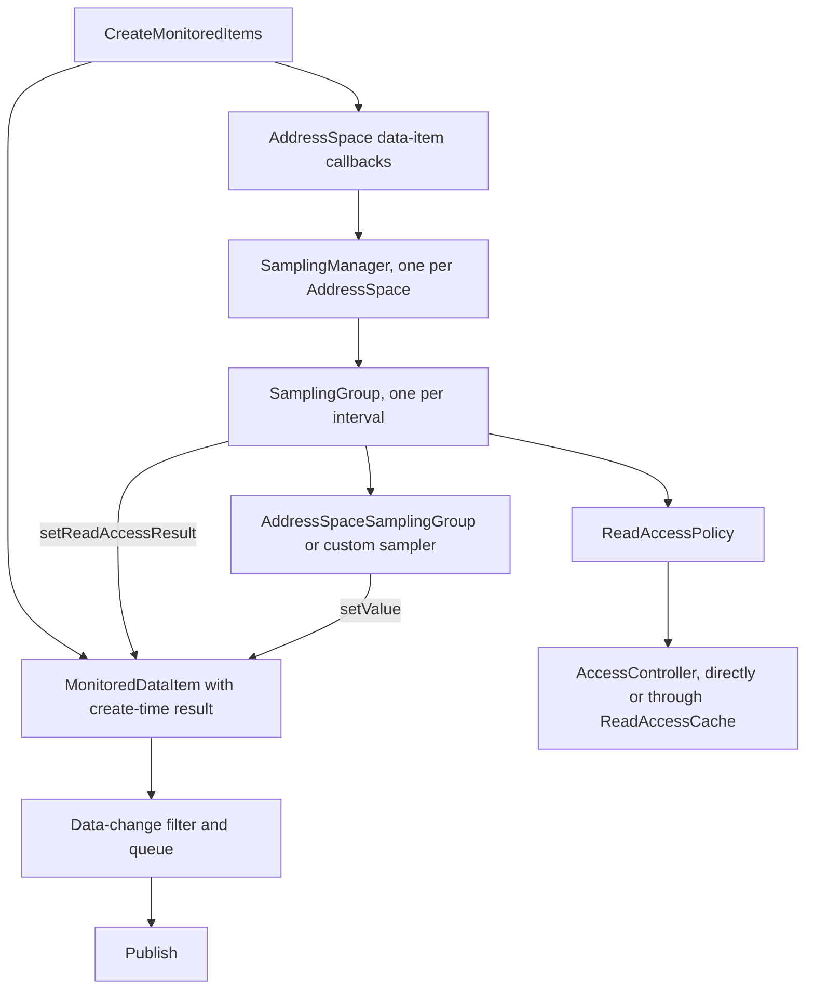

# Sampling framework architecture

The sampling framework produces values for data MonitoredItems and keeps each item's read
access result current while it does. This overview is for developers reading or extending the
server SDK: where the framework sits, what each piece owns, the invariants the pieces maintain
together, and why it is built the way it is. Configuration, examples, and migration are in the
[sampling framework guide](../features/sampling.md).

* * *

## Table of contents

- [Where sampling fits](#where-sampling-fits)
- [Ownership](#ownership)
- [The sampling turn](#the-sampling-turn)
- [Read access](#read-access)
- [Runtime boundaries](#runtime-boundaries)
- [Design decisions](#design-decisions)
- [Reading the implementation](#reading-the-implementation)

* * *

## Where sampling fits

Part 4 gives a server two obligations for a data MonitoredItem: produce a value at its sampling
interval, and report in Publish when the item's Session may not read it, including when that
changes after the item was created (§5.13.2.1). Three layers share them:

| Layer | Owns |
| --- | --- |
| Subscription and item core (`subscriptions`, `items`) | Creating items, seeding each with its create-time read access result, enforcing the latest result in `MonitoredDataItem.setValue()`, data-change filtering, queueing, Publish. |
| Sampling framework (`sampling`) | When items are sampled, and when and how their read access result is refreshed. The only caller of the `AccessController` on the sampling path. |
| Access control (`access`) | The `AccessController` that decides, the `ReadAccessCache` that remembers read decisions, and the invalidation and listeners that keep them current, grouped under `AccessControlManager`. |
| AddressSpace or custom sampler | How a value is read. Never sees access control. |



Two inputs reach the item separately: a decision and a value. The item applies the stored
decision to every value, so no sampler can bypass it. The item does not evaluate permissions
itself; an allowed result stays allowed until something refreshes it. Event MonitoredItems take
a different path and are outside the framework.

## Ownership

```text
ManagedAddressSpace
  SamplingManager              created on first use; started and stopped by the lifecycle helpers
    SamplingGroup, 100 ms      items from any Subscription or Session of this AddressSpace
    SamplingGroup, 250 ms
    SamplingGroup, 1000 ms
    disabled items             tracked by the manager, in no group
```

The manager owns the mapping from the four data-item callbacks to group membership: created
items join the group for their normalized interval, a modified item moves only if its normalized
interval changed, deleted items leave and an empty group stops, and a Disabled item is parked
outside every group until Sampling or Reporting re-enables it. Other item modifications do not
reach the groups; a sampler reads the item's current parameters when it delivers.

Groups are created by a `SamplingGroupFactory`, so a driver substitutes its own subclass without
touching the manager. The manager's lifecycle is one-shot, and it never blocks on a turn in
progress, since its caller may hold locks a sample needs.

The read-access half has a separate owner. `AccessControlManager`, one per server, holds the
controller, the cache, and the listeners, and is the only entry point for invalidation. The
`sampling` package depends on `access` and not the reverse; `ReadAccessPolicy` stays in `sampling`
because how a group refreshes is a sampling concern, while what a refresh asks and what it may
cache is an access concern.

## The sampling turn

A group runs one turn at a time. A turn is a cycle, which considers every member, or an initial
sample, which considers the new and re-enabled members waiting for their first value. Both run
the same sequence:

```text
snapshot membership, with the token each item joined under
if membership changed since the last turn:  onItemsChanged(all members)
refresh:                                    results = readAccessPolicy.check(items to sample)
apply, under the lock, to items whose token is unchanged
sample(items whose stored result is not denied); skipped when there are none
when the stage completes: log a failure, release the turn, run whatever became due
```

The delay to the next cycle is `max(1 ms, interval - elapsed)`, so cycles keep a fixed
start-to-start rate while the group keeps up and never overlap. A cycle that becomes due while
a turn is held runs when the turn is released; a due cycle wins over a due initial sample
because it covers the pending items too. Handoffs go through the scheduler, never inline, so a
completing stage does not run the next turn on its own thread and an executor that runs tasks
inline cannot recurse.

The token on each membership entry is what makes refresh results safe. A check that started
before an item left the group, or left and came back, finds a different token and applies
nothing. That protects the handoff when an item moves between groups without waiting for the old
group's network I/O. The group also records each item's Session before the check and applies
nothing to an item that a TransferSubscriptions moved meanwhile; the transfer applies the new
Session's answer itself, and the item is read again next cycle.

## Read access

`ReadAccessPolicy` decides where a refresh gets its answers. `perCycle()` asks the
`AccessController` once per Session per refresh. `cached()` answers from the server's
`ReadAccessCache`, keyed by Session object, NodeId, and AttributeId, and checks only the misses.
A custom policy returns whatever map it likes, and the group applies it.

The cache is server-wide, has no time-to-live, and keeps grants and denials alike until
`AccessControlManager.invalidateReadAccess(scope)` drops them or the Session closes. Invalidation bumps a
generation under the cache's write lock; a fill stores its answers only if the generation it
read before checking is still current, and otherwise checks again, up to three times, before
using the last answer uncached. After dropping entries the server tells every
`ReadAccessListener` on the calling thread. The SDK invalidates for identity and endpoint
changes, Subscription transfers, and Session close, and for the first three also re-checks the
affected items itself; the application invalidates for everything it controls.

A result that is not a decision never changes an item. A check that throws, a Session whose
check failed, and `AccessResult.NODE_UNKNOWN` all leave the item's last result in place. The
refresh and the read are separate steps that do not re-authorize each other: the default
`AddressSpaceSamplingGroup` calls `AddressSpace.read()`, which sits below the service layer's
access check, after the refresh has already decided.

## Runtime boundaries

Timers run on the server's scheduled executor and turns on its executor. Both default to the
stack's shared pools of platform threads, one sized to the processors and one cached, and the
executor is shared with service requests. A turn holds the group's logical turn, not a thread:
an asynchronous sampler returns its transport's stage, and the completion callback finishes the
bookkeeping wherever that stage completes.

`onItemsChanged()` and `sample()` are serialized per group. `onItemsAdded()` and
`onItemsRemoved()` run on the thread that changed membership, immediately, and can overlap a
turn. The refresh is synchronous. The default read is synchronous and sequential within a turn.
Exceptions anywhere in a turn are logged and the next cycle is scheduled all the same; a stage
that never completes is the one failure the group cannot recover from, and the watchdog only
reports it.

Shutdown clears membership and cancels timers without waiting for a turn in progress. A sample
that completes afterwards is harmless: its results find no matching token and apply nothing,
and any value it delivers still passes through the item's gate.

## Design decisions

### The gate is in the item, not the sampler

`MonitoredDataItem.setValue()` applies the stored read access result to every value. The
alternative, trusting each sampler to withhold values, would make the Publish obligation depend
on every custom driver getting it right. With the gate in the item, a sampler can be wrong in
only one direction: it can fail to refresh, which leaves a stale result, but it cannot deliver a
value past a denial. The SDK core owns the spec obligation; the framework owns freshness.

### Refresh is a step of the cycle

Access could have been refreshed on its own schedule. Making it the first step of every turn
means a value is always gated by the decision of the cycle that read it, there is no window
between a check and the read it authorizes, and the group needs one serialization mechanism
rather than two. The one event that changes an item's Session between the two, a
TransferSubscriptions, checks the item for its new Session and applies that answer itself. It also means the per-cycle policy costs one check per Session per cycle, which
is why the cached policy exists.

### A failed check keeps the last result

A fault is not an access decision. Turning an exception or an unknown Node into a denial would
blank every subscription whenever a filter or the AddressSpace had a transient problem; turning
it into an allowance would leak. Keeping the last result makes a broken refresher stale, never
leaky, and lets Read keep reporting `Bad_NodeIdUnknown` for a Node that has gone.

### Per-cycle by default, cached by choice

The per-cycle policy is correct with no help from the application, so it is the default. The
cache trades that for a map lookup per item, and it can only be as current as the application's
invalidations, so it is opt-in. Nothing in the server observes every input to an access
decision, so a cache without an invalidation contract would be wrong by construction.

### One server-wide cache, keyed by Session object, with no TTL

One cache lets framework groups and application refreshers share answers and one invalidation
API. The key is the Session object rather than the user, because two Sessions for one user can
differ in endpoint security and in what they have been told. A time-to-live was rejected: it
would make every answer stale for up to the TTL without making any of them reliably fresh, and
it would hide a missing invalidation instead of exposing it.

### Invalidation does not touch items

`invalidateReadAccess` runs on the caller's thread, often inside the application's own locks and
transactions. Recomputing decisions there would mean reading attributes through filters, and
possibly the device, from inside that context. So invalidation only drops entries and notifies;
the next turn does the work on the group's executor. The cost is a window of up to one interval
between a change and its effect, which the guide states plainly.

### `sample()` gets the permitted subset; `onItemsChanged()` gets everything

A driver's request plan depends on which registers are monitored, which changes rarely. Which of
them this Session may read changes per Session and per refresh. Rebuilding the plan on
permission changes would defeat the optimization, and reading a denied item's register is
harmless because the gate withholds it. So membership drives the plan and the permitted subset
drives delivery.

### One turn per group, no global budget

Serializing turns per group is the smallest rule that keeps `onItemsChanged()` and `sample()`
from overlapping and keeps a slow device from accumulating overlapping cycles. A device-wide
concurrency limit, timeouts, and cancellation were left to the driver, which knows the device.
The framework exposes the stage so a driver can implement those on its own transport.

### Intervals are revised up to what the framework samples at

Grouping nearby intervals cuts the number of timers and requests. The framework supports the
multiples of the bucket at or above the minimum, and a request is revised up to the next one
rather than down, because Part 4 §7.21 requires the revised interval to be equal to or higher
than the requested one and to be the interval the item is assigned. `ManagedAddressSpace`
reports that interval from its revision hooks using the configuration its own manager samples
with, so a client is never told one interval and sampled at another.

### One manager for authorization, one getter on the server

The controller, the cache, the listeners, and invalidation sit on `AccessControlManager` rather
than as a dozen methods on `OpcUaServer`. The server keeps one getter for the manager and keeps
`getAccessController()` as the single shortcut, because every service set calls it and it predates
the rest. Grouping them also gave the types a package of their own, `access`, instead of leaving
the controller in `servicesets.impl` and the cache in `sampling`, where neither described what it
was.

### A listener, not an EventBus subscriber

Invalidations are announced through `ReadAccessListener` rather than an event on the internal
EventBus. The EventBus is Guava's, relocated in the published jars; a subscriber compiled against
unrelocated Guava registers without error and is never called. A small typed listener has no
such failure mode and puts no third-party type in the public API.

### Not in scope

The framework does not time out or cancel device I/O, does not purge notifications already
queued when a denial arrives, does not sample event MonitoredItems, and does not use virtual
threads or per-group executors on the Java 17 baseline.

## Reading the implementation

| Start here | What it explains |
| --- | --- |
| [sampling package-info][package-info] and [access package-info][access-package-info] | The data flow, invariants, and extension points of each package on one page. |
| [AccessControlManager][access-manager] | The controller, the cache, invalidation, and listeners. |
| [SamplingManager][manager] | Callback handling, interval normalization, and group ownership. |
| [SamplingGroup][group] | The turn, membership tokens, initial samples, handoffs, and failure handling. |
| [AddressSpaceSamplingGroup][as-group] | The default reader. |
| [ReadAccessPolicy][policy] and [ReadAccessCache][cache] | Refresh and invalidation. |
| [MonitoredDataItem][item] | The gate, the data-change filter, and the queue. |
| [ManagedAddressSpace][managed] | Default wiring and the factory and configuration hooks. |

The [unit tests][unit-tests] run the group and manager against a manual scheduler and pin the
ordering and the membership races; [SamplingFrameworkTest][integration-test] covers the
client-visible behavior.

[package-info]: ../../opc-ua-sdk/sdk-server/src/main/java/org/eclipse/milo/opcua/sdk/server/sampling/package-info.java
[manager]: ../../opc-ua-sdk/sdk-server/src/main/java/org/eclipse/milo/opcua/sdk/server/sampling/SamplingManager.java
[group]: ../../opc-ua-sdk/sdk-server/src/main/java/org/eclipse/milo/opcua/sdk/server/sampling/SamplingGroup.java
[as-group]: ../../opc-ua-sdk/sdk-server/src/main/java/org/eclipse/milo/opcua/sdk/server/sampling/AddressSpaceSamplingGroup.java
[policy]: ../../opc-ua-sdk/sdk-server/src/main/java/org/eclipse/milo/opcua/sdk/server/sampling/ReadAccessPolicy.java
[cache]: ../../opc-ua-sdk/sdk-server/src/main/java/org/eclipse/milo/opcua/sdk/server/access/ReadAccessCache.java
[access-package-info]: ../../opc-ua-sdk/sdk-server/src/main/java/org/eclipse/milo/opcua/sdk/server/access/package-info.java
[access-manager]: ../../opc-ua-sdk/sdk-server/src/main/java/org/eclipse/milo/opcua/sdk/server/access/AccessControlManager.java
[item]: ../../opc-ua-sdk/sdk-server/src/main/java/org/eclipse/milo/opcua/sdk/server/items/MonitoredDataItem.java
[managed]: ../../opc-ua-sdk/sdk-server/src/main/java/org/eclipse/milo/opcua/sdk/server/ManagedAddressSpace.java
[unit-tests]: ../../opc-ua-sdk/sdk-server/src/test/java/org/eclipse/milo/opcua/sdk/server/sampling
[integration-test]: ../../opc-ua-sdk/integration-tests/src/test/java/org/eclipse/milo/opcua/sdk/server/sampling/SamplingFrameworkTest.java
