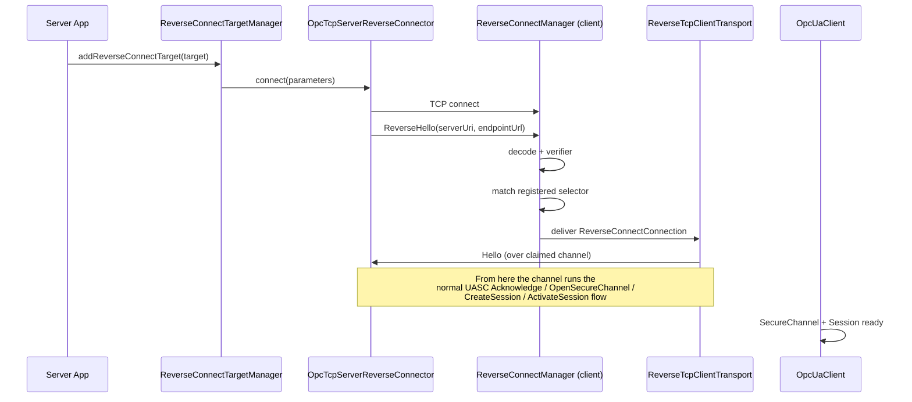

# Reverse Connect

OPC UA Reverse Connect inverts the direction of the initial TCP handshake: the server
opens an outbound socket to a client that is listening for inbound reverse connections.
It is used when network policy prevents clients from reaching servers directly — typically
servers behind NAT or restrictive firewalls — and is defined by OPC UA Part 6 §7.1.2.6
(`ReverseHello`). Milo supports it symmetrically on both client and server, at the stack
layer (wire protocol and transport) and the SDK layer (lifecycle and configuration).

* * *

## Table of Contents

- [Overview](#overview)
- [How It Works](#how-it-works)
- [Usage](#usage)
- [Configuration](#configuration)
- [Design Decisions](#design-decisions)
- [Testing](#testing)

* * *

## Overview

In a normal OPC UA connection, the client dials the server: TCP connect, `Hello`,
`Acknowledge`, `OpenSecureChannel`, Session activation. In reverse connect, the server
dials the client. After the TCP socket is open the server sends an unencrypted
`ReverseHello(serverUri, endpointUrl)` frame, and from that point onward the handshake is
identical to a normal connection — the client sends `Hello`, the SecureChannel is opened,
the server's certificate is validated, and a Session is activated using the normal
client-side identity-provider flow.

This means `ReverseHello` is *only* a pre-SecureChannel routing and admission hint. It is
not authenticated, and Milo deliberately keeps all identity validation in the standard
client certificate, endpoint, security policy, SecureChannel, and Session paths after the
reverse-opened channel rejoins the normal pipeline.

Three usage shapes are supported on the client side:

1. **Hint-based** — the client knows which server it expects (the application URI or
   endpoint URL) and registers a `ReverseConnectSelector` to claim a matching candidate.
2. **Discovery-first** — the client does not know the endpoint up front. It consumes the
   first inbound reverse connection for `GetEndpoints`, selects an endpoint, and waits
   for a later matching reverse connection for the production Session.
3. **Shared listener** — a single client listener serves many unknown servers,
   demultiplexed by `ServerUri`.

On the server side, applications register one or more *targets* (a target describes one
client listener URL and the server endpoint to advertise). A `ReverseConnectTargetManager`
schedules outbound attempts according to a retry policy, observes attempt state
transitions, and tracks the resulting active reverse-opened channels. Targets are
controllable at runtime via pause, resume, trigger (immediate attempt), and remove.

* * *

## How It Works

### Wire Protocol

A `ReverseHello` message reuses the 8-byte UA-TCP frame header. The message type bytes
are `R H E`, the chunk type byte is always `F` (final), and the payload is two
length-prefixed UTF-8 strings:

```
+--------+--------+--------+--------+--------+--------+--------+--------+
|  'R'   |  'H'   |  'E'   |  'F'   |       messageSize (LE u32)        |
+--------+--------+--------+--------+--------+--------+--------+--------+
|              serverUri length (LE i32, -1 = null)                     |
+-----------------------------------------------------------------------+
|                       serverUri bytes (UTF-8)                         |
+-----------------------------------------------------------------------+
|              endpointUrl length (LE i32, -1 = null)                   |
+-----------------------------------------------------------------------+
|                      endpointUrl bytes (UTF-8)                        |
+-----------------------------------------------------------------------+
```

Both string fields are capped at 4096 UTF-8 bytes (OPC UA Part 6 limit). Wire encoding
goes through static `MessageType.toMediumInt()` / `MessageType.fromMediumInt()` helpers
that pack the three message-type bytes into a little-endian medium integer. The mapping
is decoupled from the enum's Java ordinal, so adding new message types (as `ReverseHello`
itself did at ordinal 6) does not shift the wire encoding of existing types.
`MessageTypeTest.testExistingMessageTypeOrdinalsRemainStable` guards that ordinal
stability.

### End-to-End Flow



### Client-Side Components

The client SDK owns the listener side. A `ReverseConnectManager` binds one or more local
sockets (`addBindAddress`) and accepts inbound TCP from servers. Each accepted socket
becomes a *candidate* and progresses through `ReverseConnectCandidateState`:

```
WAITING_FOR_REVERSE_HELLO ──► PENDING ──► CLAIMED   (success)
                          │             ─► REJECTED  (verifier / app / hold-time)
                          │             ─► EXPIRED   (hold time elapsed)
                          │             ─► CLOSED    (peer closed before claim)
                          ├─────────────► REJECTED  (first-message timeout, malformed)
                          └─────────────► CLOSED    (peer closed before ReverseHello)
```

The first frame must be a valid `ReverseHello` or the manager rejects the socket with
`FIRST_MESSAGE_TIMEOUT` or `MALFORMED_REVERSE_HELLO`. A configurable
`ReverseHelloVerifier` runs after `ReverseHello` decode and before the candidate becomes
pending. Verifier rejections return a `ReverseConnectVerificationResult` carrying a
`ReverseConnectRejectionReason` (default `VERIFIER_REJECTED`), an OPC UA `StatusCode`
(default `Bad_TcpEndpointUrlInvalid`), and a diagnostic string surfaced in candidate
snapshots.

Once pending, the manager evaluates registered `ReverseConnectSelector` predicates. The
first selector that returns `true` claims the candidate and receives a one-shot
`ReverseConnectConnection`. Selector matching is one-shot: a claim consumes both the
registration and the candidate. Candidates that no selector claims sit pending until a
configurable hold time expires (default 30 seconds).

`ReverseTcpClientTransport` is the bridge from a claimed channel back to the normal
client UASC pipeline. It implements `OpcClientTransport` and is used by
`OpcUaClient.createReverseConnect(...)`. Two construction modes exist:

- **Manager + selector** — reusable. On every `connectAsync()` it registers a fresh
  selector. If a claimed channel fails before the handshake completes the transport
  re-arms automatically.
- **Pre-claimed connection** — one-shot. Used when the application claims a candidate
  explicitly via `manager.claim(UUID)` and then constructs a client around it.

Two helpers compose on top:

- `DiscoveryFirstReverseConnectClient` runs the discovery-first flow: claim one
  candidate via a discovery selector, run `GetEndpoints` over it, select an endpoint
  with a `ReverseConnectEndpointSelector`, then construct a production reverse client
  that waits for the *next* matching candidate.
- `ReverseConnectAcceptor` is a long-running observer that repeats the same
  discovery-first flow per deduplicated candidate key (default key is `serverUri`). It
  is the right primitive when one client listener must serve multiple unknown servers
  on the same port.

### Server-Side Components

The server SDK owns the dialer side. `OpcUaServer` exposes a target management API
(`addReverseConnectTarget`, `updateReverseConnectTarget`, `removeReverseConnectTarget`,
plus snapshot and listener registration). Internally, a single
`ReverseConnectTargetManager` owns scheduling, retry, and listener dispatch for all
targets.

Each target progresses through these phases:

1. **Registered** — exists in the manager; if disabled or paused it is not scheduled.
2. **Scheduled** — a future attempt time is queued.
3. **In-flight** — exactly one transport-level attempt is running.
4. **Handoff or terminal** — the transport emits a `ReverseConnectAttemptState` stream:
   `CONNECTING` → `CONNECTED` → `REVERSE_HELLO_SENT` → `HELLO_HANDLER_INSTALLED` →
   terminal `HANDOFF` on success, or one of `CLIENT_ERROR`, `FAILED`, `CANCELLED`,
   `CLOSED` on any error path.
5. **Active channel** — after `HANDOFF` the channel runs the normal server UASC path;
   the manager keeps a reference so it can close it on target removal.
6. **Retry** — on terminal failure or active-channel close, the
   `ReverseConnectRetryPolicy` chooses the next delay and the manager re-schedules.

Targets cannot have multiple in-flight attempts at once: a scheduled fire that arrives
while an attempt is still running is dropped. Listeners observe lifecycle events
(`onTargetAdded`, `onTargetUpdated`, `onAttemptEvent`, `onTargetRemoved`) and receive
immutable `ReverseConnectTargetSnapshot` and `ReverseConnectAttemptEvent` records.

### Stack-Layer Primitives

The stack layer provides the low-level mechanics on both sides:

- `ReverseHelloMessage`, `MessageType.ReverseHello`, and the encoder/decoder additions
  in `TcpMessageDecoder`/`TcpMessageEncoder` implement the wire protocol.
- `OpcTcpServerReverseConnector` opens the outbound socket, sends `ReverseHello`,
  installs an `OpcTcpServerReverseConnectResponseHandler` (which gates the channel until
  the client responds with `Hello` or `Error`), and hands off to the standard server
  pipeline via `OpcTcpServerChannelInitializer.initializeReverseChannel(...)`. Reverse
  channels skip the listener-side rate limiter because the server itself opened them.
- `OpcTcpClientChannelInitializer` was extracted from `OpcTcpClientTransport` so the
  same UASC pipeline can be installed onto either a freshly dialed outbound socket
  (`initializeOutboundChannel`) or an already-connected inbound socket
  (`initializeConnectedChannel`). The latter is what
  `ReverseTcpClientTransport` invokes once the manager claims a candidate.
- `UascClientAcknowledgeHandler` sends the client `Hello` from either `channelActive()`
  or `handlerAdded()`, whichever fires first, guarded by a `helloSent` `AtomicBoolean`.
  WebSocket already required this dual trigger; Reverse Connect uses the same
  `handlerAdded` path because by the time the handler is installed on a claimed channel
  the socket is already active.

### Key Components

> Some stack-layer classes (`OpcTcpServerReverseConnector`, `OpcTcpServerChannelInitializer`,
> `OpcTcpServerReverseConnectResponseHandler`) are package-private and appear here as
> architectural reference points, not public extension points. Production code interacts
> with them via `OpcUaServer`, `OpcUaClient`, and the SDK-layer `*Manager` classes.

| Component | Location | Role |
| --- | --- | --- |
| `ReverseHelloMessage` | `opc-ua-stack/stack-core/.../channel/messages/ReverseHelloMessage.java` | Wire-format value object for the `RHE/F` frame |
| `OpcTcpServerReverseConnector` | `opc-ua-stack/transport/.../server/tcp/OpcTcpServerReverseConnector.java` | Stack-layer dialer: opens the outbound socket, writes `ReverseHello`, hands off to the normal server pipeline |
| `OpcTcpClientChannelInitializer` | `opc-ua-stack/transport/.../client/tcp/OpcTcpClientChannelInitializer.java` | Installs the client UASC pipeline onto either an outbound or already-connected channel |
| `ReverseConnectManager` | `opc-ua-sdk/sdk-client/.../reverse/ReverseConnectManager.java` | Client-side listener, candidate lifecycle, selector matching, listener dispatch |
| `ReverseConnectSelector` | `opc-ua-sdk/sdk-client/.../reverse/ReverseConnectSelector.java` | Predicate over candidate snapshots; static factories for common matches |
| `ReverseTcpClientTransport` | `opc-ua-sdk/sdk-client/.../reverse/ReverseTcpClientTransport.java` | `OpcClientTransport` for reverse connections. Two modes: reusable (manager + selector, auto-rearms on handshake failure) and one-shot (pre-claimed `ReverseConnectConnection`) |
| `DiscoveryFirstReverseConnectClient` | `opc-ua-sdk/sdk-client/.../reverse/DiscoveryFirstReverseConnectClient.java` | One-shot helper that runs `GetEndpoints` over the first reverse connection and waits for a matching production connection |
| `ReverseConnectAcceptor` | `opc-ua-sdk/sdk-client/.../reverse/ReverseConnectAcceptor.java` | Long-running multi-server variant of the discovery-first flow on a shared listener |
| `ReverseConnectTarget` | `opc-ua-sdk/sdk-server/.../reverse/ReverseConnectTarget.java` | Immutable server-side target: client listener URL, advertised endpoint URL, registration period, connect timeout, enabled/paused flags, retry policy, stable id |
| `ReverseConnectTargetManager` | `opc-ua-sdk/sdk-server/.../reverse/ReverseConnectTargetManager.java` | Schedules attempts, applies retry policy, dispatches listener events, tracks active reverse channels |
| `ReverseConnectTargetHandle` | `opc-ua-sdk/sdk-server/.../reverse/ReverseConnectTargetHandle.java` | Per-target runtime control returned to the caller: `pause`, `resume`, `trigger`, `remove`, `snapshot` |
| `ReverseConnectRetryPolicy` | `opc-ua-sdk/sdk-server/.../reverse/ReverseConnectRetryPolicy.java` | Functional interface that computes the next retry delay |

* * *

## Usage

### Server: Registering a Target

Targets can be added before startup via `OpcUaServerConfigBuilder.addReverseConnectTarget`
(returned from `OpcUaServerConfig.builder()`) or at runtime via
`OpcUaServer.addReverseConnectTarget`. The configuration is the same in both cases:

```java
ReverseConnectTarget target = ReverseConnectTarget.builder()
    .setClientListenerUrl("opc.tcp://client.example.com:48060")
    .setEndpointUrl("opc.tcp://server.example.com:12686/milo")
    .setRegistrationPeriod(uint(30_000))
    .setConnectTimeout(uint(5_000))
    .build();

ReverseConnectTargetHandle handle = server.addReverseConnectTarget(target);
```

The returned `ReverseConnectTargetHandle` is the runtime control surface:

```java
handle.pause().get();      // stop scheduling new attempts
handle.resume().get();     // resume scheduling after pause
handle.trigger().get();    // request an immediate attempt
handle.snapshot();         // current state (Optional, empty if removed)
handle.remove().get();     // cancel scheduled/in-flight work, close active channels
```

Observe target lifecycle on the server:

```java
server.addReverseConnectTargetListener(new ReverseConnectTargetListener() {
    @Override
    public void onAttemptEvent(ReverseConnectAttemptEvent event) {
        log.info("attempt #{} target={} state={} status={}",
            event.attemptNumber(), event.targetId(), event.state(), event.statusCode());
    }
    @Override
    public void onTargetUpdated(ReverseConnectTargetSnapshot snapshot) {
        log.info("target {} activeChannels={}",
            snapshot.targetId(), snapshot.activeChannelCount());
    }
});
```

`ReverseConnectTargetListener` also exposes defaulted `onTargetAdded` and
`onTargetRemoved` callbacks; override the ones your observability needs.

### Client: Hint-Based

When the client already has an `EndpointDescription` for the expected server, use
`OpcUaClient.createReverseConnect(config, manager, selector)`:

```java
ReverseConnectManager manager = ReverseConnectManager.builder()
    .addBindAddress(new InetSocketAddress("0.0.0.0", 48060))
    .build();
manager.startup();

OpcUaClient client = OpcUaClient.createReverseConnect(
    config,
    manager,
    ReverseConnectSelector.byServerUriAndEndpointUrl(
        "urn:example:server",
        "opc.tcp://server.example.com:12686/milo"));

try {
    client.connectAsync().get();
    // ... use client ...
} finally {
    client.disconnectAsync().get();
    manager.shutdown();
}
```

Selector factories on `ReverseConnectSelector`: `any()`, `byCandidateId(UUID)`,
`byServerUri(String)`, `byEndpointUrl(String)`, `byServerUriAndEndpointUrl(String, String)`.

A four-argument overload accepts a `Consumer<OpcTcpClientTransportConfigBuilder>` for
callers that need to customize transport timers, executors, or the channel pipeline.

### Client: Discovery-First

When the endpoint is not known up front, use `DiscoveryFirstReverseConnectClient`. It
consumes the first matching reverse connection for `GetEndpoints`, applies a
`ReverseConnectEndpointSelector` to choose an endpoint, and builds a normal reverse
client that waits for the next matching connection:

```java
ReverseConnectManager manager = ReverseConnectManager.builder()
    .addBindAddress(new InetSocketAddress("0.0.0.0", 48060))
    .setPendingConnectionHoldTime(Duration.ofSeconds(30))
    .build();
manager.startup();

CompletableFuture<OpcUaClient> connected =
    DiscoveryFirstReverseConnectClient.builder(manager)
        .setClientConfig((discovery, endpoint) ->
            OpcUaClientConfig.builder()
                .setEndpoint(endpoint)
                .setDiscoveryEndpoints(discovery.endpoints())
                .setApplicationUri("urn:example:client")
                .build())
        .connectAsync();

OpcUaClient client = connected.get(30, TimeUnit.SECONDS);
```

The default endpoint selector is
`preferReverseHelloEndpointUrl(isNoSecurityAndAnonymous)` — it picks the
no-security/anonymous endpoint whose URL matches the `ReverseHello` hint, falling back to
the first no-security/anonymous endpoint if no URL match exists. To use a different
identity provider, pass a matching predicate. For example, a Basic256Sha256/SignAndEncrypt
endpoint that still allows anonymous activation:

```java
.setEndpointSelector(
    ReverseConnectEndpointSelectors.preferReverseHelloEndpointUrl(endpoint ->
        SecurityPolicy.Basic256Sha256.getUri().equals(endpoint.getSecurityPolicyUri())
            && endpoint.getSecurityMode() == MessageSecurityMode.SignAndEncrypt
            && ReverseConnectEndpointSelectors.allowsAnonymous(endpoint)))
```

The default client-config factory disables session endpoint validation because the
server's `CreateSession` endpoint list often does not match the discovery endpoint list
seen over the reverse channel. If you override `setClientConfig`, either re-apply
`setSessionEndpointValidationEnabled(false)` or audit your server's endpoint
advertisement.

### Client: Shared Listener for Multiple Servers

`ReverseConnectAcceptor` is the same discovery-first flow but repeated for each
distinct candidate key (default key is `ServerUri`). One listener, many servers:

```java
ReverseConnectAcceptor acceptor = ReverseConnectAcceptor.builder(manager)
    .setDiscoverySelector(candidate ->
        candidate.serverUri() != null
            && expectedServerUris.contains(candidate.serverUri()))
    .setClientConfig((discovery, endpoint) ->
        clientConfigForServer(discovery.serverUri(), endpoint, discovery.endpoints()))
    .setClientListener((discovery, endpoint, client) ->
        registerProductionClient(discovery.serverUri(), client))
    .setErrorListener((candidate, failure) ->
        log.warn("acceptor failed for {}", candidate, failure))
    .build();

acceptor.start();
```

The acceptor deduplicates by candidate key, so a single misbehaving server cannot start
multiple discovery flows in flight at once. Override `setKeyFunction` if the default
`ServerUri` key is unsuitable.

### Dynamic Claiming

For applications that observe the manager directly and pick candidates by inspection:

```java
ReverseConnectCandidateSnapshot candidate =
    manager.snapshot().pendingCandidates().get(0);
ReverseConnectConnection connection =
    manager.claim(candidate.id()).orElseThrow();

OpcUaClient client = OpcUaClient.createReverseConnect(config, connection);
try {
    client.connectAsync().get();
} finally {
    client.disconnectAsync().get();
}
```

A claimed connection is one-shot: it is consumed on the first `connectAsync()` call and
cannot be reused. To reconnect, claim a new candidate.

* * *

## Configuration

### `ReverseConnectManagerBuilder` (client)

| Property | Type | Default | Description |
| --- | --- | --- | --- |
| `addBindAddress` | `InetSocketAddress` | (none) | Local socket to bind. Call once per listener. At least one bind address is required. |
| `setFirstMessageTimeout` | `Duration` | 5 s | Maximum time the manager waits for a `ReverseHello` after accepting a socket. |
| `setPendingConnectionHoldTime` | `Duration` | 30 s | How long a verified candidate stays pending before being rejected as `PENDING_EXPIRED`. |
| `setMaxPendingCandidates` | `int` | 64 | Backpressure cap on the number of unclaimed pending candidates. |
| `setMaxRetainedCandidateSnapshots` | `int` | 1024 | Per-bucket bound on retained terminal candidates exposed by `snapshot()`. Applied independently to `acceptedCandidates` and `rejectedCandidates`. |
| `setReverseHelloVerifier` | `ReverseHelloVerifier` | accept-all | Synchronous admission hook called after `ReverseHello` decode. |
| `setExecutor` / `setScheduler` / `setEventLoop` | various | shared `Stack` resources | Executor for listener callbacks, scheduler for timeouts, Netty event loop for listener sockets. |
| `setBootstrapCustomizer` | `Consumer<ServerBootstrap>` | no-op | Customizer applied to each listener `ServerBootstrap`. |

`setFirstMessageTimeout` and `setPendingConnectionHoldTime` each accept either a
`Duration` or a `UInteger` (milliseconds), so callers that already have `UInteger`
constants do not need to import `Duration`.

### `ReverseConnectTarget.Builder` (server)

| Property | Type | Default | Description |
| --- | --- | --- | --- |
| `setClientListenerUrl` | `String` | (required) | `opc.tcp://host:port` URL of the client reverse listener to dial. |
| `setEndpointUrl` | `String` | (required) | Server endpoint URL advertised in `ReverseHello`. Must match a configured server endpoint at validation time. |
| `setRegistrationPeriod` | `UInteger` (ms) | 30 000 | Used as the default retry delay (see `ReverseConnectRetryPolicy.registrationPeriod`). |
| `setConnectTimeout` | `UInteger` (ms) | 5 000 | TCP connect timeout for each outbound attempt. |
| `setEnabled` | `boolean` | `true` | Disabled targets are registered but not scheduled. Toggle by replacing the target via `updateReverseConnectTarget`; the `ReverseConnectTargetHandle` does not expose a runtime enable/disable. |
| `setPaused` | `boolean` | `false` | Paused targets are registered but not scheduled. Toggle at runtime via `handle.pause()` / `handle.resume()`. |
| `setRetryPolicy` | `ReverseConnectRetryPolicy` | `registrationPeriod()` | Function from `(target, event) → delay millis`. `fixedDelay(UInteger)` is also provided. |
| `setId` | `UUID` | random | Override the target id (used to correlate updates and listener events). |

Example with a non-default retry policy:

```java
ReverseConnectTarget target = ReverseConnectTarget.builder()
    .setClientListenerUrl("opc.tcp://client.example.com:48060")
    .setEndpointUrl("opc.tcp://server.example.com:12686/milo")
    .setRegistrationPeriod(uint(10_000))
    .setConnectTimeout(uint(3_000))
    .setRetryPolicy(ReverseConnectRetryPolicy.fixedDelay(uint(5_000)))
    .build();
```

### `OpcUaServerConfigBuilder` (server)

| Property | Type | Default | Description |
| --- | --- | --- | --- |
| `addReverseConnectTarget` | `ReverseConnectTarget` | (empty) | Add one target to the startup set. May be called repeatedly. |
| `setReverseConnectTargets` | `Set<ReverseConnectTarget>` | empty set | Replace the entire startup target set. |

Both startup-configured targets and targets added or updated at runtime are validated
against the server's bound `opc.tcp` endpoints. A target whose `endpointUrl` does not
match any bound endpoint causes startup, `addReverseConnectTarget`, or
`updateReverseConnectTarget` to fail.

* * *

## Design Decisions

### `ReverseHello` is a routing hint, not authentication

`ReverseHello` is sent unencrypted before any SecureChannel exists and carries no signed
material. Milo treats it strictly as a pre-SecureChannel routing and admission hint:
selectors may consult it, verifiers may reject obviously bogus values, but server
identity validation happens unchanged in the normal certificate, endpoint, security
policy, SecureChannel, and Session validation paths after a claimed channel rejoins the
client transport pipeline. The alternative would be to trust the advertised `serverUri`
implicitly. That would create a spoofing surface where any peer that reached the listener
address could be matched to a legitimate registration.

### Selector matching is one-shot

A `ReverseConnectSelector` registration consumes exactly one matching candidate. The
matched candidate becomes a `ReverseConnectConnection`, and any future inbound connection
matching the same hints requires a fresh selector registration. In manager + selector
mode the `ReverseTcpClientTransport` registers a fresh selector after handshake failure
or active-channel close, so ordinary `OpcUaClient` lifecycle methods (`connect`,
`disconnect`, `reconnect`) do not require the application to re-register. One-shot
semantics make ownership transfer explicit — once a candidate is claimed, the manager
will not close that channel on shutdown — and they avoid ambiguity when multiple
selectors could match the same candidate.

### Retry is server-driven only

The server schedules attempts via `ReverseConnectRetryPolicy`; the client is purely
passive — it accepts whatever the server dials when it dials it. This matches the
asymmetry of the OPC UA specification (only the server has a notion of "when to try
again") and keeps client behavior simple: the client listener is either bound or it is
not. Applications that want client-driven retry should treat the server as offline when
no candidates arrive within a deadline and surface that to operators rather than
attempting transport-level reconnection on the client.

### Stack/SDK split

Responsibilities split cleanly across the two layers:

- **Stack — server** (`opc-ua-stack/transport/.../server/tcp`): outbound socket
  lifecycle, the `ReverseHello` write, and the handoff to the standard server UASC
  pipeline.
- **SDK — server** (`opc-ua-sdk/sdk-server/.../reverse`): target registration,
  scheduling, retry policy, listener events, and tracking of handed-off active channels.
- **Stack — client** (`opc-ua-stack/transport/.../client/tcp`): the extracted channel
  initializer and the dual-trigger `UascClientAcknowledgeHandler`.
- **SDK — client** (`opc-ua-sdk/sdk-client/.../reverse`): the manager, listeners,
  selectors, verifier, discovery helpers, and acceptor.

This isolates protocol concerns from configuration and observability, keeps the
transport package directly reusable for applications that want to embed a different
reverse-connect lifecycle, and matches the existing layering used for normal connections.

* * *

## Testing

```bash
# Wire protocol
mvn -q verify -pl opc-ua-stack/stack-core -Dtest=ReverseHelloMessageTest,MessageTypeTest

# Stack transport (both sides)
mvn -q verify -pl opc-ua-stack/transport \
    -Dtest=OpcTcpServerReverseConnectorTest,OpcTcpServerChannelInitializerTest,OpcTcpClientChannelInitializerTest

# Client SDK
mvn -q verify -pl opc-ua-sdk/sdk-client -Dtest='ReverseConnect*,DiscoveryFirstReverseConnect*,OpcUaClientReverseConnectTest,DiscoveryClientReverseConnectTest,ReverseTcpClientTransportTest'

# Server SDK
mvn -q verify -pl opc-ua-sdk/sdk-server -Dtest='ReverseConnect*,OpcUaServerReverseConnectTargetTest,OpcUaServerConfigTest'

# Full-stack integration
mvn -q verify -pl opc-ua-sdk/integration-tests -Dtest=OpcUaClientReverseConnectTest
```

| Test Class | What It Covers |
| --- | --- |
| `ReverseHelloMessageTest` | Wire-format round trip, header bytes, length limits, negative/truncated length rejection |
| `MessageTypeTest` | Stable ordinals and `toMediumInt`/`fromMediumInt` mapping for `ReverseHello` |
| `OpcTcpServerReverseConnectorTest` | Attempt state machine, cancellation, error response handling, connector shutdown closing all channels |
| `OpcTcpServerChannelInitializerTest` | Passive vs reverse pipeline differences: rate limiter is skipped on reverse channels and the Hello deadline is scheduled on the active channel |
| `OpcTcpClientChannelInitializerTest` | Outbound vs connected-channel initialization on the client side |
| `ReverseConnectManagerTest` | Listener bind/unbind, candidate lifecycle, verifier, selector matching, hold-time expiry, max-pending backpressure |
| `ReverseConnectAcceptorTest` | Shared-listener flow, error listener invocation, deduplication-key behavior, pre-delivery failure recovery |
| `ReverseConnectEndpointSelectorsTest` / `ReverseConnectProductionSelectorsTest` | Endpoint and production selector helpers, including `preferReverseHelloEndpointUrl` fallback |
| `ReverseConnectEndpointSelectionFailureTest` | Empty discovery result vs selector-returned-no-endpoint vs discovery error distinctions |
| `DiscoveryFirstReverseConnectClientCancellationTest` | Cancellation/timeout cleanup; ensures selectors are unregistered when callers cancel |
| `ReverseTcpClientTransportTest` | Transport handoff, re-arm after handshake failure (manager mode), one-shot direct mode |
| `OpcUaClientReverseConnectTest` (sdk-client) | `OpcUaClient.createReverseConnect` factory wires the right transport |
| `DiscoveryClientReverseConnectTest` | `DiscoveryClient.getEndpoints(ReverseConnectConnection)` discovery flow |
| `ReverseConnectTargetManagerTest` | Target add/update/remove, retry policy invocation, generation counter, listener dispatch, active-channel close reschedules an attempt |
| `OpcUaServerReverseConnectTargetTest` | Public `OpcUaServer` API: pause, resume, trigger, remove, snapshot, listener events |
| `OpcUaServerConfigTest` | Reverse Connect target round-trip through `OpcUaServerConfigBuilder` |
| `ReverseConnectTargetSnapshotTest` | Defensive copying of the last exception (including suppressed and cause chains) |
| `OpcUaClientReverseConnectTest` (integration-tests) | Full end-to-end coverage. See the scenarios listed below. |

Key end-to-end scenarios validated:

- Server registers a target, dials the client listener, sends `ReverseHello`, hands off
  to the normal UASC path; client opens a SecureChannel, activates a Session, and reads
  the server status.
- Discovery-first flow: first reverse connection is consumed for `GetEndpoints`, a
  second matching reverse connection is used for the production Session.
- Shared-listener flow: two servers with different `ServerUri` values dial the same
  client listener; the acceptor produces one `OpcUaClient` per server independently.
- Server-driven retry: the target retries on `FAILED`, `CLIENT_ERROR`, and active-channel
  close events according to the configured retry policy; pause halts scheduling, resume
  restarts it, trigger forces an immediate attempt.
- Target removal: cancels scheduled and in-flight attempts and closes active
  reverse-opened channels.
- Cancellation: cancelling a `DiscoveryFirstReverseConnectClient` or
  `OpcUaClient.connectAsync()` future unregisters the underlying selector and releases
  any pending candidate.
