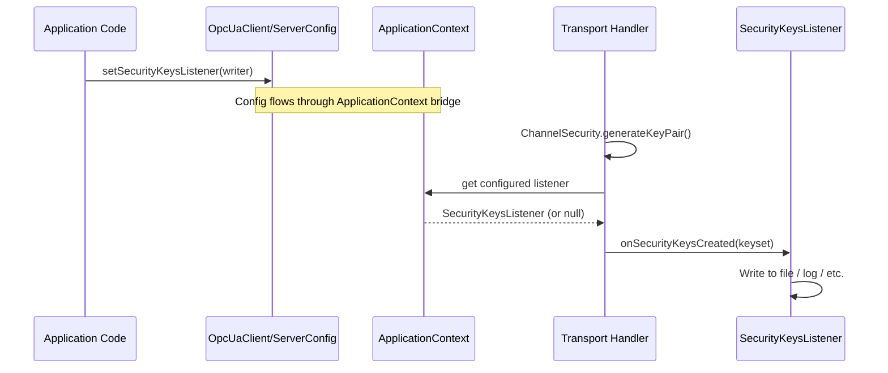

# Wireshark Key Log

Milo can export the symmetric encryption keys derived during OPC UA SecureChannel
handshakes in a format that Wireshark 4.4+ understands, enabling offline decryption of
encrypted OPC UA traffic. The feature is disabled by default and must be explicitly
enabled by configuring a `SecurityKeysListener` on the client or server.

* * *

## Table of Contents

- [Overview](#overview)
- [How It Works](#how-it-works)
- [Usage](#usage)
- [Design Decisions](#design-decisions)
- [Testing](#testing)

* * *

## Overview

Debugging encrypted OPC UA traffic normally requires running with
`MessageSecurityMode.None`, which changes protocol behavior and is not always possible.
Wireshark 4.4 introduced support for decrypting OPC UA Secure Conversation messages when
given the ephemeral symmetric keys from the `OpenSecureChannel` handshake.

This feature adds a listener-based callback that fires after every key derivation, plus a
built-in file writer (`WiresharkKeyLogWriter`) that produces key log files Wireshark can
consume directly. The listener is generic — applications can implement
`SecurityKeysListener` to route keys anywhere (logging framework, remote service, etc.),
but the common case is writing to a file and loading it into Wireshark via
**Edit > Preferences > Protocols > OPC UA > Key log file**.

Both the client and server SDK support the feature. Each side sees its own key derivation
event, so a key log file from either the client or the server is sufficient for
Wireshark to decrypt traffic in both directions.

* * *

## How It Works

Key derivation happens at two points in the codebase — one client-side, one server-side —
both immediately after `ChannelSecurity.generateKeyPair()` returns. When a
`SecurityKeysListener` is configured, the transport handler constructs a `SecurityKeyset`
value object from the derived key material and invokes the listener synchronously on the
Netty event loop thread. If no listener is configured, the code path is a no-op. If the
security policy is `None`, no keys are derived and the listener is never invoked.



Channel renewals produce new keysets with the same channel ID but a new token ID. Each
renewal triggers another listener invocation, and `WiresharkKeyLogWriter` appends the new
entry to the same file. Wireshark matches entries by `(channelId, tokenId)` so both
initial and renewed keys are used for the appropriate message ranges.

### Key Log File Format

Each keyset produces six lines. The suffix `<channelId>_<tokenId>` identifies the
SecureChannel and security token the keys belong to:

```
client_iv_<channelId>_<tokenId>: <HEX>
client_key_<channelId>_<tokenId>: <HEX>
client_siglen_<channelId>_<tokenId>: <signatureSize>
server_iv_<channelId>_<tokenId>: <HEX>
server_key_<channelId>_<tokenId>: <HEX>
server_siglen_<channelId>_<tokenId>: <signatureSize>
```

- Hex values are uppercase with no separators (e.g., `A1A2A3A4...`).
- `signatureSize` is a decimal integer (20 for SHA-1, 32 for SHA-256).
- Signing keys are intentionally omitted — Wireshark does not need them.

### Key Components

| Component | Location | Role |
| --- | --- | --- |
| `SecurityKeysListener` | `opc-ua-stack/stack-core/.../channel/SecurityKeysListener.java` | Callback interface notified after key derivation |
| `SecurityKeyset` | `opc-ua-stack/stack-core/.../channel/SecurityKeyset.java` | Immutable value object carrying channel ID, token ID, keys, IVs, and signature size |
| `WiresharkKeyLogWriter` | `opc-ua-stack/stack-core/.../channel/WiresharkKeyLogWriter.java` | Built-in `SecurityKeysListener` that writes the Wireshark key log format to a file |
| `ClientApplicationContext` | `opc-ua-stack/transport/.../client/ClientApplicationContext.java` | Bridge interface — exposes the listener from client config to the transport layer |
| `ServerApplicationContext` | `opc-ua-stack/transport/.../server/ServerApplicationContext.java` | Bridge interface — exposes the listener from server config to the transport layer |
| `UascClientMessageHandler` | `opc-ua-stack/transport/.../client/uasc/UascClientMessageHandler.java` | Client-side integration point — invokes listener in `installSecurityToken()` |
| `UascServerAsymmetricHandler` | `opc-ua-stack/transport/.../server/uasc/UascServerAsymmetricHandler.java` | Server-side integration point — invokes listener in `openSecureChannel()` |

* * *

## Usage

### Client

```java
Path keyLogFile = Path.of("/tmp/opcua_client_keys.log");
var writer = new WiresharkKeyLogWriter(keyLogFile);

OpcUaClientConfig config = OpcUaClientConfig.builder()
    .setSecurityKeysListener(writer)
    // ... other config ...
    .build();

OpcUaClient client = OpcUaClient.create(config);
client.connect();

// ... use the client ...

writer.close(); // flush and close when done
```

### Server

```java
Path keyLogFile = Path.of("/tmp/opcua_server_keys.log");
var writer = new WiresharkKeyLogWriter(keyLogFile);

OpcUaServerConfig config = OpcUaServerConfig.builder()
    .setSecurityKeysListener(writer)
    // ... other config ...
    .build();

OpcUaServer server = new OpcUaServer(config, transportFactory);
server.startup().get();

// ... server runs ...

writer.close();
```

### Loading in Wireshark

1. Capture OPC UA traffic (e.g., with tcpdump or Wireshark itself).
2. Open the capture in Wireshark 4.4+.
3. Go to **Edit > Preferences > Protocols > OPC UA**.
4. Set **Key log file** to the path of the key log file.
5. Encrypted OPC UA messages are now decrypted in the packet list.

A key log file from either the client or the server is sufficient — both contain the same
symmetric key material for both directions.

### Custom Listener

Implement `SecurityKeysListener` to handle key material in any way:

```java
SecurityKeysListener listener = keyset -> {
    logger.debug(
        "Keys derived for channel={}, token={}",
        keyset.channelId(),
        keyset.tokenId()
    );
    // write to database, send to remote service, etc.
};

OpcUaClientConfig config = OpcUaClientConfig.builder()
    .setSecurityKeysListener(listener)
    .build();
```

The interface is a single-method interface and is lambda-compatible. Implementations must
be thread-safe — multiple channels may derive keys concurrently.

* * *

## Design Decisions

### Signing keys are excluded from the keyset

`SecurityKeyset` carries encryption keys, IVs, and the signature size, but not the
signing keys themselves. Wireshark does not need signing keys for decryption — it only
needs the signature length to know how many trailing bytes to strip before decrypting.
Omitting signing keys limits the exposure if a key log file is accidentally leaked or
left on disk.

### Listener is invoked synchronously on the event loop

The listener callback runs synchronously on the Netty event loop thread, immediately
after key derivation and before the first encrypted message is sent. This guarantees the
key log entry is written before any traffic that uses those keys, which is important
because Wireshark needs the keys to decrypt the corresponding messages. The built-in
`WiresharkKeyLogWriter` uses a buffered file append that completes in microseconds, so
event loop latency is negligible. If a custom listener performs slow I/O, it should
dispatch to a separate executor internally.

### SecurityKeyset uses defensive copying for byte arrays

The `SecurityKeyset` record clones all `byte[]` fields in both the compact constructor
and the accessor methods. This ensures the keyset is truly immutable — callers cannot
corrupt it by modifying the original arrays or the returned copies. The cost is minimal
since key arrays are small (16-32 bytes) and key derivation happens infrequently (once
per channel lifetime, plus renewals).

* * *

## Testing

```bash
mvn -q verify -pl opc-ua-stack/stack-core \
    -Dtest="SecurityKeysetTest,WiresharkKeyLogWriterTest"
```

| Test Class | What It Covers |
| --- | --- |
| `SecurityKeysetTest` | Defensive copy behavior and value round-tripping |
| `WiresharkKeyLogWriterTest` | File format correctness, append mode, and thread safety |

Key test scenarios:

- **Single entry format** — verifies the exact six-line output for AES-256 keys with a
  large channel ID, confirming field names, hex formatting, and decimal signature size.
- **Append mode** — writes two keysets (same channel, different tokens) and verifies 12
  lines with correct token ID ordering.
- **Thread safety** — 20 concurrent threads each write a keyset and the test verifies
  no interleaved lines (every 6-line group has the correct field order).
- **Defensive copy on construction** — mutates the original `byte[]` arrays after
  constructing a `SecurityKeyset` and verifies the record retains the original values.
- **Defensive copy on accessor return** — mutates the arrays returned by accessors and
  verifies subsequent accessor calls still return the original values.
- **Component value round-trip** — confirms all fields (including large unsigned 32-bit
  channel IDs carried as `long`) survive construction and accessor calls.
